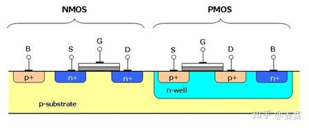

# 1.7c 四图对照（看图记知识点）

> 拆自 [1.7_CMOS晶体管.md](./1.7_CMOS晶体管.md) · 内容完整保留

### 四图对照（看图记知识点）

学 CMOS 时手里常有四类图，各盯一件事。下面用示意标出该看什么（有实拍/课本图时按同样标注对号入座）。

#### 一、NMOS 单管剖面图（你一直在学的那根管子）

```
        G（栅极金属/多晶硅）
        ═══════
       / SiO₂  \     ← 绝缘，电子不过栅
  ────┴─────────┴──── 硅最表面
  [N+]  ~电子沟道~  [N+]
   S    （临时薄层）  D
   │ ╲             ╱ │
   │  ╲__ PN结 __╱  │   ← 侧壁·底面 ↔ P（正式结，朝下）
   └──────┬──────────┘
          P 衬底（整片）
```

| 标注 | 是什么 |
|------|--------|
| 底层粉色/整片 | **P型衬底** |
| 左右蓝 N+ 方块 | **源 S、漏 D** |
| S/D 底面·侧壁 ↔ P | **实体 PN结** |
| SiO₂ 上方 | **栅极 G**（与硅完全绝缘） |
| 栅下 P 表层 | **临时电子 N沟道**（只横向连 S/D **顶面**，不穿过下方结） |

→ 对号：[补充_PN结到MOS](./补充_PN结到MOS.md)「顶面无结 / 侧壁底面有结 / 电子只走表层」。

#### 二、CMOS 反相器电路原理图（最基础 CMOS 单元）

```
              VDD
               │
            源 │
         ┌─────┴─────┐
         │   PMOS    │  ← 上：P沟道，源接 VDD
         │   （P）   │
         └─────┬─────┘
            漏 │
    A ─────────┼────────── Y（输出）
     （两栅相连）│
         ┌─────┴─────┐
         │   NMOS    │  ← 下：N沟道，源接 GND
         │   （N）   │
         └─────┬─────┘
            源 │
              GND
```

| 点 | 记住 |
|----|------|
| 上管 | **PMOS**，源极接 **VDD** |
| 下管 | **NMOS**，源极接 **GND** |
| 输入 A | **两栅连一起** |
| 输出 Y | **两漏连一起** |
| 互补 | 输入高 → NMOS开、PMOS关；输入低 → 反过来；**永远一路通**，静态几乎不耗电 |

#### 三、CMOS 芯片硅片横截面（同一块硅上做两种管）



```
  G        G
  ║        ║
 ═╩═      ═╩═     ← 各自栅 + 氧化层
[N+][N+] [P+][P+]
  S  D     S  D
  NMOS      PMOS
────┬──────────┬────
    │  P衬底   │ N阱 │  ← 右边挖出 N阱放 PMOS
    └──────────┴────┘
```

| 工艺点 | |
|--------|--|
| 基底 | 整片 **P型硅（p-substrate）** |
| 左边 NMOS | 直接在 P 衬底：S/D = **n+**；体区 B 经 **p+** 接到 P 衬底（常内部接 GND） |
| 右边 PMOS | 在 **n-well** 里：S/D = **p+**；体区 B 经 **n+** 接到 N 阱（常内部接 VDD） |
| 隔离直觉 | N 阱接 VDD、P 衬底接 GND → 阱–衬底 PN 反偏，两种管互不干扰（教学默认工艺） |

→ 架构层仍是「上 P 下 N 互补」；本图只回答「两种管怎么长在同一片硅上」。体系结构向看到这里即可，勿再钻工艺步骤。

#### 四、CMOS 版图 / 显微镜实拍（实物排布）

课本或显微镜图里常见：

- **上方长条区域** ≈ PMOS  
- **下方区域** ≈ NMOS  
- **同一输入** 用共用 **栅极金属/多晶走线** 串起来  

看图目的：建立「真实芯片里两种管并排、共栅」的直觉，不必背版图规则。

#### 极简：四图各学什么

| 图 | 盯住 |
|----|------|
| ① NMOS 剖面 | S/D **底部·侧壁 PN结** + 表层 **N沟道** 通路 |
| ② 反相器电路 | CMOS **互补成对** 的接线逻辑 |
| ③ CMOS 剖面 | 一块硅上同时做 NMOS + PMOS（**N阱**） |
| ④ 版图实拍 | 真实芯片里两种 MOS 的排布样式 |

（若你另存了实拍/课本截图，可放进 `ch01_binary/figures/`，文件名建议：`nmos-cross-section` / `cmos-inverter` / `cmos-well` / `cmos-layout`。）

---

