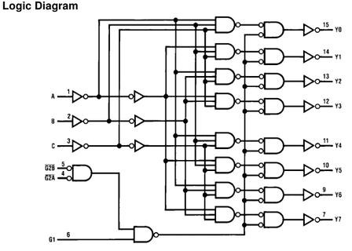
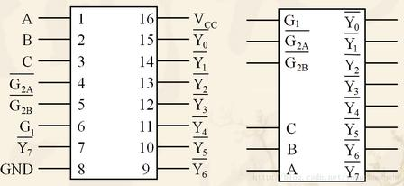

# 2.8.2 译码器 Decoder

> 拆自 [2.8_组合逻辑模块.md](./2.8_组合逻辑模块.md) · 内容完整保留

### 2.8.2 译码器 Decoder（重中之重）

**功能：** 二进制编码 → **唯一一路** 输出有效（相对**理想普通编码器**的功能逆运算；见上节，勿等同于「电路反接」）。

| 类 | 典型 | 要点 |
|----|------|------|
| **二进制** | **74HC138**（**3–8**，不是「83」） | 见下专节 |
| **BCD** | 4–10 | 8421 BCD → 10 路 |
| **七段** | BCD→段码 | 共阳（低亮）/ 共阴（高亮）；仪表显示 |

#### 3–8 译码器（74HC138）钉死

**口误纠：** 是 **3 线→8 线**，不是 83。方向与编码器相反。

| | 编码器（如 8–3 优先 74HC148） | **译码器 3–8（74HC138）** |
|--|------------------------------|---------------------------|
| 方向 | **多进少出**（8→3） | **少进多出**（3→8） |
| 功能 | 有效输入 → 二进制编号 | 二进制地址 → 独热选一路 |

**端口：**

| | |
|--|--|
| 输入 | 地址 **A₂ A₁ A₀**（3 bit） |
| 使能 | /E1,/E2（低有效脚须为 0）+ E3（须为 1）；缺一则全输出高 |

| 输出 | /Y0~/Y7：**低电平有效**（带横线！） |

**口误钉死（高频错）：**  
❌ 「某一路输出为**高**代表选中」  
✅ 使能开时：对应那一路 **拉低为 0** = 选中；其余 **7 路全为 1**。使能关：八路**全高**，无一路有效。  
横线 /Y = 低有效。为何如此做：内存/外设 /CS 也多低有效 → 138 可直连，少加反相器。  
教材「理想译码」有时画**高有效**独热；**74HC138 实物是低有效**，别混。

3 地址 → 000～111 共 8 种 → 故有 8 根输出，每种地址唯一对应一根。  
**任何时刻最多一路输出有效（为低）。**

**四大用途：**

| # | 用途 | 说明 |
|---|------|------|
| 1 | **地址译码**（硬件最常用） | CPU 地址 → 选外设/片选；HFT·嵌入式·ARM 大量用 |
| 2 | **实现任意组合函数**（教材考点） | /Yi=/mi；译码器出全部最小项 + 与非门 → 任意 F=sum m(dots)。例 F=sum m(1,3,5)：/Y1,/Y3,/Y5 进三输入与非 |
| 3 | **当 DEMUX** | 某一使能端当数据入，A₂A₁A₀ 当通道地址 → 一进八出分配 |
| 4 | **脉冲/时序选通** | 地址轮转 → 轮流拉低 8 路，触发后级 |

> **坑：** 输出低有效；使能不全满足则整片不工作。

#### 74HC138 完整逻辑拆解（门级必吃透）

**定性：** 3 地址入 → 8 路**低有效**出；带使能；**纯组合**；核心是并行**与非门阵列**。

**工作条件（钉死）：** E3=1 且 /E1=0 且 /E2=0。  
任一不满足 → **全部** /Y 恒高（无效），地址怎么变都不管。

**总使能 EN（纠表达式坑）：**  
引脚 /E1,/E2 是**低有效**：脚上为 0 才算打开。不能写成「EN=/E1·/(E2·E3)」（脚=0 时乘积反而是 0）。

正确：


EN = E3 · /(/E1) · /(/E2)


即：EN=1 ⇔ E3=1 且两低有效使能脚均为 0。  
（口述可记：EN = E3 land (/E1脚为低) land (/E2脚为低)。）

**核心式：**


/Yi = /EN · mi(A2,A1,A0)


八路展开：

| i | 表达式 |
|-------|--------|
| 0 | /Y0=/EN·/A2 /A1 /A0 |
| 1 | /Y1=/EN·/A2 /A1 A0 |
| 2 | /Y2=/EN·/A2 A1 /A0 |
| 3 | /Y3=/EN·/A2 A1 A0 |
| 4 | /Y4=/(EN·A2) /A1 /A0 |
| 5 | /Y5=/(EN·A2) /A1 A0 |
| 6 | /Y6=/(EN·A2) A1 /A0 |
| 7 | /Y7=/(EN·A2) A1 A0 |

→ 每一路 = **EN + 该路最小项的原/反变量** 送进一个与非门。

**三级结构：**

```
A2,A1,A0 ──► [反相器] ──► 原变量 + 反变量
E3,/E1,/E2 ─► [使能组合] ──► EN
                │
                ▼
        8 个并行与非门（每路 EN + 3 个地址字面量）
                │
                ▼
         /Y0 … /Y7（低有效）
```

**纠「三输入」：** 每路是 **四输入与非**（EN + 三个地址字面量），不是三输入。  
（若片内先把地址三变量与成 mi 再与 EN 与非，级数不同，布尔等价。）

**完整真值表（EN=1；一眼看 8 路电平。EN=0 时八列全为 1）：**

| A₂ | A₁ | A₀ | Y̅₀ | Y̅₁ | Y̅₂ | Y̅₃ | Y̅₄ | Y̅₅ | Y̅₆ | Y̅₇ |
|----|----|----|-----|-----|-----|-----|-----|-----|-----|-----|
| 0 | 0 | 0 | **0** | 1 | 1 | 1 | 1 | 1 | 1 | 1 |
| 0 | 0 | 1 | 1 | **0** | 1 | 1 | 1 | 1 | 1 | 1 |
| 0 | 1 | 0 | 1 | 1 | **0** | 1 | 1 | 1 | 1 | 1 |
| 0 | 1 | 1 | 1 | 1 | 1 | **0** | 1 | 1 | 1 | 1 |
| 1 | 0 | 0 | 1 | 1 | 1 | 1 | **0** | 1 | 1 | 1 |
| 1 | 0 | 1 | 1 | 1 | 1 | 1 | 1 | **0** | 1 | 1 |
| 1 | 1 | 0 | 1 | 1 | 1 | 1 | 1 | 1 | **0** | 1 |
| 1 | 1 | 1 | 1 | 1 | 1 | 1 | 1 | 1 | 1 | **0** |

粗体 **0** = 该行唯一有效（选中）。口误坑：/Y2 行是 **010**，不是第二个 000。

任意时刻（EN=1）**至多一路为低**，其余全高。

**与已学串联：**

| 点 | 结论 |
|----|------|
| 片选 | /Y 直连 /CS，电平匹配 |
| 组合函数 | EN=1 时 /Yi=/mi；F=sum m(i,j,k) → 把对应 /Y 送入与非：NAND(/Yi,/Yj,/Yk)=mi+mj+mk |
| 链路 | CMOS → NAND → 并行 NAND 阵列 → 138 → 地址译码 / 片选 |
| 使能二级译码 | 高位再控 E3//E1//E2，可扩展片选、做 4–16 等 |

**自测：两片 138 → 4–16 译码**

设地址 A3 A2 A1 A0（A3 最高）。两片地址脚都接 A2 A1 A0：

| 芯片 | 负责 | 使能接法（一例） |
|------|------|------------------|
| 低片 | /Y0~/Y7（地址 0000～0111） | E3=1，/E1=0，/E2=/A3（A3=0 时该片开） |
| 高片 | /Y8~overlineY15（1000～1111） | E3=A3，/E1=/E2=0（A3=1 时该片开） |

A3=0 只开低片；A3=1 只开高片 → 16 路互斥低有效输出。使能就是为这种**级联扩展**准备的。

**验收：** 给内部图能写出上表；知每路 = EN· mi 的与非。  
**止步：** 不拆 CMOS 版图。总深度 → [学习深度_门级到译码](../学习深度_门级到译码.md)。

**三张图怎么对照看（门级 / 引脚 / 片选）：**

| 图 | 看什么 | 对应上文 |
|----|--------|----------|
| **内部门级** | 反相器 → 使能与 → 8×四输入与非 → /Y | 整段「完整逻辑拆解」 |
| **引脚框图** | 标准符号与脚名 | 下表别名 |
| **片选接线** | 高位→CBA；/Y→各片 /CS；低位并联 | 「内存片选」专节 |

**教材彩图（对照用）：**






> **极性钉死：** 引脚图 / 符号输出带横线 → **选中=拉低**。部分 Logic Diagram 末级画法易看成高有效——**以 74HC138 手册为准：/Y 低有效**；结构仍认「原/反变量 + 使能 + 八路互斥」。

**EPROM 实战图读法（与「高位译码、低位片内」一致）：**

| 接线 | 含义 |
|------|------|
| A₁₅→非→G1；A₁₄→/G2A；IO//M→/G2B | 仅 A₁₅A₁₄=00 且访存时译码器才开 |
| A₁₃A₁₂A₁₁ → C B A | 选 Y0/Y1/Y2… |
| /Y0/1/2→三片 2716 的 /CS | 片选低有效直连 |
| A₁₀…A₀ 并联三片 | 每片 2KiB（2^11）片内寻址 |

例：使能满足且 CBA=000 → /Y0 低 → EPROM1；地址窗约 `0000H～07FFH`。CBA=001 → `0800H～0FFFH`；CBA=010 → `1000H～17FFH`。

**引脚别名（教材 / 数据手册常混用，钉死）：**

| 常见写法 | 另一写法 | 含义 |
|----------|----------|------|
| A, B, **C** | A₀, A₁, **A₂** | 地址；**C = A₂ = 最高位** |
| G1 | E₃ | 使能，**高有效** |
| /G2A, /G2B | /E1, /E2 | 使能，**低有效** |
| /Y0~/Y7 | 同左 | 低有效输出 |

使能打开：G1=1 且 /G2A=/G2B=0（与前面 EN 条件同一件事）。

**信号推演例：A2 A1 A0 = 011（即 CBA=011）→ 为何只有 /Y3 变低**

前提：使能已满足，EN=1。

1. 反相器：A2=0,A1=1,A0=1 → /A2=1,/A1=0,/A0=0  
2. 最小项：m3=/A2 A1 A0=1·1·1=1；其余 mi=0  
3. /Y3=/(EN·m3)=/1·1=0（拉低）  
4. 对其它 i：mi=0 → /Yi=/(EN·0)=1（保持高）  
5. 若 /Y3 接第 3 片 /CS → 仅该片唤醒；低位地址在该片内选单元。

传播路径：地址/使能 →（反相器延迟）→（与非门延迟）→ /Y；级数有限但非零 → 组合延迟 / 毛刺直觉见 [2.9](./2.9_时序.md)。

**地址译码 / 内存片选（完整硬件流程，纠口述坑）：**

**结论一句：** CPU 把**出现在地址总线上的物理地址**拆开——**高位进外部译码器 → 片选哪一块芯片**；**低位进被选中芯片 → 片内哪个单元**。3–8（74HC138）是最简单的一类片选译码器。

```
物理地址（示意 18 bit）：
  A17 A16 A15 | A14 ………… A0
  └─ 高 3 位 ─┘ └─ 低 15 位 ─┘
        │              │
        ▼              ▼
   74HC138 的          每片 SRAM 的
   引脚 A2 A1 A0       地址脚 A14…A0
        │
        ▼
  Y0~Y7 → 各片 /CS
```

**一步步真实顺序（简化板级 / 教学机）：**

1. CPU 执行访存指令，算出要访问的地址。  
   - **有 MMU 的系统：** 虚地址 → 物理地址（这步在 CPU/MMU 内部完成；**总线上看不到虚地址**）。  
   - **无 MMU 的单片机/简单板：** 指令里的地址往往直接就是物理地址。  
   → 译码电路只关心：**地址总线上出现的那串物理位**。
2. 地址（及 /RD//WR 等控制）放到总线上。
3. **高位**接外部译码器；**低位**并联接到所有内存芯片的地址脚（未选中片因 /CS 无效而不响应）。
4. 译码器使能满足且高位=某值 → **仅一路** /Yi 拉低 → 第 *i* 片 /CS 有效。
5. 被选中芯片用**低位**做片内译码（SRAM 常为地址→单元；DRAM 还有行/列分时），再按 /OE//WE 把数据放到/取自数据总线。
6. 同一时刻正常设计下 **只有一块** 被片选（互斥），避免多片同时驱动数据总线冲突。

**数字例子：** 8 片相同 SRAM；高 3 位 = `011` → /Y3 低 → 第 3 片选中；低位在第 3 片内选具体单元。

| 系统高地址（例 A17..A15） | 138 输出 | 接到 |
|---------------------------|----------|------|
| 000 | /Y0 | 第 0 片 /CS |
| 011 | /Y3 | 第 3 片 /CS |
| 111 | /Y7 | 第 7 片 /CS |

**两层「选择」（易混，钉死）：**

| 层 | 谁做 | 用哪段地址 | 选什么 |
|----|------|------------|--------|
| 片间 | 板级/SoC 里的译码器（可简化为 138） | **高位** | 哪一块芯片 / 哪块外设 |
| 片内 | 芯片内部行列/地址译码 | **低位** | 芯片里哪个存储单元 |

**命名大坑（必纠）：**  
74HC138 芯片引脚叫 **A₂ A₁ A₀**，只表示「译码器的 3 个输入脚」，**不等于**系统地址的最低位 A2 A1 A0。  
接到这三脚的，应是系统的**高位地址线**（如上例 A17 A16 A15）。口述里说「最高 3 根叫 A2 A1 A0」会把「引脚名」和「总线位号」搅在一起。  
正确说法：系统高位（例 A12 A11 A10）→ **接到** 138 的引脚 A2 A1 A0。

**定量小例（3 高 + 10 低）：**  
地址总线共 13 根：高 3 + 低 10。每片容量 2^10=1 Ki 单元；8 片共 8 Ki 单元，高位区分 8 段。  
高位=`010` → /Y2 低 → 2 号片 /CS 有效；低 10 位进 2 号片内译码选单元。  
0/1/3～7 号片 /CS 无效：**低位线虽并联到它们，也不驱动数据总线**。

**电平匹配：** 多数内存 /CS 低有效，138 的 /Y 也低有效 → 常可直连，少加反相器（138 常做片选的原因之一）。

**简易布线关系：**

```
              CPU 地址总线
         ┌────────┴────────┐
         │ 高3位            │ 低10位（并联到每片）
         ▼                  ▼
    ┌─────────┐      ┌──────────┐  ┌──────────┐     ┌──────────┐
    │ 74HC138 │      │ SRAM #0  │  │ SRAM #1  │ ... │ SRAM #7  │
    │ A2A1A0  │      │ A9..A0   │  │ A9..A0   │     │ A9..A0   │
    │  Y0─────┼──────│/CS       │  │          │     │          │
    │  Y1─────┼──────│──────────┼──│/CS       │     │          │
    │  ...    │      │          │  │          │     │          │
    │  Y7─────┼──────│──────────┼──│──────────┼─────│/CS       │
    └─────────┘      │ D7..D0───┼──│ D7..D0───┼─────│ D7..D0   │←→ 数据总线
                     └──────────┘  └──────────┘     └──────────┘
         （未画 /OE /WE、138 使能；读时仅 /CS 有效的那片驱动数据）
```

**编码 vs 译码（记忆）：**  
编码：多路有效线 → 短二进制编号。  
译码：短二进制 → **单独一根** 有效选中线（138 为低有效「一冷」）。

**现实拓展：**  
现代 PC/手机很少外挂 74HC138；片选逻辑在 **CPU 片内存储控制器 / SoC**（旧教材说的「北桥」多数已并进 CPU）。地址线几十根、分区复杂，但原理不变：**截高位产生片选/区域选通，低位进存储体**。  
138 的使能端常接 /RD//WR 或「落在合法地址窗」信号，非法访问时整片不译码。

**极简口诀：** 高位外部译码出片选；低位并联到各片，仅被选中片用片内译码定位单元。

---

