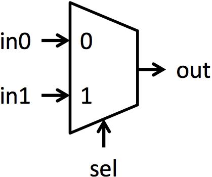
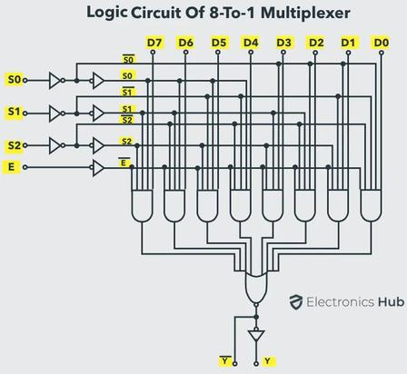
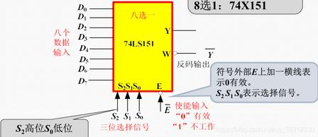

# 2.8.3 数据选择器 MUX

> 拆自 [2.8_组合逻辑模块.md](./2.8_组合逻辑模块.md) · 内容完整保留
> ↔ [CSAPP §4.2 HCL](../../02-computer-systems/chapter-04-processor-architecture/notes/section-4.2-HCL逻辑与组合电路.md)

### 2.8.3 数据选择器 MUX

**一句话：** 多路数据入 + 地址选通道 → **一路数据出**（多进一出）。



**2 选 1（最小模型）：** `sel=0` → `out=in0`；`sel=1` → `out=in1`。  
公式：Y=bar S· I0+S· I1。  
→ 可作 D 锁存直觉：`out` 反馈回 `in0`，`in1=D`，`sel=EN` → EN=1 跟 D，EN=0 保持（与 [3.2](../ch03_sequential/3.2_锁存器和触发器.md) 电平锁存同源思想）。

| | 3–8 译码器 | MUX（如 8 选 1） |
|--|------------|------------------|
| 地址做什么 | → 多路**控制/选中**信号 | → 挑哪一路**数据**送到 Y |
| 输出是什么 | 控制线（如 /CS） | **数据** 0/1 流 |
| 内部关系 | 最小项阵列 | **≈ 小型译码 + 与或**：Y=sum mi Di |

生活类比：译码=按编号只点亮一盏灯；MUX=按编号只把一台播放器接到音箱。

#### 8 选 1（74HC151）标准模型






梯形符号：左宽入、右窄出。图中 I0~ I7 = 数据 D0~ D7；底边 S2 S1 S0 = 选择地址 A2 A1 A0（S2 最高位）；Out = Y。  
S2S_1S0=i → Y=Ii（使能有效时）。

**内部门级读法（印证「MUX=译码+与或」）：**  
S 经反相器得原/反变量 → 八个与门各吃 mi· Di· Eint → 或门汇总得 Y；再非得 /Y/W。  
使能脚 /E **低有效**：图中常先非成高有效内使能再进与门；/E=1 时各与门封死 → Y=0。

> **纠「三输入与门」：** 仅地址最小项是 3 个字面量；再乘上 Di 就是 **四输入与**；若使能也进与门则是 **五输入**（教材图常见）。说「三输入」只指译码那三根，别漏掉 Di。

与 138 对照一句：两边第一级都是地址原/反变量；138 **只引出** /mi 控制线；MUX **多** mi· Di 与或 → 单路数据 Y。

| 脚 | 含义 |
|----|------|
| A2 A1 A0（或 S2 S1 S0） | 选择地址（与 3–8 译码地址同角色）；**S2 高位** |
| D0~ D7（或 I0~ I7） | 八路数据 |
| /EN//E | 使能，**低有效**（0 工作，1 不工作） |
| Y；W 或 /Y | 原码输出；反码输出 |

**逻辑（使能打开时）：**


Y = sumi=0^7 mi Di
= m0 D0 + m1 D1 + ·s + m7 D7


其中 mi 即地址最小项（与 138 同源）。

**使能公式坑（必纠）：**  
脚名 /EN 低有效：/EN=0 才工作。  
**不能**写成 Y=/EN·(sum mi Di)（把脚电平直接相乘）——使能有效时脚=0，乘积反成全 0。  
应记：


Y =
begincases
sum mi Di & /EN=0（使能） \\
0（或芯片规定的固定电平） & /EN=1（禁止）
endcases


或 Y = Eint·sum mi Di，其中 Eint=/(/EN)。

**真值表（/EN=0）：** 地址 i → Y=Di（000→D₀ … 111→D₇）。

#### 内部门级（打通译码）

```
A2A1A0 → [反相器] → 全部最小项 m0…m7   ← 等价小型 3–8 译码思想
              │
         mi & Di（与）
              │
         全部相或 → Y
```

**结论：** **MUX = 译码（最小项）+ 与或阵列**。芯片内部常是同一套原/反变量树，不必真焊一颗 138。  
CMOS 层仍多落到 NAND/NOR 等价实现；学到门级与或即可，不拆版图。

#### MUX / DEMUX / 译码：边界钉死（同源 ≠ 等价）

**结论：** 底层都是**最小项地址译码**；但 **不能**说「MUX = 3–8 译码器」。DEMUX 则是译码器的一种**用法/工作模式**。

| 说法 | 对错 |
|------|------|
| MUX 就是 3–8 译码器 | ❌ |
| MUX **内部含有**一套 3–8 形式译码 | ✅ |
| DEMUX 是全新另一种电路 | ❌（功能名不同） |
| DEMUX = 3–8 译码器换信号定义（使能当数据） | ✅ |

**口诀：** 译码器是底座；DEMUX = 底座换用法；MUX = 底座再加数据选择（与或）通路。

```
地址译码（最小项）
├─ 只出控制线          → 3–8 译码器（片选等）
├─ 使能脚改定义为 Data → DEMUX（一进多出；芯片可不改焊）
└─ + mi&Di 与或阵列    → MUX（多进一出；多一整套数据通路）
```

比喻：译码=只扳 8 个开关的控制器（无数据通道）；DEMUX=用控制器把一路数据送到选中线；MUX=先造同款控制器，打开一路数据通道汇到一根线。

| | 3–8 译码（138） | 8 选 1 MUX（151） |
|--|-----------------|-------------------|
| 有无数据入 | 无（作译码时） | 有 D0~ D7 |
| 译码产物 | 常引出 /mi（低有效） | 内部用 **原码** mi（极性不同，同源） |
| 输出 | 8 路**控制** | 1 路**数据** Y=sum mi Di |
| 公式 | /Yi=/(EN·mi) | 使能开时 Y=sum mi Di |

**踩坑：** 138 外接拼 MUX 要处理 /mi→mi；工程用 151。

#### 两大用途（接上节）

| # | 用途 | 要点 |
|---|------|------|
| 1 | **数据通路切换** | 多源共用一线；改地址轮流选通（传感器、总线源） |
| 2 | **实现任意组合函数**（考点） | 变量接选择端；真值表 0/1 接到各 Di（常无需外部门） |

与译码器实现函数对照：

| 方案 | 做法 |
|------|------|
| A 译码器 | 138 出 /mi + 外接与非 → F=sum m |
| B MUX | 地址=变量，Di=该行函数值 0/1 → 直接得 F |

CPU 数据通路大量 MUX（CSAPP §4.2）；HFT/FPGA 里也是选通与延迟敏感点。

#### 自测：4 选 1 实现三变量函数 F(A,B,C)

选择端只有 2 根，不能三变量都接地址。标准手法：

- A1 A0 接 **两个**变量（如 B,C）
- 第三个变量 A（及其 /A、常量 0/1）接到四个 D 端，使对每一组 BC，D 上出现「以 A 为变量的子函数」

例：对固定 BC，若真值表要求 F=/A，则该 Di 接 /A；若 F=1 则该 Di 接 1。  
→ 4:1 可实现任意 3 变量函数（数据端允许接变量/常量）。8:1 则三变量全接地址、Di 只接 0/1 即可。

---

