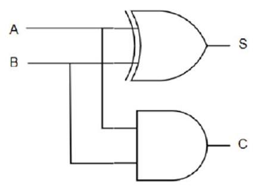
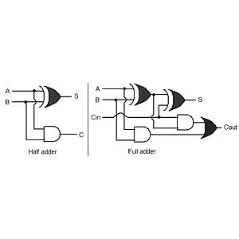

# 2.8.5 加法器（运算核心）

> 拆自 [2.8_组合逻辑模块.md](./2.8_组合逻辑模块.md) · 内容完整保留

### 2.8.5 加法器（运算核心）

细节精读 → [5.2](../ch05_digital_blocks/5.2_算术电路.md)。

#### 半加器 Half Adder（无低位进位）




| | |
|--|--|
| 入 | A、B（两比特） |
| 出 | S=A⊕ B（和）；C=A· B（进位） |
| 门 | 上 **XOR** → S；下 **AND** → C |

全与非实现（共享 /AB）→ [1.5 · 全与非半加器](../ch01_binary/1.5_逻辑门.md)。

| A | B | S | C |
|---|---|---|---|
| 0 | 0 | 0 | 0 |
| 0 | 1 | 1 | 0 |
| 1 | 0 | 1 | 0 |
| 1 | 1 | 0 | 1 |

→ 只能加两比特，**没有**来自更低位的进位 Cin；多位加法要 **全加器**（再加 Ci）。异或你已会用 NAND 搭 → [1.5](../ch01_binary/1.5_逻辑门.md)。

#### 全加器 Full Adder（有 Cin，可级联）



| | 半加 | 全加 |
|--|------|------|
| 入 | A、B | A、B、**Cin** |
| 出 | S、C | S、**Cout** |
| 和 | S=A⊕ B | S=A⊕ B⊕ Cin（两级 XOR） |
| 进位 | C=AB | Cout=AB+(A⊕ B)Cin（两 AND + OR） |

读右图：第一级 XOR/AND = 半加 A,B；第二级把半加的和再与 Cin 异或得 S，并把「半加进位」与「(A⊕ B)· Cin」或起来得 Cout。  
→ **全加 ≈ 两半加 + 或**（进位合并）。多位：全加器串成行波进位链 → [5.2](../ch05_digital_blocks/5.2_算术电路.md)。

| 积木 | 输入 | 输出 | 备注 |
|------|------|------|------|
| **半加器 HA** | A、B | S、Co | **无** 低位进位；仅最低位 |
| **全加器 FA** | A、B、Ci | S、Co | 可级联多位 |
| **行波进位** | 多 FA 串 | | 进位逐级传，慢 |
| **超前进位 CLA**（如 74HC283） | 并行算进位 | | 更快；ALU 常用 |

减法：A-B=A+(~ B)+1（B 取反且最低位 Cin=1），补码。

#### 1 位 ALU（MUX 正式上场 · Harris / MIPS / CSAPP 同款思想）

```
A ──┬── AND ──┐
    ├── OR  ──┤
B ──┤         ├──► 4:1 MUX ──► Result
    │  FA     │         ▲
    └──(+/-)──┘    Operation
         ▲
    Binvert / Cin（减法则 B 取反且 Cin=1）
```

| 块 | 作用 |
|----|------|
| AND / OR（可再加 XOR 等） | 位逻辑，与加法**并行**算出 |
| 全加器 | 算术：加；减 = 加补码 |
| **4 选 1 MUX** | 用 Operation 挑选：AND / OR / ADD / SUB… 哪一路出 |

**钉死：** **ALU ≠ 加法器**。加法器只做加（减）；ALU = 算术 + 逻辑，靠 **MUX 选功能**。  
N 位 ALU：N 个 1 位切片横拼，全加器的 Cout→ 下一位 Cin（行波）；细节与 Flags → [5.2](../ch05_digital_blocks/5.2_算术电路.md)。

**链路：** CMOS → NAND/XOR → HA → FA → 1 位 ALU（FA+逻辑+MUX）→ N 位 ALU → CPU 运算单元。

---

