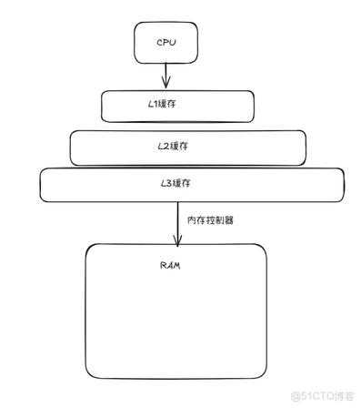

## 1.5 高速缓存至关重要

### 为何 cache 是性能第一公民

- CPU 与主存速度差距 **持续拉大**（「内存墙」）
- **缓存 (cache)** — 由 SRAM 构成的小而快的存储，自动保存主存中 **最近用过** 的数据副本
- 典型三级：**L1（指令/数据）→ L2 → L3（LLC）→ 主存**

**访存路径简图（越往下容量越大、越慢）：**



```
CPU → L1 缓存 → L2 缓存 → L3 缓存(=LLC) → 内存控制器 → RAM(DRAM)
```

- miss 逐级下探；L3 再 miss 才经 **内存控制器** 访问主存  

| 命中 | 含义 | 延迟量级（直觉） |
|------|------|------------------|
| L1 hit | 数据已在 L1 | ~1 ns 级 |
| L2/L3 hit | 逐级更慢 | 数 ns ~ 十数 ns |
| **cache miss** | 需访问 DRAM | ~50–100+ ns |
| 跨 NUMA | 远程节点 DRAM | 更慢 + 不一致风险 |

---

### LLC · L3 · L3C 三种叫法（别打架）

| 写法 | 全称 | 命名角度 |
|------|------|----------|
| **L3** | Level-3 Cache | 层级编号 |
| **L3C** | Level-3 **C**ache | 同上 + Cache 缩写成 C（文档里偶见；L1C/L2C 也能写，少用） |
| **LLC** | **Last Level** Cache | **功能定位** — 片上最后一级、再 miss 下 DRAM |

- 主流三级机：**L3 = L3C = LLC**，**同一块硬件**  
- 两级机：可能 **L2 = LLC**  
- **HFT / 服务器文档** 偏好写 **LLC**（强调「最后一级」）；见 **L3C** 时按 L3 Cache 读即可，不是第三种缓存  

---

### L1 · L2 · L3 存什么、归谁（拆开背）

#### 1. L1 = L1I + L1D（单核私有，必须拆）

CPU 同时干两件事：**取指令**（代码）与 **读写数据**（变量）— L1 直接拆两块，**互不抢通路**：

| 缩写 | 全称 | 存什么 |
|------|------|--------|
| **L1I** | L1 Instruction Cache | **只存指令**（`add`/`mov`/`call`…） |
| **L1D** | L1 Data Cache | **只存数据**（变量、数组、临时值） |

- 每核 **各有一套** L1I + L1D  
- 容量最小、延迟最低  

**为何只有 L1 拆 I/D：** 取指与访数 **并行双路**；L2/L3 不做双路并行取，混存可简化硬件。

#### 2. L2（单核私有，统一混存）

| | |
|--|--|
| **存** | 指令 + 数据 **混放** |
| **作用** | 接 L1 miss：L1I 未命中 → L2 取指；L1D 未命中 → L2 取数 |
| **归属** | **仅本核**；他核不能直接读你的 L2 |
| **定位** | 次热缓冲区；比 L1 大、延迟略高、单位成本更低 |

```
运算单元
├─取指令 → L1I ──┐
└─读写数据 → L1D ─┘
                  ↓ miss
                L2（指令+数据混存 · 本核私有）
                  ↓ miss
                L3 (= L3C = LLC)
```

#### 3. L3 / L3C / LLC（全核共享，混存）

| | |
|--|--|
| **存** | 指令 + 数据混放 |
| **归属** | **全核共享**（不是私有） |
| **容量** | 片上最大；延迟在三级里最高 |
| **典型内容** | 各核 L2 淘汰后仍复用的行；**多线程共享** 变量（跨核常落这里） |

```
Core0 [L1I+L1D]→L2 ──┐
Core1 [L1I+L1D]→L2 ──┤
Core2 [L1I+L1D]→L2 ──┼── L3C/LLC 全核共享
Core3 [L1I+L1D]→L2 ──┘
                      ↓ miss
                    DRAM
```

#### 极简汇总表

| 层级 | 全称缩写 | 存储内容 | 归属 |
|------|----------|----------|------|
| **L1I** | L1 Instruction Cache | 仅指令 | 单核私有 |
| **L1D** | L1 Data Cache | 仅数据 | 单核私有 |
| **L2** | L2 Cache | 指令+数据混 | 单核私有 |
| **L3C** | L3 Cache（= **LLC**） | 指令+数据混 | **全核共享** |

| 层级 | 热度 | 容量直觉 |
|------|------|----------|
| L1I/D | 最热 | 最小（数十 KB） |
| L2 | 次热 | 中等 |
| L3=LLC | 相对更冷、共用 | 最大（数十 MB） |

再往下是 **DRAM（物理内存）**；再往外是磁盘。**虚拟内存**不是这塔上又一级 SRAM，而是 OS/MMU 在 **DRAM + swap** 之上造的 **逻辑地址抽象**（→ [§1.7.3](./section-1.7-操作系统管理硬件.md) · [Ch 9](../../chapter-09-virtual-memory/)）。

---

### 局部性（locality）— 程序行为决定 miss 率

1. **时间局部性** — 刚访问过的，很可能很快再访问（循环变量、热结构体）
2. **空间局部性** — 刚访问地址附近，很可能接着访问（数组顺序扫描）

**编译器/程序员能做的：** 数据结构布局、SoA vs AoS、对齐、避免冷路径污染 cache line。

**HFT 高频场景：**

- **Order book / ring buffer** 顺序访问 → 空间局部性好
- **指针 chasing、链表跳来跳去** → miss 多，P99 抖
- **伪共享 (false sharing)** — 两线程改同一 cache line 不同字段 → 行乒乓（→ [Ch 6](../../chapter-06-memory-hierarchy/)、[Ch 12](../../chapter-12-concurrent-programming/)）
- **perf `cache-misses` / `perf c2c`** — 生产验证（→ [14-Systems-Performance Ch 13](../../../15-Systems-Performance-2nd/chapter-13-perf/)）
- **LLC miss** — 热路径上常比 L1/L2 miss 更贵；关注共享数据布局、避免无意义的跨核踩 LLC

### 缓存按行 (cache line) 管理

- 常见 **64 字节一行** — 读 1 字节可能整行载入
- **预取 (prefetch)** 硬件/软件可隐藏部分延迟

→ 全书深入：[Ch 6 存储器层次结构](../../chapter-06-memory-hierarchy/)

---

← [本章导读](../README.md)
