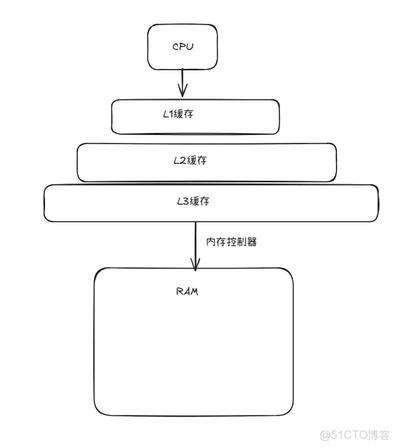

## 1.6 存储设备形成层次结构

### 存储层次（金字塔）

从快到慢、从贵到便宜、从小到大的 **层次结构 (memory hierarchy)**：



```
寄存器  →  L1 → L2 → L3(=LLC)  →（内存控制器）→  主存 DRAM  →  本地磁盘  →  远程存储
  ↑ 更快、更贵、更小                                                          ↓ 更慢、更便宜、更大
```

**图注：** 框越宽 ≈ 容量越大；L3 miss 后才经 **内存控制器** 访问 RAM。详细 L1I/L1D 拆分见 [§1.5](./section-1.5-高速缓存至关重要.md)。

**设计思想：** 上层是下层的 cache — 磁盘缓存页在内存，内存缓存行在 **LLC**，…

| 层级 | 典型用途 | HFT |
|------|----------|-----|
| 寄存器 / L1–L2 | 热路径计算、order book 热行 | 单核布局主战场 |
| **LLC (L3)** | 跨核共享、仍落片上 | 共享结构、避免无谓踩 LLC |
| DRAM | 工作集、mmap 行情缓冲 | NUMA 绑定、大页 |
| SSD | 日志、回放、配置 | 顺序写、避免热路径 sync |
| 网络存储 | 备份、研究数据 | **不在 tick 路径** |

### 与 1.5 的关系

- **1.5** 强调 CPU–cache–DRAM 路径延迟，并分清 **L1/L2/LLC**（→ [§1.5](./section-1.5-高速缓存至关重要.md)）
- **1.6** 把 **磁盘 I/O** 纳入同一图景 — I/O 慢几个数量级，必须 **异步 / 批量 / 摊销**

**HFT 实践：**

- 热路径：**零磁盘**（内存 ring、预分配）
- 冷路径：批量落盘、单独线程 + 专用核
- 基准：区分 **memory-bound vs I/O-bound**（→ [06.6-Systems-Performance Ch 12 基准测试](../../../06.6-systems-performance/chapter-12-benchmarking/)）

→ [Ch 6](../../chapter-06-memory-hierarchy/) · [Ch 10 系统级 I/O](../../chapter-10-system-io/)

### 自测题

<details>
<summary>1. 存储器层次结构的核心思想是什么？</summary>

**用层次结构弥补速度-容量-成本的三角矛盾**。每层都是下一层的缓存：寄存器→L1→L2→L3→DRAM→磁盘→网络。上层小快贵，下层大慢便宜。程序访问有局部性（时间+空间），所以大部分访问命中上层，平均访问时间接近上层速度。

</details>

<details>
<summary>2. 时间局部性和空间局部性分别是什么？给一个 HFT 的例子。</summary>

**时间局部性**：刚访问过的数据很快会再被访问（如循环变量、热点计数器）。**空间局部性**：被访问数据附近的数据很快也会被访问（如数组顺序扫描、行情队列连续读取）。HFT 例子：tick 队列用连续内存数组而非链表（空间局部性 → prefetcher 自动预取 → cache miss 少）。

</details>


---

← [本章导读](../README.md)
