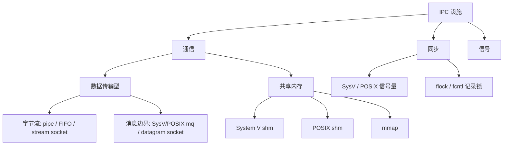

# TLPI 第 43 章 — Interprocess Communication Overview

> 对应目录：`chapter-43-ipc-overview/`  
> （勿用 `…-interprocess-communication-intro` — 与 [CHAPTER-MAP](../CHAPTER-MAP.md) 一致）  
> 书名原文：**Interprocess Communication Overview**  
> ⚠️ **导论章：建立分类与选型框架，不深挖 API。** 两大维度：**可访问范围** + **持久性**（进程 / 内核 / 文件系统）。共享内存必须另配同步。

**优先级**：🟡（IPC 全书地图）  
**前置**：[Ch42 共享库高级 / dlopen](../chapter-42-shared-libraries-advanced/notes.md)  
**后置**：[Ch44 管道与 FIFO](../chapter-44-pipes-fifos/notes.md)

---

## 章节目标

三类 IPC；通信再分「拷贝型 vs 共享内存」；命名/句柄表；持久性；SysV vs POSIX 铺垫；选型原则。

---

## 43.1 三大类

| 类 | 作用 |
|----|------|
| **通信** | 交换数据 |
| **同步** | 互斥、次序、消竞态 |
| **信号** | 异步事件；数据极少；实时信号可带少量 payload |

### 通信 · 数据传输型

写 → 内核缓冲 → 读；通常 **两次用户↔内核拷贝**。  
字节流：pipe、FIFO、流式 socket。  
消息边界：SysV/POSIX 消息队列、数据报 socket。

### 通信 · 共享内存

多进程映射同一物理页；**无内核拷贝，最快**。  
SysV shm · POSIX shm · `mmap`（匿名/文件）。  
⚠️ **本身无同步** → 必须配信号量/文件锁等。

### 同步

SysV 信号量 · POSIX 信号量（有名/无名）· `flock` / `fcntl` 记录锁。

---

## 43.2 命名与句柄（表 43-1 精简）

| 工具 | 跨进程识别名 | 进程内句柄 |
|------|--------------|------------|
| 匿名管道 | 无 | fd |
| FIFO | 路径名 | fd |
| UNIX / Internet socket | 路径或 IP:port | fd |
| System V IPC | `key_t` | IPC id |
| POSIX mq / 有名 sem / shm | `/` 路径名 | `mqd_t` / `sem_t*` / fd |
| POSIX 无名 sem | 无（放共享内存） | `sem_t*` |
| mmap 文件映射 | 文件路径 | fd |

痛点：SysV 独立 key/id，无标准路径名 → POSIX 用类文件名改良。

---

## 43.2 可访问范围 + 持久性（表 43-2 · 高频）

### 可访问范围

| 范围 | 例子 |
|------|------|
| 仅相关进程 | 匿名 pipe、匿名 POSIX sem |
| 本机任意（权限掩码） | FIFO、Unix socket、SysV/POSIX IPC、文件锁 |
| 跨主机 | Internet socket |

### 持久性（生命周期）

| 级别 | 含义 | 代表 |
|------|------|------|
| **进程持久** | 最后一方关句柄即毁 | pipe、FIFO、socket |
| **内核持久** | 须显式删或重启；进程全退仍在 | SysV IPC、POSIX 有名 mq/sem/shm |
| **文件系统持久** | 落盘，重启仍在 | 基于文件的 `mmap` |

坑：内核持久对象忘记 `*_unlink` / `ipcrm` → 资源泄漏、占满限额。

---

## 43.3 SysV vs POSIX（铺垫）

| | System V | POSIX |
|--|----------|-------|
| 时代 | 80 年代 SysV | 后标准化 |
| 命名 | key + id | `/name` 类路径 |
| 句柄 | IPC id | 偏 fd / 专用类型 |
| 持久 | 内核持久 | 有名对象多为内核持久 |
| 清理 | 易忘显式删 | 有 open/close/unlink 语义 |
| I/O 多路复用 | 弱 | mq 等更易接 poll/epoll（视实现） |

细读：Ch45–48（SysV）· Ch51–54（POSIX）。

---

## 43.4–43.5 选型原则

1. 大批量高吞吐 → **共享内存 + 同步**  
2. 亲缘进程简单单向 → **pipe**  
3. 无关本地字节流 → FIFO / UNIX 流 socket  
4. 消息边界 / 优先级 → **POSIX mq**（通常优于 SysV mq）  
5. 跨主机 → Internet socket  
6. 互斥/条件等待 → POSIX 信号量（或 futex 上层封装）  
7. 极老 UNIX 兼容 → 慎用/备选 SysV  

性能：拷贝型有内核缓冲开销；关键路径务必实测。

---

## 后续阅读路线

| 章 | 目录 |
|----|------|
| 44 | [pipes-fifos](../chapter-44-pipes-fifos/notes.md) |
| 45–48 | SysV IPC 全套 |
| 49–50 | [memory-mappings](../chapter-49-memory-mappings/notes.md) 等 |
| 51–54 | POSIX IPC |
| 55 | 文件锁 |
| 56+ | Socket |

---

## 思考题（43.6）

1. 匿名管道无路径名，只能靠继承 fd → 仅相关进程。  
2. 进程持久 vs 内核持久；SysV 忘删 → 泄漏。  
3. 共享内存可见同一数据，无原子/序保证 → 需同步。  
4. 无名 sem 无名字可打开，须放在双方都能看见的共享区。

---

## 背诵卡

| # | 要点 |
|---|------|
| 1 | 通信 / 同步 / 信号 三类 |
| 2 | 拷贝型 vs 共享内存（最快且须同步） |
| 3 | 命名：路径·fd vs SysV key·id |
| 4 | 持久：进程 / 内核 / 文件系统 |
| 5 | 跨机只用 Internet socket |
| 6 | 内核持久记得 unlink/显式删 |

---

## 参考

- Kerrisk · TLPI Ch43（非 Ch17）  
- 后续各章 `man` 页见对应笔记
