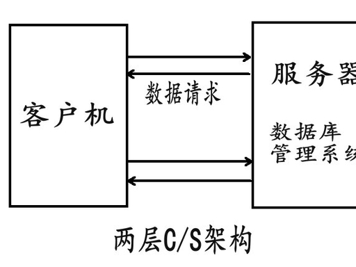
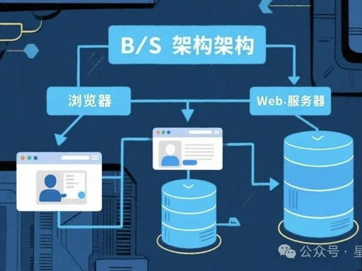

# 1.1 概述

> [1.2 时间客户](./1.2_SimpleTimeClient.md) · [1.7 OSI](./1.7_OSIModel.md) · [C/S→B/S](#ch1-1-cs-bs)  
> 同主题厚版：[TCP/IP 1.1 §四](../../../TCP-IP-Volume1-Protocols/chapter01-overview/1.1-architecture-principles.md#ch1-1-cs-bs)

---

## 核心主旨与关键论据

网络应用由 **客户（client）** 与 **服务器（server）** 通过 **协议（protocol）** 通信。以 **TCP/IP** 说明 LAN/WAN 互连；应用层逻辑端到端，物理上经协议栈与介质到达对端。

---

## 核心知识点

| 概念 | 说明 |
|------|------|
| **C/S 模型** | 客户主动请求，服务器被动响应 |
| **TCP/IP** | TCP 可靠字节流 + IP 路由 |
| **LAN** | 同网通信通常**无需路由器** |
| **WAN** | 跨网经**路由器**；最大 WAN = **Internet（因特网）** |
| **逻辑 vs 物理** | 应用层端到端；实际经本地栈→介质→对端栈 |

---

## 易错细节

| 易混 | 纠正 |
|------|------|
| **Internet vs internet** | 专有全球网 vs 任意 TCP/IP 网络（普通名词） |
| **HTTP vs TCP/IP** | HTTP 应用层；传输用 TCP，网络用 IP |
| **C/S vs B/S** | C/S 要装专用客户端；B/S 用浏览器，走 HTTP/HTTPS |

---

<a id="ch1-1-cs-bs"></a>

## C/S → B/S 演进（与 UNP 套接字、HTTP 对齐）

UNP 全书在 **C/S 模型** 上教 **socket API**（[1.2 客户](./1.2_SimpleTimeClient.md)、[1.5 服务器](./1.5_SimpleTimeServer.md) 即经典 **三层 C/S** 里的客户机 ↔ 应用服务器）。下面把**部署形态**从老两层 C/S 讲到 B/S，便于和自顶向下 HTTP 章打通。

### 人话定义

| | 你要装啥 | 例子 |
|---|----------|------|
| **C/S** | **专用客户端** | QQ、迅雷、老财务软件；**UNP 时间客户端** |
| **B/S** | **浏览器** | 淘宝网页、网课；底层仍是 **TCP + HTTP** |

### 演进时间线（必背）

```text
① 两层 C/S     客户机 ──────────────► 数据库（DBMS）
② 三层 C/S     客户机 ──► 应用服务器 ──► 数据库   ← UNP 时间服务属此类
③ B/S          浏览器 ──► Web服务器 ──► 应用服务器 ──► 数据库
```

### 两层 C/S 结构图（胖客户端直连库）



- 界面、业务逻辑、**连库**都在客户机；服务器侧主要是 **DBMS**。
- 问题：逐台装客户端升级难；客户端握库账号 → **安全/并发差**。

### 三层 C/S（UNP 起点）

```text
客户机 ── TCP/socket ──► 应用服务器（如 daytime 守护进程）──► （可选）数据库
```

- [1.2](./1.2_SimpleTimeClient.md) `socket` + `connect` + `read` = **客户**；[1.5](./1.5_SimpleTimeServer.md) `bind` + `listen` + `accept` = **服**。
- 协议常是 **自定义 TCP 端口**（如 13 号 daytime），**不是 HTTP**。

### B/S 结构图（浏览器换客户端）



- 浏览器极瘦；业务在服务器；应用层统一 **HTTP/HTTPS**。
- 下面仍是 **TCP → IP → 链路层**（与 UNP 第 2～3 章、自顶向下一致）。

### 一句话对比

| | C/S（含 UNP 示例） | B/S |
|---|-------------------|-----|
| 安装/升级 | 要装/编译客户端 | 有浏览器即可 |
| 协议 | 私有或简单文本 over TCP | **HTTP/HTTPS** |
| 本书 | **全书 socket C/S** | 对照 [§2.2 HTTP](../../../top_down/02_application_layer/2.2_http_and_web/study.md) |

### 30 秒背诵

**两层直连库 → 三层加应用服（UNP socket）→ B/S 换浏览器走 HTTP。C/S 要装软件；B/S 好维护。**

### 后续拓展留白

- [ ] 前后端分离（REST + Vue/React）
- [ ] Electron / Flutter 混合客户端
- [ ] 与 [Ch 5 并发回射](../Chapter05_TCP_Client_Server_Demo/study.md)、[Ch 30 设计模式](../../4_ArchitectureDesign/Chapter30_Client_Server_DesignMode/study.md) 对照

---

## 个人学习总结

（待填）
