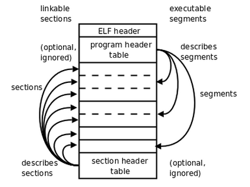

# Ch 3 §3.2 ELF 三大核心结构 · 链接视图 vs 执行视图

> **MikanOS** · 原书第 3 章

## ELF 三大核心结构

同一份 `kernel.elf` 文件，从上到下 **物理布局** 大致是：

```
┌─────────────────────────┐
│  ELF Header             │  ← 魔数、架构、入口 e_entry、各表偏移
├─────────────────────────┤
│  Program Header Table   │  ← Bootloader / QEMU 加载时读这张
├─────────────────────────┤
│                         │
│  .text / .data / .bss   │  ← 段 (Segment) 与 节 (Section) 叠在这里
│  …（中间大块）           │
│                         │
├─────────────────────────┤
│  Section Header Table   │  ← 链接器、readelf -S、gdb 读这张
└─────────────────────────┘
```

| 结构 | 给谁看 | 核心内容 |
|------|--------|----------|
| **① ELF Header** | 所有人 **第一站** | 魔数 `7F ELF`、**架构** (x86-64)、**入口地址 `e_entry`**、Program/Section 表在文件中的 **偏移** |
| **② Program Header Table (PHT)** | **Bootloader、OS Loader、QEMU `-kernel`** | 每个 **Segment（段）**：`.text`、`.data` 等 **如何载入内存** — 虚拟地址、文件偏移、大小、**R/W/X 权限** |
| **③ Section Header Table (SHT)** | **链接器、`ld`、`readelf -S`、`gdb`** | 每个 **Section（节）**：符号表、字符串表、**调试行号**、`.bss` 大小等 |

---

## 一张图：两种「读法」



### 链接视图（Linking View）— 左侧

| | |
|---|---|
| **谁用** | 编译器、**链接器 `ld`**、`readelf -S` |
| **依据** | **Section Header Table** 描述各个 **Section（节）** |
| **Program Header** | 在此视角 **可选、常被忽略** — 链接阶段关心 **节** 如何拼进文件 |
| **典型节** | `.text` 代码、`.data` 已初始化数据、`.bss` 未初始化、`.symtab` 符号 |

**白话：** 工厂 **装箱清单** — 每个 **零件（节）** 在箱子里的位置，方便 **再加工（链接）**。

### 执行视图（Execution View）— 右侧

| | |
|---|---|
| **谁用** | **MikanLoader**、QEMU、U-Boot |
| **依据** | **Program Header Table** 描述 **Segment（段）** — 往往 **多个 Section 合并成一个 Segment** |
| **Section Header** | 在此视角 **可选、可被忽略** — CPU 跑起来 **不需要** 节表 |
| **典型段** | `PT_LOAD` — 需要 **拷进内存** 的代码+数据 |

**白话：** **送货单** — 告诉 Loader：**把哪几大块搬到内存哪、能不能执行**。

---

## MikanLoader 只关心执行视图

```
MikanLoader 做的事 ≈ 只读 Program Header：

  for each PT_LOAD:
      AllocatePages(物理页)
      memcpy(文件偏移 → 内存)
  jump(e_entry)
```

| 工具 | 读的表 |
|------|--------|
| **MikanLoader** | **Program Header** (`readelf -l`) |
| **gdb** | **Section + 符号** (`readelf -s`, DWARF) |
| **你写链接脚本** | 决定 **节 → 段** 如何合并、**加载地址** |

---

## 关键字段速查

| 字段 | 在哪 | Loader 用途 |
|------|------|---------------|
| **`e_entry`** | ELF Header | 跳转地址 = 内核入口 |
| **`p_type == PT_LOAD`** | Program Header | 需要加载的段 |
| **`p_vaddr` / `p_paddr`** | Program Header | 载入 **虚拟/物理** 地址（Mikan 早期常一致） |
| **`p_filesz` / `p_memsz`** | Program Header | 文件大小 vs 内存大小（**.bss 扩展**） |
| **`p_flags`** | Program Header | **R/W/X** — 代码段要 **可执行** |

---

## 自检

- [ ] 能说出 **Section = 链接用，Segment = 加载用**
- [ ] 能解释 **为什么 gdb 需要节头，而 Loader 可以不要**
- [ ] 知道 **`readelf -l`** 对应 **Program Header**，**`-S`** 对应 **Section Header**

---

← [3.1 基础定义](./section-3-1-kernel.elf基础定义与核心作用.md) · [§3 索引](./section-3-第一个内核与ELF加载.md) · 下一节 [3.3 编译与链接脚本](./section-3-3-编译链接脚本与生成流程.md)
