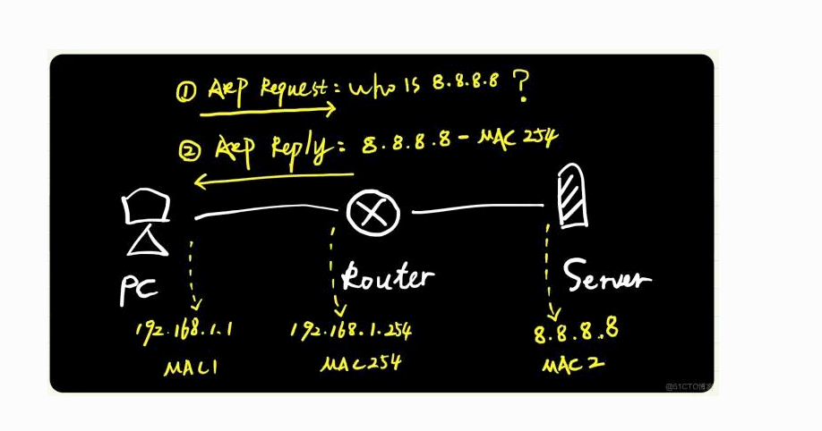
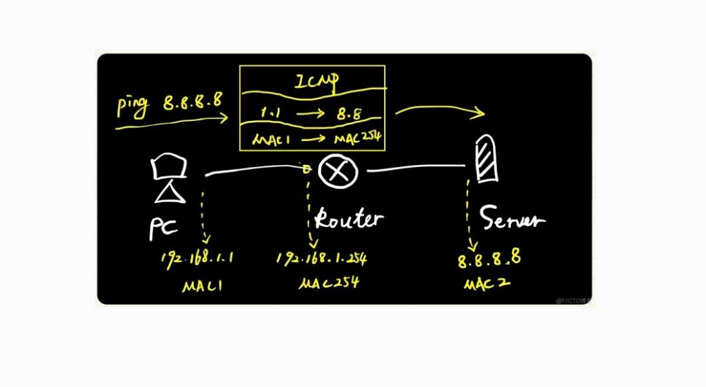

# 4.7 代理 ARP（Proxy ARP）

> 章级精读：[study.md#ch04-7-proxy](./study.md#ch04-7-proxy) · 正常网关路由：[4.2 §路由+ARP](4.2-arp-basic-operation.md#ch04-2-route-arp) · ARP 铁律：[4.2 §零附 C](4.2-arp-basic-operation.md#ch04-2-iron-rules) · 欺骗：[4.11](4.11-arp-spoof-defense.md)

## 本节核心目标

理解路由器**冒充目标主机**代答跨网段 ARP 的机制、前提条件，以及与**正常默认网关路由**的本质区别。

<a id="ch04-7-proxy"></a>

---

<a id="ch04-7-define"></a>

## 一、核心定义

**代理 ARP（Proxy ARP）**：路由器 / 三层设备收到**跨网段** ARP 请求时，**冒充目标主机**，用**自身入接口 MAC** 返回应答；让请求方误以为目标在**同一网段**，实际流量先发给路由器再**三层转发**。

**本质**：**善意的二层欺骗** — ARP 表出现「远端 IP → 网关 MAC」的**欺骗性映射**。

| 对比 | 说明 |
|------|------|
| **普通 ARP** | 同网段，目标主机**真实 MAC** 应答 |
| **正常网关路由** | 跨网段，主机 ARP **网关 IP**，得**网关 MAC** |
| **代理 ARP** | 跨网段，主机 ARP **目标 IP**，路由器**代答目标 IP** |

---

<a id="ch04-7-flow"></a>

## 二、机制（工作流程）

### 典型拓扑

| 设备 | 地址 | 说明 |
|------|------|------|
| **主机 A** | `192.168.1.10/24` | **无默认网关** |
| **路由器 R** | E0 `192.168.1.1/24`、E1 `10.1.1.1/24` | 连接两网段 |
| **主机 B** | `10.1.1.10/24` | 与 A **跨网段** |

### 步骤

| # | 动作 | 细节 |
|---|------|------|
| **1** | **A 发 ARP 请求（广播）** | A 误判 B 同网段，广播：**谁是 10.1.1.10？请回复 192.168.1.10** |
| **2** | **R 接收并判断** | 目标 IP **非**本地接口 IP；路由表**有** `10.1.1.0/24` 路由；接口**已开代理 ARP** → 触发代答 |
| **3** | **R 发 ARP 应答（单播）** | 回复 A：**10.1.1.10 的 MAC 是 R-E0-MAC**（自身 E0 MAC，**非 B 的真实 MAC**） |
| **4** | **A 更新 ARP 表** | 条目：**10.1.1.10 → R-E0-MAC**（误以为 B 在本地 LAN） |
| **5** | **数据转发** | A 发往 B 的帧：**目的 MAC = R-E0-MAC**；R 收帧后查路由，从 E1 转发至 B |

### 图示：代答过程



PC（`192.168.1.1`）无网关，广播问远端 `8.8.8.8`；路由器（`192.168.1.254` / MAC254）**冒充** `8.8.8.8` 应答。

### 图示：后续发包封装



`ping 8.8.8.8` 时：**IP 层** `192.168.1.1 → 8.8.8.8`（不变）；**以太网** `MAC1 → MAC254`（第一跳是路由器，与正常网关路由**帧形态相同**，但 ARP 表键不同 — 见下节对比）。

→ 正常跨子网（配网关）走读：[4.2 §路由+ARP](4.2-arp-basic-operation.md#ch04-2-route-arp)

---

<a id="ch04-7-prereq"></a>

## 三、关键前提（R 才会代答）

| 条件 | 说明 |
|------|------|
| ✅ **接口开启代理 ARP** | 现代设备**默认关闭**（如 Cisco `no ip proxy-arp` 为常见缺省） |
| ✅ **路由表存在目标网段路由** | 知道往哪转发，才“有资格”代答 |
| ✅ **请求为跨网段 IP 的 ARP 广播** | 同网段由目标主机自己应答，不触发代理 |

---

<a id="ch04-7-pros-cons"></a>

## 四、利弊

### 利（适用场景）

| # | 场景 |
|---|------|
| 1 | **主机无需配置默认网关** — 老旧设备 / 无路由栈的终端 |
| 2 | **网络透明化** — 主机“感觉”全在同一网段 |
| 3 | **兼容旧拓扑** — 早期网络、移动 IP、部分 VPN / 透明防火墙部署 |

### 弊（排障风险）

| # | 风险 |
|---|------|
| 1 | **排障极难** — ARP 表出现「跨网段 IP → 网关 MAC」，与正常「仅网关 IP → 网关 MAC」**混淆**，易误判二层连通性 |
| 2 | **ARP 风暴** — 每个远端 IP 都可能触发广播 ARP，**网段 ARP 流量激增**，占 CPU |
| 3 | **安全隐患** — 机制可被**恶意 ARP 欺骗**利用，伪造“代理”应答劫持流量 → [4.11](4.11-arp-spoof-defense.md) |
| 4 | **拓扑不清晰** — 隐藏三层结构，不利于运维与扩容 |

---

<a id="ch04-7-compare"></a>

## 五、易混点（必考）

### 代理 ARP ≠ 正常跨子网路由

| | **正常路由（配默认网关）** | **代理 ARP（无默认网关）** |
|---|---------------------------|---------------------------|
| A 的判断 | 目标**跨网段** | 误判目标**同网段** |
| ARP 问谁 | **网关 IP**（如 `192.168.1.1`） | **目标 IP**（如 `10.1.1.10`） |
| ARP 表 | **仅** `网关 IP → 网关 MAC` | **跨网段 IP → 网关 MAC**（欺骗性） |
| 帧 MAC 目的 | 网关 MAC | 网关 MAC（**形态相同**） |
| 帧 IP 目的 | 远端主机（不变） | 远端主机（不变） |

**关键区分**：看 ARP 表里**被解析的 IP 是网关还是远端主机**。

### 三方对比表

| 特性 | 普通 ARP（同网段） | 代理 ARP（跨网段） | 正常网关路由 |
|------|-------------------|-------------------|--------------|
| **响应者** | 目标主机 | 路由器 | 网关（**仅应答自身 IP**） |
| **ARP 请求目标** | 同网段 IP | **跨网段 IP** | **网关 IP** |
| **ARP 表条目** | 真实 IP → 真实 MAC | 跨网段 IP → 网关 MAC | 网关 IP → 网关 MAC |
| **主机配置** | 无需网关 | 无需网关 | **需默认网关** |
| **本质** | 二层直连解析 | 三层代答欺骗 | 三层路由转发 |

→ 间接交付总览：[4.2 间接交付](4.2-arp-basic-operation.md#ch04-2-indirect) · [study.md §4.2](study.md#ch04-2)

---

<a id="ch04-7-cheat"></a>

## 六、考点速记

| # | 要点 |
|---|------|
| 1 | 代理 ARP = 路由器**冒充目标**，用**自身接口 MAC** 代答**跨网段** ARP |
| 2 | 三条件：**开代理 ARP** + **有目标路由** + **跨网段 ARP 广播** |
| 3 | 利：无网关通信、拓扑透明；弊：排障难、ARP 风暴、安全风险 |
| 4 | 区分：代理 ARP **代答目标 IP**；正常路由 **仅应答网关 IP** |

---

<a id="ch04-7-lab"></a>

## 七、Lab / 排障提示

```bash
# 查看 ARP 表 — 若出现「远端网段 IP → 网关 MAC」，怀疑代理 ARP 或无网关主机
arp -a          # Windows
ip neigh show   # Linux
```

| 现象 | 可能原因 |
|------|----------|
| `10.x.x.x` 映射到网关 MAC，但本机**未配网关** | 路由器**代理 ARP** 生效 |
| 同网段 IP 映射到**非目标** MAC | ARP **欺骗**或代理，需对照拓扑 → [4.11](4.11-arp-spoof-defense.md) |

---

## 拓展

<!-- 待补：Cisco `ip proxy-arp` / 华为等价命令；常见排障步骤 -->

---

## 疑问与总结

**代理 ARP 让主机以为“全世界都在同一网段”；排障时先看 ARP 表键是网关 IP 还是远端 IP。**
