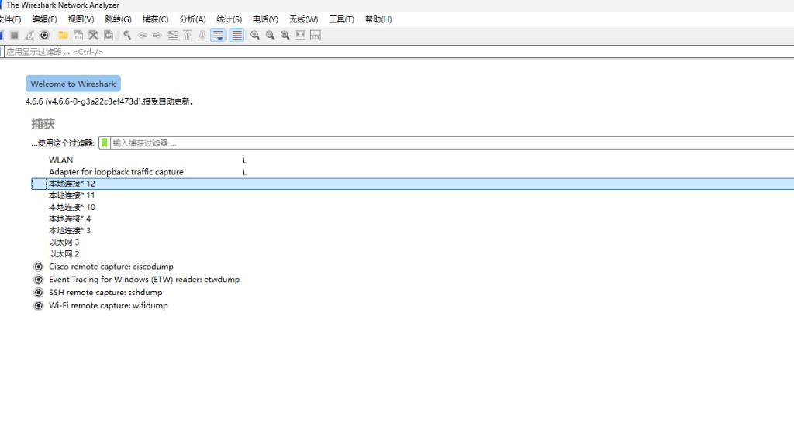
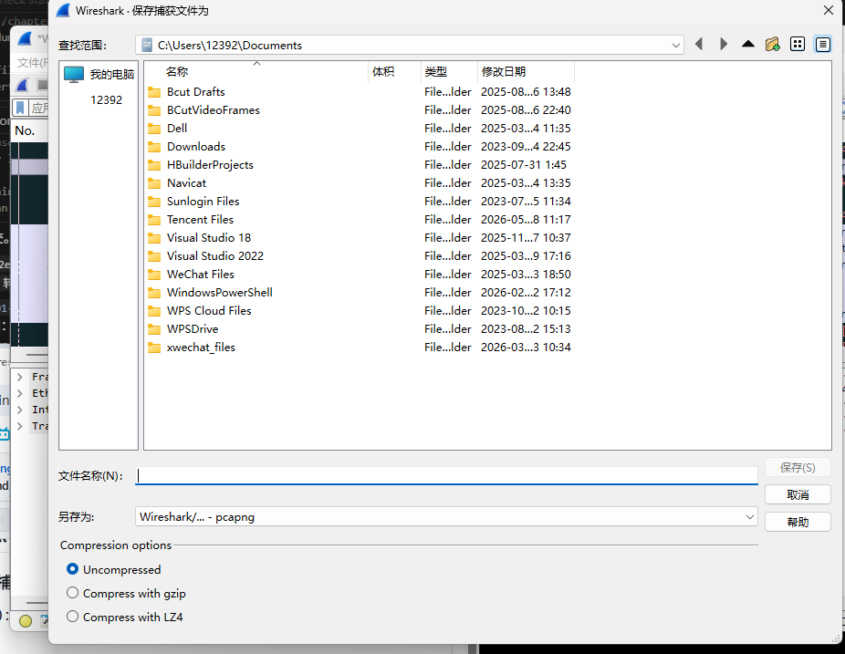

# 3.4 Wireshark 初步入门

> 本章：[chapter-summary.md](./chapter-summary.md) · 全书：[../README.md](../README.md) · 过滤器速查：[cheatsheet/notes.md](../cheatsheet/notes.md)

**核心主旨**：首次抓包、三面板界面、首选项、着色规则、全局/个人配置与 **Configuration Profiles**。

## 核心知识点

### 3.4.1 第一次捕获与基线思维

**基线（Baseline）**：在**网络正常**时抓一段代表性流量，作为日后对比「异常时多了/少了什么」的参照。

| 步骤 | 菜单/操作 |
|------|-----------|
| 1 | 启动 Wireshark，在**欢迎界面**或 `Capture` → `Interfaces` 选网卡 |
| 2 | 双击正在上网的接口（右侧**流量曲线在动**）开始捕获 |
| 3 | `Stop` 红色方块结束；运行典型业务一段时间再停 |
| 4 | `File` → `Save As…`（**保存捕获文件为**）存为 `.pcapng` 作基线档案 |

> 勿只在故障发生后才抓包——缺少正常对照难以判断异常。

#### 欢迎界面：选择捕获接口

启动后默认进入 **Welcome to Wireshark**，中央 **捕获** 区列出本机可用接口：



| 界面元素 | 说明 |
|----------|------|
| **接口列表** | **WLAN** = 无线；**以太网** = 有线；**本地连接 \*** = 虚拟/隧道等；选**正在上网**的那块 |
| **右侧曲线** | 实时流量「火花线」；**在动**说明该口有包，适合双击开抓 |
| **输入捕获过滤器 …** | 可选 **BPF 捕获过滤器**（抓之前就筛，如 `tcp port 80`）→ 与显示过滤器不同，见 [§4.5](../chapter-04-capture-packet/05-capture-filters.md) |
| **双击接口名** | 直接开始捕获（等同选中后点工具栏鲨鱼鳍） |
| **工具栏齿轮** | `Capture Options`：混杂模式、多文件、环状缓冲等 → [§4.4](../chapter-04-capture-packet/04-advanced-capture-options.md) |

| 怎么选 | 建议 |
|--------|------|
| 家里 Wi‑Fi 上网 | 通常选 **WLAN** |
| 插网线 | 选对应 **以太网** |
| 曲线不动 | 换接口，或确认 Npcap 已装、[§3.3](./03-install-wireshark.md) |

顶部 **应用显示过滤器** 栏在**抓完后**筛列表用；欢迎页抓之前要用列表上方的 **捕获过滤器** 输入框。

#### 保存捕获文件（Save As）

`File` → `Save As…` 打开保存对话框：



| 项 | 说明 |
|----|------|
| **文件名** | 必填（如 `baseline-home.pcapng`）；未填时 **保存** 按钮为灰 |
| **保存类型** | 默认 **Wireshark/… - pcapng**（推荐）：支持多接口、注释、选项等元数据；旧版 **pcap** 兼容性更好但功能少 |
| **压缩** | **Uncompressed**（默认，打开最快）· **gzip**（体积小）· **LZ4**（压缩/解压快，适合大文件归档） |

| 格式 | 何时用 |
|------|--------|
| **pcapng** | 日常、基线、交给他人用 Wireshark 分析 |
| **pcap** | 需给只认旧格式的工具 |
| **gzip / LZ4** | 长期存档、邮件传输；分析前 Wireshark 可直接打开压缩包 |

保存后可用 `File` → `Open` 离线分析；大流量也可先 [tcpdump 落盘](../chapter-06-tshark-tcpdump/03-capture-save-read.md) 再 GUI 打开。

### 3.4.2 主窗口三大面板

```text
┌─ Packet List（包列表）────────────── 序号、时间、源/目的、协议、Info
├─ Packet Details（包细节）────────── 协议树，可展开各层 Header/字段
└─ Packet Bytes（包字节）────────── 十六进制 + ASCII；与细节面板联动高亮
```

| 面板 | 作用 |
|------|------|
| **Packet List** | 全局索引；单击选中一包 |
| **Packet Details** | **分层结构化**解码；排障主战场 |
| **Packet Bytes** | 链路上**原始形态**；点击字段→对应字节高亮 |

### 3.4.3 首选项（Preferences）

`Edit` → `Preferences`，常用六块：

| 分类 | 典型调整 |
|------|----------|
| **Appearance** | 列、字体、配色 |
| **Capture** | 默认接口、**混杂模式**、是否实时刷新列表 |
| **Filter Expressions** | 保存常用显示/捕获过滤器 |
| **Name Resolutions** | 是否把 IP→主机名、MAC→厂商、端口→服务名（排障时可关以免 DNS 干扰） |
| **Protocols** | 各协议解码开关（如 TCP 相对序号） |
| **Statistics** | 统计模块内部选项 |

### 3.4.4 数据包彩色高亮（Coloring Rules）

`View` → `Coloring Rules`：按规则为行着色（默认如 DNS 蓝、TCP 绿等）。

| 场景 | 做法 |
|------|------|
| 快速区分协议 | 用默认规则 |
| 盯特定 IP/协议 | 新建规则，背景设**高亮色**（如明黄） |
| 恶意 DHCP 等 | 对 `bootp` / 指定 Server ID 定制颜色 |

着色作用于**显示**，不改变捕获内容；与**显示过滤器**可配合使用。

### 3.4.5 配置文件路径

`Help` → `About Wireshark` → **Folders** 标签：

| 类型 | 范围 |
|------|------|
| **Global configuration** | 全机所有用户默认 |
| **Personal configuration** | 仅当前账户；**优先于**全局 |

个人配置适合保存自己的列、着色、最近过滤器。

### 3.4.6 配置方案（Configuration Profiles）

将**列 + 过滤器 + 着色 + 首选项子集**存为命名方案，按场景切换：

| 场景示例 | 方案可含 |
|----------|----------|
| 延迟分析 | 相对时间列、TCP 着色 |
| 安全分析 | 可疑端口过滤器、告警色 |
| 蓝牙 / 专网 | 专用列与 dissector 设置 |

| 操作 | 路径 |
|------|------|
| 管理方案 | `Edit` → `Configuration Profiles` |
| **快速切换** | 点击界面**右下角当前配置名**下拉 |

每个方案对应**独立目录**，可打包备份或分享给团队。

## 抓包/实操记录

| 练习 | 目标 |
|------|------|
| 选口 | 欢迎界面看火花线，双击 **WLAN** 或当前上网的 **以太网** |
| 基线 | 正常时段抓 5 分钟 Web + DNS → `Save As` → `baseline-home.pcapng`（类型选 pcapng，先不压缩） |
| 保存 | 试一次 **gzip** 与 **Uncompressed** 体积对比；`File` → `Open` 确认都能打开 |
| 三面板 | 选中 HTTP 包，在 Details 展开 `Hypertext Transfer Protocol`，观察 Bytes 高亮 |
| 着色 | 为 `ip.addr == 你的网关` 设黄色背景 |
| Profile | 复制默认方案为 `lab`，增加「Delta Time」列 |

**捕获选项**：`Capture` → `Options` → 确认 **Promiscuous**（与 [§2.1](../chapter-02-traffic-monitor/01-promiscuous-mode.md) 一致）。

## 疑问与总结

- **显示过滤器**（抓完后筛）vs **捕获过滤器**（抓之前筛）——下章深入；初学先用显示过滤器即可。
- 名称解析打开后 Info 列更易读，但可能引入 **DNS 查询包** 本身，分析纯 L3 时可关闭。
- Profile 切换不会丢失已打开文件，但列与着色会随方案变。
