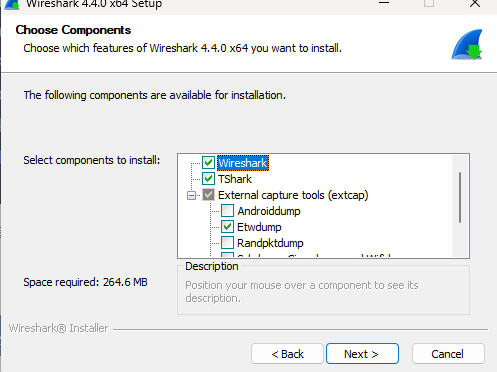
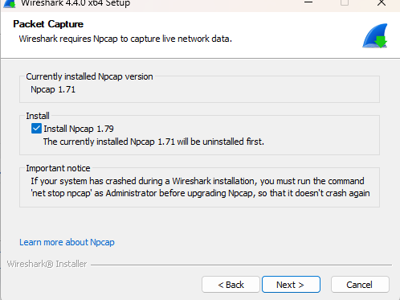
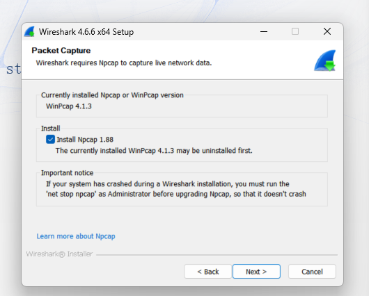
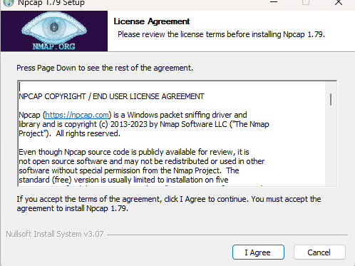

# 安装与首次抓包验证

> 速查：[notes.md](./notes.md) · Wireshark 详解：[§3.3](../chapter-03-wireshark-intro/03-install-wireshark.md) · tcpdump：[§6.2](../chapter-06-tshark-tcpdump/02-install-tcpdump.md)

照着做即可；装完后用本文 **第三节** 验证。

---

## 一、Wireshark（图形化）安装

### Windows（Win10/11 64 位）

1. 打开官网下载页：[https://www.wireshark.org/download.html](https://www.wireshark.org/download.html)
2. 选择 **Windows 64-bit Installer**（`.exe`），下载后双击运行
3. **许可协议**：阅读后点 **I Agree** / 同意
4. **Choose Components（选择组件）**：保持默认即可（**Wireshark**、**TShark** 建议勾选；扩展抓包工具 extcap 可按需）

   

   > **说明**：Npcap **不在**本页勾选，会在下一步 **Packet Capture** 单独安装。

5. **Packet Capture（抓包驱动）**：务必勾选 **Install Npcap**（必选）。未装 Npcap 则无法抓本机网卡实时流量。版本号随安装包变化（如 1.79、1.88），以界面为准。

   本机已有抓包驱动时，安装程序会提示先卸载再装，**属正常**，常见两种：

   | 当前已装 | 界面提示（示例） |
   |----------|------------------|
   | 旧版 **Npcap** | “The currently installed Npcap x.xx will be uninstalled first.” |
   | 旧版 **WinPcap** | “The currently installed WinPcap x.x.x may be uninstalled first.” → 由 Npcap 接替 |

   

   

   > 若此前安装 Wireshark 时系统崩溃过，需先以管理员运行 `net stop npcap` 再升级（安装程序界面有提示）。

6. **Npcap 子安装向导**：弹出 Npcap 窗口 → 许可协议点 **I Agree** → 其余选项一路 **Next** / 默认即可，直到完成

   

7. **安装路径**：Wireshark 主程序用默认路径（如 `C:\Program Files\Wireshark`）即可
8. 等待 Wireshark 与 Npcap 均安装完成
9. **开始菜单** 搜索并打开 **Wireshark**，进入主界面

| 组件/步骤 | 是否必选 | 说明 |
|-----------|----------|------|
| **Wireshark** | 是 | 图形界面 |
| **TShark** | 建议 | 命令行抓包/分析（同目录，可加 PATH） |
| **Install Npcap** | **是** | 抓包驱动；旧教材称 WinPcap，现用 Npcap |
| **USBPcap** | 否 | 仅 USB 抓包需要 |
| extcap（Androiddump 等） | 否 | 特殊场景再装 |

> 旧教材写 WinPcap；现行安装包为 **Npcap**，作用相同。

### macOS（Intel / Apple Silicon）

1. 官网下载 **macOS .dmg**
2. 打开 dmg，将 **Wireshark** 拖入 **Applications**
3. 首次运行若提示「无法打开」：
   - **系统设置** → **隐私与安全性** → **仍要打开**
4. 首次启动会安装命令行组件（**tshark** 等），按提示允许

可选：`brew install --cask wireshark`

### Linux（Ubuntu / Debian）

```bash
sudo apt update
sudo apt install wireshark -y
```

允许普通用户抓包（否则每次需 `sudo`）：

```bash
sudo usermod -aG wireshark $USER
# 注销并重新登录
wireshark
```

---

## 二、tcpdump / tshark（命令行）安装

### Linux（服务器最常用）

**Ubuntu / Debian**

```bash
sudo apt update
sudo apt install tcpdump -y
tcpdump --version
```

**CentOS / RHEL / Fedora**

```bash
sudo yum install tcpdump -y      # CentOS 7
sudo dnf install tcpdump -y      # CentOS 8+ / Fedora
```

### macOS

系统常**自带** `tcpdump`。若无或需新版：

```bash
brew install tcpdump
```

### Windows（无原生 tcpdump）

| 方案 | 做法 |
|------|------|
| **推荐：tshark** | 安装 Wireshark 后，将 `C:\Program Files\Wireshark` 加入系统 **PATH**，用 `tshark` 代替 tcpdump |
| **WSL** | 安装 Ubuntu 子系统，按 Linux 方式 `apt install tcpdump` |

---

## 三、快速验证是否装好

### Wireshark

| 检查 | 通过标准 |
|------|----------|
| 启动 | 打开后 **Interfaces** 列表有网卡，非全灰 |
| 试抓 | 双击某网卡 → 列表包计数递增 → **Stop** |

### 命令行

```bash
# Linux / macOS
sudo tcpdump -i any -c 5

# Windows（PATH 已配 tshark）
tshark -i 1 -c 5
```

能输出若干行包摘要 → 正常。`Ctrl+C` 结束 tcpdump。

---

## 四、安装后首次抓包（建议练习）

### A. Wireshark 抓网页流量

1. 打开 Wireshark → **Capture** → **Interfaces** → 选正在上网的网卡（如 Wi‑Fi / 以太网）
2. 勾选 **Promiscuous mode**（实验环境；无线可能受限）
3. **Start**
4. 浏览器访问 `http://neverssl.com` 或任意 HTTP 站（HTTPS 也可，但应用层需解密才见明文）
5. **Stop** → 显示过滤器输入：`http` 或 `ip.addr == 你的IP`
6. 点开一包 → 展开 **Frame → Ethernet → IP → TCP → HTTP**（若有）

### B. Wireshark 保存与过滤

| 操作 | 菜单/命令 |
|------|-----------|
| 保存 | **File** → **Save As** → `first.pcapng` |
| 只看 DNS | 过滤器：`dns` |
| 只看某 IP | `ip.addr == 192.168.1.10` |

### C. tcpdump 抓 10 个包落盘

```bash
sudo tcpdump -nni eth0 -c 10 -w /tmp/first.pcap
# 网卡名用 ip link 或 tcpdump -D 查看；Windows WSL 内同理
```

用 Wireshark 打开 `first.pcap` 分析。

### D. tshark 一行命令（Windows / 已装 Wireshark）

```powershell
tshark -i 1 -c 20 -w C:\temp\first.pcapng
tshark -r C:\temp\first.pcapng -Y "http" -n
```

`tshark -D` 查看接口编号。

---

## 五、如何用工具（对应关系）

| 你想做 | 用谁 | 章节 |
|--------|------|------|
| **图形化抓包、看协议树** | Wireshark GUI | [第3–4章](../chapter-03-wireshark-intro/chapter-summary.md) |
| **服务器后台抓包、脚本** | tcpdump / tshark | [第6章](../chapter-06-tshark-tcpdump/chapter-summary.md) |
| **分析已保存 pcap** | Wireshark 或 `tshark -r` | [第4–5章](../chapter-04-capture-packet/chapter-summary.md) |
| **排障慢/断** | Expert + 过滤器 | [第11章](../chapter-11-network-slow-fix/chapter-summary.md) |

**最小口诀**：线上 `tcpdump`/`tshark` **抓**，线下 Wireshark **看**；过滤器先记 `http`、`ip.addr == x.x.x.x`。
