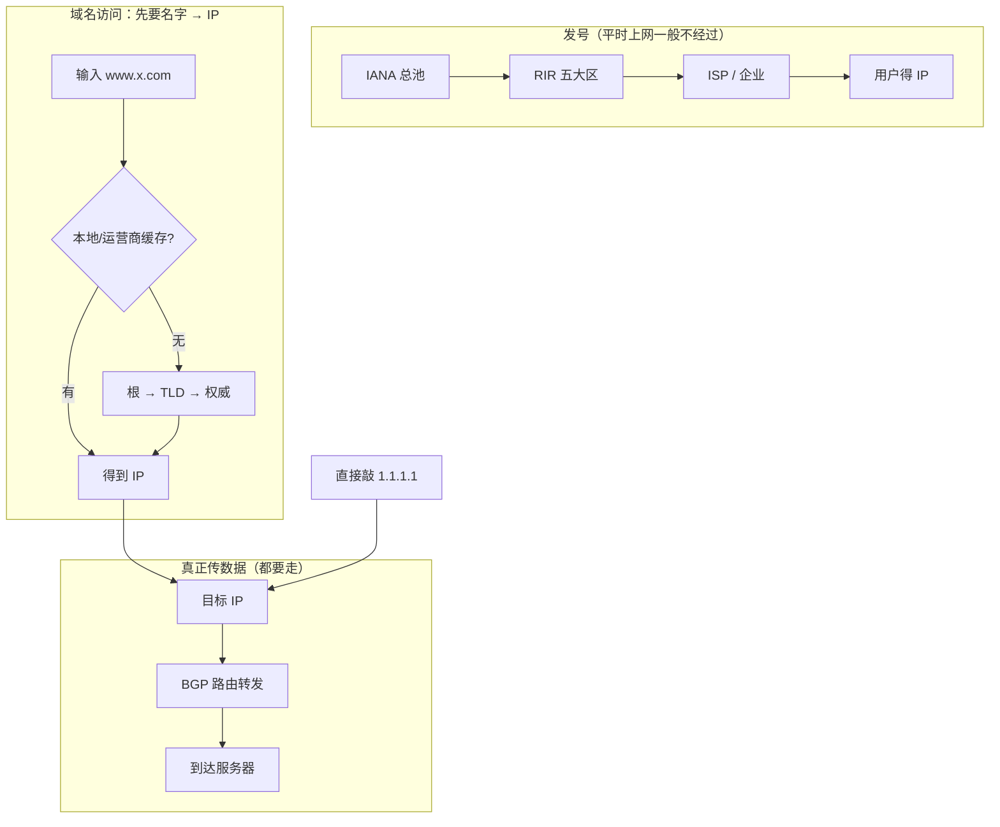

# 2.6 分配

> 章级精读：[../study.md#ch02-6](../study.md#ch02-6) · 站点规划：[2.7](./2.7-unicast-allocation.md)

## 本节核心目标

掌握 **全球 IP 空间的层级分配体系**、**和 DNS 的异同**（结构像、访问时不一样），以及 **WHOIS/RDAP 溯源**。

---

<a id="ch02-6-chain"></a>

## 一、层级结构（必考 · 记死这条链）

```text
IANA（全球池）→ RIR（5 大区域）→ LIR/ISP/大企业 → 终端用户/站点前缀
```

### 1）IANA（Internet Assigned Numbers Authority）

| 项 | 说明 |
|----|------|
| 角色 | 全球**顶级地址管家**（ICANN 运营） |
| 职责 | 管理 IPv4/IPv6 **总池**；分给 **5 个 RIR**（**不直接给 ISP/用户**）；兼管 AS 号、DNS 根、协议端口 |
| 粒度 | IPv4 典型 **`/8`**；IPv6 典型 **`/12` 或 `/23`** 等超大块 |

### 2）五大 RIR（Regional Internet Registry）

| 缩写 | 负责区域 | 备注 |
|------|----------|------|
| **APNIC** | **亚太**（中国、日本、韩国、澳洲等） | **中国 IP 查 APNIC** |
| **ARIN** | 北美（美、加等） | |
| **RIPE NCC** | 欧洲、中东、中亚 | |
| **LACNIC** | 拉美、加勒比 | |
| **AFRINIC** | 非洲 | |

### 3）LIR / ISP / 大型企业

- **LIR（Local Internet Registry）**：本地注册机构，多为 **ISP 或大企业**。
- 从 RIR 拿块，再分给：下游小 ISP、企业/机房、家庭用户（IPv4 常经 **NAT**）。

### 4）终端用户或站点前缀

- 企业/家庭：公网前缀（IPv6 常见 **`/56`、`/64`**）或内网 + NAT（IPv4）。
- **公网 IP 必须层层分配 → 全球唯一、不重叠**。

---

<a id="ch02-6-vs-dns"></a>

## 二、IANA 发 IP vs DNS 域名（大白话）

> **IP 分配体系 = DNS 域名体系：层级结构一模一样，都是从上往下分。**  
> **但「平时上网访问」时，走的完全不是一条路。**

### 1）结构对比：都是「总管家 → 大区 → 下面一层层分」

| | **IP 地址（IANA 体系）** | **DNS 域名** |
|---|--------------------------|--------------|
| 总管家 | **IANA**（全球 IP 总池） | **根服务器**（13 组逻辑根 A–M） |
| 下一层 | **5 个 RIR**（APNIC 等） | **顶级域**（`.com`、`.cn` …） |
| 再往下 | **ISP / 大企业（LIR）** | **二级域**（`baidu.com`） |
| 最底 | **用户 / 站点** | **具体主机**（`www.baidu.com`） |

```text
IP：  IANA → RIR → ISP → 用户
DNS： 根   → TLD → 权威 → 网站
```

→ DNS 细节：[自顶向下 §2.4 DNS](../../top_down/02_application_layer/2.4_dns_service/study.md)

### 2）访问时完全不一样（最易混）

#### 用 IP 直接访问（如 `1.1.1.1`）

- **全程不经过 IANA、不经过 RIR、不查 DNS 根**
- IANA 只管**地址怎么发出去**，**不管数据包怎么跑**
- 数据靠 **BGP 路由** 在运营商线路里一层层转发 → [2.4 CIDR+BGP](./2.4-cidr-aggregation.md#ch02-4-bgp)

**一句话：IANA 只管发 IP，不管传数据。**

#### 用域名访问（如 `www.baidu.com`）

1. **先 DNS 解析**：本地缓存 → 递归 DNS → 根 → `.com` → 百度权威 → **拿到 IP**
2. **再按 IP 走 BGP 路由** 访问（这一步和「直接敲 IP」一样）

### 3）根服务器每天这么多查询，会崩吗？

**一般不会**，三个原因：

| 原因 | 大白话 |
|------|--------|
| **多镜像** | 13 组逻辑根（A–M），全球**大量镜像**，流量分散 |
| **缓存** | 电脑、路由器、运营商 DNS **解析完会缓存**；绝大多数请求**到不了根** |
| **只指路** | 根只告诉你「`.com` 去问谁」，**不存网页内容**，负载很轻 |

### 4）极简流程图



### 5）五句逻辑（直接抄笔记）

1. **IANA 分配 IP**：从上到下发地址，只管**归属**，不管数据包怎么走。  
2. **DNS 解析域名**：根服务器从上到下**指路**，把域名翻译成 IP。  
3. **IP 访问**：直接 **BGP 路由**，全程**不经过** IANA、DNS 根。  
4. **域名访问**：先 **DNS**（可能查到根）→ 得 IP → 再 **BGP**。  
5. 根服务器不易崩：**多镜像 + 缓存 + 只指路不存内容**。

---

<a id="ch02-6-whois"></a>

## 三、WHOIS / RDAP 溯源（大白话）

<a id="ch02-6-plain-query"></a>

### 先搞懂几个词

| 词 | 大白话 |
|----|--------|
| **ISP** | **互联网服务提供商** = 卖宽带/流量、**分公网 IP** 的公司。**中国移动、联通、电信**都是 ISP；国外 Verizon、AT&T 也是 |
| **WHOIS** | **查 IP/域名是谁家的** = IP/域名的「**户口本查询**」（老工具，**文本**） |
| **RDAP** | **新版 WHOIS** = 功能一样，格式是 **JSON**，更规范，**优先用** |
| **curl** | 命令行里的「**迷你浏览器**」= 在终端里**发 HTTPS 请求**；RDAP 走网页，所以常用 `curl` 去查 |

**层级一句通**

```text
IANA 总管 → 分给五大 RIR（亚太是 APNIC）→ 分给 ISP（如中国移动）→ 分给你
想查 IP 是谁家的？→ WHOIS 或 RDAP（RDAP 用 curl 访问）
```

### 三条命令（复制就能跑）

```bash
# 1）WHOIS：查 IP 归属（系统需已安装 whois）
whois 223.5.5.5

# 2）RDAP：去 APNIC 查同一 IP（返回 JSON）
curl https://rdap.apnic.net/ip/223.5.5.5

# 3）RDAP 看得更清爽（有 jq 时；没有可跳过）
curl -s https://rdap.apnic.net/ip/223.5.5.5 | jq ".name, .country, .entities[0].vcardArray"
```

> 示例 `223.5.5.5` 常为公共 DNS 等；**以查询结果里的组织名为准**。文档网段可用 `203.0.113.0` 练手。

**WHOIS 典型会看到**：属于哪家（ISP/公司）、来自哪个 RIR、分配时间、联系人、**abuse** 举报邮箱。

### WHOIS vs RDAP（专业对照）

| | WHOIS | RDAP |
|---|--------|------|
| 协议 | 传统，**TCP 43** | 现代（RFC 7480），**HTTPS + JSON** |
| 格式 | 文本，**各 RIR 不统一** | **结构化、统一、Unicode** |
| 怎么查 | `whois <IP>` | **`curl https://rdap.<RIR>/ip/<IP>`** |
| 现状 | 仍可用 | **五大 RIR 均支持，优先 RDAP** |

| RIR | RDAP 基址（亚太示例） |
|-----|------------------------|
| **APNIC** | `https://rdap.apnic.net/ip/` |
| ARIN | `https://rdap.arin.net/registry/ip/` |
| RIPE | `https://rdap.db.ripe.net/ip/` |

<a id="ch02-6-trace-three"></a>

### 溯源三要素（WHOIS/RDAP 和 BGP 啥关系？）

> **WHOIS/RDAP = 查档案**（谁买的、谁负责，**静态登记**）  
> **BGP = 跑路线**（数据包怎么走，**实时路由**）  
> 不是一个东西，**溯源攻击时常常两个一起用**。

| | WHOIS / RDAP | BGP |
|---|--------------|-----|
| 像什么 | **户口本、分配档案** | **实时导航图** |
| 记什么 | CIDR 分给谁、联系人、abuse 邮箱 | 哪个 **AS** 在宣告、流量从哪条路径来 |
| 存在哪 | **五大 RIR 官方库**（APNIC 等） | 各路由器里的 **路由表**（运营商之间**点对点交换**，**不是广播**） |

#### 1）前缀归属

**大白话**：CIDR 把一大段（如 `223.5.0.0/16`）分给**中国移动**，移动再切成 `/24` 分给下面。

**这些「谁拿到哪段」的记录，存在 RIR 数据库里**（APNIC、ARIN…）——谁拿了哪个 `/16`/`/24`、分给谁、何时分配。

**WHOIS/RDAP = 读这份官方档案** → **前缀归属 = 这个 CIDR 网段是谁家的**

#### 2）滥用投诉（Abuse）

登记 IP 时**必须留投诉邮箱**（如 `abuse@xxx.com`）：

> 我这个网段下的用户要是**发垃圾邮件、攻击、诈骗、DDoS**，请发邮件到这里，我来处理/封 IP。

**WHOIS/RDAP 把 abuse 邮箱查出来** → 你被某 IP 攻击 → 发邮件给对应运营商追责。

#### 3）路由溯源（和 BGP 配合）

**易混纠正**：**BGP 不广播**；是运营商之间**一对一交换路由信息**（和 [2.4](./2.4-cidr-aggregation.md#ch02-4-bgp) 里「对外只发聚合大前缀」是一回事）。

**两步配合**：

1. **RDAP/WHOIS**：这个 IP **属于哪个 AS**（自治系统，如中国移动 **AS9808**）、哪家运营商  
2. **BGP 路由表 / 路径工具**：攻击流量**从哪条线路、经过哪些 AS** 跳过来的

```text
被 IP 攻击 → RDAP：归属中国移动 → 查 BGP 路径：电信 → 移动 → 你
路由溯源 = 谁家的 IP + 流量怎么走过来的
```

<a id="ch02-6-aspath"></a>

#### 卡点：本地 BGP 记的是「出去的路」，怎么知道别人怎么「进来」？

**你先理解对了**：本地路由器的 BGP 表、**AS‑PATH**，记的是：

> **我要去某个 IP，要经过哪些 AS**（出去的方向）

**疑惑**：别人攻击我，流量是**进来**的；表里只有**出去**的路，怎么溯源？

**核心一句**：在**对称路由**假设下（教学/常考常用），**别人怎么来 ≈ 你怎么去的反向**。

```text
你家 AS1 ──要去──▶ 电信 AS2 ──▶ 移动 AS3   （本地 BGP：AS‑PATH = AS1 → AS2 → AS3）

移动 AS3 访问你：  AS3 → AS2 → AS1         （进来的反向路径）
```

| | 说明 |
|---|------|
| 本地 BGP 表 | 记**本机出去**到某前缀的 **AS‑PATH** |
| 别人进来 | 常假设与出去**同一条路，方向相反** |
| 注意 | 现网可能有**非对称路由**；精确路径要靠抓包/全网视图，不要死背「永远对称」 |

**第二个关键：溯源不靠你家里那张小表** → 见下节「公开 BGP 库」

<a id="ch02-6-bgp-global"></a>

#### 卡点：有没有「全球统一的 BGP 中央数据库」？所有 AS 表一样吗？

**先纠正最大误区**：**没有**一个全球统一、大家都去同步的 **BGP 中央库**！  
互联网**没有中心**；BGP 是 **AS 之间分布式、点对点互相传路由**，不是全体抄同一份数据库。

**真正的 BGP 怎么跑**

```text
移动 AS9808 ←──BGP邻居──→ 电信 AS4134 ←──→ 联通 … ←──→ 国外运营商
```

- 每个运营商 = 一个 **AS**
- **两两建邻居**，一对一交换自己知道的路由
- **没有总服务器**，各 AS 各自维护**自己的**路由表

**那「公开 BGP 数据库」是啥？**

| | 互联网里的 BGP | 公开 BGP 数据库（溯源用） |
|---|----------------|---------------------------|
| 谁用 | **各运营商自己的路由器** | **我们查路径、做溯源** |
| 怎么来 | AS 之间**点对点交换** | **第三方**（RouteViews、RIPE RIS、bgp.he.net…）与大量 AS 建邻居，**收集**路由后整理成网站 |
| 是不是中心库 | **不是** | **也不是**互联网在用的中心库，只是**收集结果的展示** |

> 真正的 AS **根本不用**这些网站；它们只给自己路由器跑 BGP。

**每个 AS 的 BGP 表一样吗？**

**绝对不一样。** 每个 AS **只存自己用得到的路径**：

| AS | 表里大概有什么 |
|----|----------------|
| 你公司 | 到电信、移动、默认路由… |
| 美国运营商 | 欧美、日韩相关前缀… |
| 非洲某 ISP | 可能**不知道**中国内部细路由 |

**为啥公开库上路径「看起来像全局」？**  
因为第三方收集了**很多 AS 发出来的路由**，拼成**上帝视角**给我们查；**不是**全世界 AS 表都相同。

**溯源最终版（WHOIS/RDAP + 公开 BGP）**

```text
1. RDAP/WHOIS → 攻击 IP 属于哪个 AS（如移动 AS9808）
2. 公开 BGP 库 → AS9808 宣告该前缀时，全网学到的路径（上帝视角）
3. 反推：移动 → 电信 → … → 到你
```

| 数据源 | 能看什么 |
|--------|----------|
| **本地 BGP** |  mainly **你出去**的路（AS‑PATH） |
| **公开 BGP 库** | **全世界**怎么学这段前缀（溯源用） |

工具（了解即可）：[bgp.he.net](https://bgp.he.net)、RouteViews、RIPE RIS、`bgp.tools` → [§5.3 BGP](../../top_down/05_network_layer_control_plane/5.3_bgp_inter_as_routing/study.md)

**五句写笔记**

1. **本地 BGP 表**：记**本机出去**的 AS‑PATH。  
2. **对称假设**：别人进来 ≈ 出去路径的**反向**（现网可能不对称）。  
3. **互联网 BGP**：**无中心库**，AS **点对点**交换；**各 AS 表各不相同**。  
4. **公开 BGP 库**：**第三方收集**，给人类溯源用，**不是**运营商在用的中心库。  
5. **路由溯源** = **RDAP 查 AS 归属** + **公开 BGP 查全球路径**。

> **必背一句**：本地 BGP 存**出去**的路；互联网 BGP **无中心、各 AS 表不同**；溯源看**第三方公开 BGP 库 + RDAP**，不是以为有个全球同步库。

### 笔记可直接抄（溯源三句 + 三个疑问）

**背诵版**

1. **前缀归属**：查该 CIDR 由哪个运营商/企业持有；记录存在 **RIR 数据库**。  
2. **滥用投诉**：查网段登记的 **abuse 举报邮箱**，用于攻击、垃圾流量追责。  
3. **路由溯源**：**RDAP 查 AS 归属**，**BGP 查转发路径**，二者结合定位源头。

**核心疑问速查**

| 疑问 | 答案 |
|------|------|
| 记录存在哪？ | CIDR 分配档案在 **五大 RIR 库**；WHOIS/RDAP **读取**它 |
| 滥用投诉是啥？ | 登记时留的 **abuse 邮箱**，举报攻击/诈骗用 |
| 和 BGP 啥关系？ | RDAP = **谁家的**；BGP = **怎么走**；BGP **不广播**，点对点换路由 |
| 有全球 BGP 中央库吗？ | **没有**；各 AS **表不同**；公开库是**第三方收集** → [#ch02-6-bgp-global](#ch02-6-bgp-global) |
| 本地 AS‑PATH 能溯源吗？ | 本地是**出去**的路；完整溯源用 **RDAP + 公开 BGP 库** → [#ch02-6-aspath](#ch02-6-aspath) |

### 考试常考结论

> **分得地址块 ≠ 自动全网可达**  
> 还须 ISP 向上游 **aggregate（聚合）并 announce（BGP 宣告）**，路由才扩散到全球。

### 笔记可直接抄（六条）

1. **ISP**：互联网服务提供商（移动、电信、联通等）。  
2. **RIR**：五大区域机构（**APNIC** 管亚太含中国）。  
3. **IANA**：全球总管理，把 IP 分给五大 RIR。  
4. **WHOIS**：老工具，查 IP 归属。  
5. **RDAP**：新工具，比 WHOIS 更规范（JSON）。  
6. **curl**：命令行访问 HTTPS，用来请求 RDAP 服务器。

→ CIDR 聚合 + BGP：[2.4 §三](./2.4-cidr-aggregation.md#ch02-4-bgp) · BGP 详解：[§5.3](../../top_down/05_network_layer_control_plane/5.3_bgp_inter_as_routing/study.md)

---

<a id="ch02-6-exam"></a>

## 四、30 秒写卷子

**层级**  
**IANA → RIR（APNIC/ARIN/RIPE/LACNIC/AFRINIC）→ LIR/ISP → 用户**。IANA **只分大块给 RIR**；APNIC 管**亚太含中国**。

**IANA vs DNS**  
结构同：自上而下分 · 访问异：**IP 直接 BGP**；**域名先 DNS 再 BGP**；IANA/根**不管传包**

**WHOIS/RDAP vs BGP**  
无中心BGP库 · 公开库=第三方收集 · 溯源=RDAP+公开BGP · 各AS表不同

**WHOIS/RDAP**  
**ISP**=运营商 · **curl**=查 RDAP · **有地址还要 BGP 宣告才全球可达**

---

## 五、自测（6 题）

1. 中国运营商拿到的 IPv4 块最初从谁分给 RIR？RIR 是？  
2. 企业从 ISP 领到 `/24` 后，为何外网仍可能 ping 不通？  
3. 访问 `8.8.8.8` 要不要先问 DNS 根？访问 `www.google.com` 呢？  
4. WHOIS 能代替 BGP 查攻击流量路径吗？BGP 是「广播」路由吗？  
5. 本地 BGP 表只有「出去」的 AS‑PATH，能据此知道攻击者怎么「进来」吗？  
6. 互联网里是不是有一个全球统一的 BGP 数据库，所有 AS 都去同步？

<details>
<summary>答案</summary>

1. **IANA** 分给 **APNIC**（亚太 RIR），再由 APNIC 分给 ISP（LIR）。  
2. 可能 **未在上游 BGP 宣告**、防火墙、或仅内网/NAT 未映射；**分配 ≠ 路由可达**。  
3. **8.8.8.8**：**不要**（已是 IP，直接路由）。**www.google.com**：先要 **DNS 解析**（通常命中缓存，很少真打到根），得到 IP 后再路由。  
4. **不能**。WHOIS/RDAP 查**静态归属**；路径要靠 **BGP 路由表/路径查询**。BGP **不广播**，是 AS 之间**交换**路由。  
5. **不能只靠本地表做完整溯源**。本地 AS‑PATH 是**出去**方向；对称时可**反推进来**；实战用 **RDAP 查 AS + 公开 BGP 库**。  
6. **不是**。BGP **分布式、点对点**交换；**没有**中心库。公开 BGP 网站是**第三方收集**；**每个 AS 的路由表各不相同**。

</details>

---

## 与下一节关系

- **2.6**：**谁发号**（全球层级 + 溯源）  
- **2.7**：**站点怎么用号**（家庭/企业/多宿主、PI）→ [2.7](./2.7-unicast-allocation.md)

---

## 个人学习总结

（待填）
