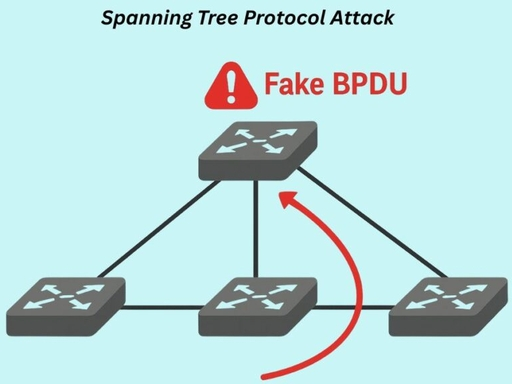

# 3.10 与链路层相关的攻击

> 章级精读：[../study.md#ch03-10](../study.md#ch03-10) · 自顶向下速查：[§8 分层攻击](../../../top_down/08_network_security/layer-attacks-cheatsheet.md) · 卷1 总览：[§1.8 体系结构威胁](../../chapter01-overview/1.8-architecture-threat.md)

## 本节核心目标

认识链路层（L2）**默认互信**带来的典型威胁与管控思路；理解常见 L2 攻击原理、危害及基础防护原则。

---

## 典型攻击（L2 / 接入层常见）

### 1）MAC 泛洪（MAC Flooding / CAM 表耗尽）

| 项 | 说明 |
|----|------|
| **原理** | 交换机 **CAM 表**（MAC→端口）容量有限（如 8K）；攻击者高速发送**大量不同伪造源 MAC** 的帧，把表撑满 |
| **结果** | 无法再学习合法 MAC；未知单播被迫**向所有端口泛洪**（像 Hub）→ 攻击者可嗅探本网段 |
| **工具** | `macof`、自定义脚本 |

→ 交换基础：[3.4](./3.4-bridge-switch-stp.md) · 嗅探前提：[Wireshark §2.1](../../../wireshark-packet-analysis/chapter-02-traffic-monitor/01-promiscuous-mode.md)

---

<a id="ch03-10-bpdu"></a>
<a id="ch03-10-stp-hijack"></a>

### 2）STP 劫持（Root Bridge Hijack / 生成树欺骗）

#### ① BPDU 是什么（大白话）

**BPDU = Bridge Protocol Data Unit（桥协议数据单元）** — 交换机之间用来**商量 STP** 的**专用二层报文**（不是 IP 包，不是用户上网流量）。

| 通俗点 | 说明 |
|--------|------|
| **为啥要 STP** | 交换机连成**环**会 **广播风暴**；STP 自动「剪掉」多余链路，留一棵**无环树** |
| **怎么商量** | 交换机**互发 BPDU** 打招呼（默认约 **每 2 秒**） |
| **BPDU 里有什么** | **桥优先级、MAC、路径开销、端口角色** 等 |
| **商量结果** | 全网比数据 → 选出 **根桥**（Bridge ID **最小** = 优先级 + MAC）→ 定 **RP/DP/BP**，阻塞冗余口 |

**环上例子（三步）**

1. 几台交换机成环，**不停互发 BPDU**  
2. 比 **优先级 + MAC**，**最小** 的当 **根桥**（网络「中心」）  
3. 其余交换机根据 BPDU **关掉一条多余线**，环路消失  

👉 **BPDU = 交换机的「聊天消息」，专门协商 STP 拓扑**。→ 选举细节：[3.4 STP](./3.4-bridge-switch-stp.md#ch03-4-stp)

#### ② 什么是「伪造 BPDU」

**伪造** = **不是正规交换机自动生成**的，而是攻击者用工具**手写、冒充**合法 BPDU 往外发。

| | **真实 BPDU** | **伪造 BPDU** |
|---|----------------|----------------|
| **谁发的** | **正常交换机**（协议栈自动） | **攻击者电脑/设备**（Yersinia、Scapy 等） |
| **内容** | 反映本机真实 Bridge ID、开销 | 常把 **优先级改成 0** 等，**故意全网最优** |
| **交换机反应** | 正常选举、收敛 | **分不清真假**，只认报文里的数 → 以为来了更强根桥 |

**劫持过程（四步）**

1. **正常**：交换机互发真 BPDU → 合法根桥 → 网络稳定  
2. **接入**：攻击者电脑插在某个**接入口**  
3. **造假**：手工构造假 BPDU，**优先级 = 0**（或更小 Bridge ID）发出去  
4. **收敛**：邻居交换机认为「新根桥来了」→ **全网 STP 重算** → 流量尽量**经攻击者** → **嗅探 / 篡改**

#### ③ 串联（STP 劫持在考什么）

| 步 | 概念 |
|----|------|
| 1 | **BPDU**：交换机协商 STP 的**沟通报文** |
| 2 | **伪造 BPDU**：人为制作的**假聊天消息** |
| 3 | **STP 劫持**：用假 BPDU **抢根桥** → **流量绕到攻击者** |

**本质（别记错）**

- ❌ **不是**伪装成交换机、也不是伪造普通业务帧  
- ✅ **是伪造 BPDU**（二层 **STP 控制报文**）

**一句话（考试/面试）**

> **STP 劫持 = 发优先级 0 的假 BPDU → 骗全网认我为根桥 → 流量全过我这里。**



> 图意：攻击者从**接入口**打入 **Fake BPDU**（二层控制帧，非业务 IP 包）→ 交换机按 STP **重选根** → 拓扑以攻击者为中心收敛。

#### 正常 vs 被劫持（流量怎么走）

**正常**（合法根桥 S0 在核心）

```text
        [S0 根桥·核心]
       /    |    \
    S1      S2      S3
   /  \    /  \    ...
  PC  PC  PC  PC

业务流：各交换机按 STP 算好的 RP/DP 转发，一般不经过边缘随机 PC。
```

**被劫持**（攻击者 Att 抢根）

```text
        [Att 假根桥]  ← 伪造 BPDU，Bridge ID 最优
       /    |    \
    S1      S2      S3
   /  \    /  \    
  PC  PC  PC  PC

业务流：为「回根/经根」路径被拉向 Att → Att 可嗅探/篡改再转发。
```

#### ④ 配套防御（对着原理记）

| 配置 | 大白话 | 防什么 |
|------|--------|--------|
| **BPDU Guard** | **接 PC 的口**一旦收到**任何 BPDU**（真假不论）→ 端口 **shutdown** | 从源头拦：**私接交换机** + **伪造 BPDU** 进网 |
| **Root Guard** | 该口**不能当根端口/不能让外侧当根** | 就算收到假 BPDU，**外侧也抢不走根桥** |

→ STP 背景：[3.4](./3.4-bridge-switch-stp.md#ch03-4-stp) · BPDU 名词：[§①](#ch03-10-bpdu)

---

### 3）无线嗅探 / WEP 破解（无线链路层）

| 项 | 说明 |
|----|------|
| **场景** | WLAN 是链路层延伸；早期 **WEP** 弱、易破；开放网**空中明文** |
| **危害** | 账号、Cookie、聊天等被嗅探 |
| **防护** | **WPA2/WPA3**、**802.1X**、无线 IDS |

→ 详见 [3.5 802.11](./3.5-wireless-80211.md) · 抓包：[Wireshark 第13章](../../../wireshark-packet-analysis/chapter-13-wifi-packet/chapter-summary.md)

---

<a id="ch03-10-arp"></a>
<a id="ch03-10-arp-spoof"></a>

### 4）ARP 基础 → 伪造 / 欺骗（L2/L3 交界）

先搞懂 **ARP 干什么、表在哪**，再讲攻击。

#### ① ARP 是干嘛的？

通信要两套地址配合：

| 地址 | 层级 | 作用 |
|------|------|------|
| **IP** | 三层（逻辑） | 找**哪台主机** |
| **MAC** | 二层（物理） | 找**哪块网卡** |

**ARP（Address Resolution Protocol，地址解析协议）**：**已知对方 IP，查出对应 MAC**。

**例子**（本机 `192.168.1.10` 要访问网关 `192.168.1.1`）

1. 发 **ARP 广播**：「谁是 **192.168.1.1**？请告诉 MAC！」  
2. 网关 **单播 ARP 应答**：「我是 192.168.1.1，MAC 是 **aa-bb-cc-dd-ee-ff**」  
3. 双方写入 **ARP 表**，以后同网段通信**直接用 MAC 转发**，不必每次都广播  

→ 报文格式与流程：[ch04 §4.2](../../chapter04-arp-protocol/4.2-arp-basic-operation.md)

#### ② ARP 表（ARP 缓存）存在哪里？

**ARP 表 = IP ↔ MAC 对应表**

| 项 | 说明 |
|----|------|
| **存在哪** | 每台设备的**内存**里（本机内核/协议栈；路由器、三层交换机也有 ARP/邻居缓存） |
| **谁有** | **电脑、手机、路由器**等；普通**二层交换机一般不帮终端维护 ARP 表**（只按 MAC 转发） |
| **特点** | **动态**、有**老化时间**（超时删除）；IP/MAC 变了会更新 |

**本机查看**

```text
Windows:  arp -a
Linux:    ip neigh
```

| IP 地址 | MAC 地址 |
|---------|----------|
| 192.168.1.1 | aa-bb-cc-dd-ee-ff |
| 192.168.1.20 | 11-22-33-44-55-66 |

→ 缓存与超时：[4.3](../../chapter04-arp-protocol/4.3-arp-cache.md) · [4.6](../../chapter04-arp-protocol/4.6-arp-cache-timeout.md)

#### ③ 什么是 ARP 伪造 / ARP 欺骗？

**原理**：ARP **没有身份验证**；设备收到 ARP **应答**（有时还有**无故应答**）往往**直接信、立刻改表**，不核实发送者是不是真主人。

攻击者：**主动发伪造 ARP** → 篡改受害者内存里的 **IP→MAC** 映射。

**中间人（MITM）四步**

```text
正常：  PC(192.168.1.10) ──► 网关(192.168.1.1 真MAC) ──► 外网

1. 攻击者告诉 PC：「192.168.1.1 的 MAC 是我」→ PC 的 ARP 表里网关 IP 绑到攻击者 MAC
2. 攻击者告诉网关：「192.168.1.10 的 MAC 是我」→ 网关回程也指向攻击者
3. PC 发出的包 → 二层先送到攻击者 → 攻击者再转给真网关
4. 攻击者可嗅探、篡改（上层无 TLS 时危害大）
```

**两种常见方向**

| 类型 | 篡改谁 | 效果 |
|------|--------|------|
| **欺骗终端** | 主机的 ARP 表 | 主机以为网关/邻居 MAC 是攻击者 |
| **欺骗网关** | 路由器 ARP 表 | 回程流量也经攻击者 |

<a id="ch03-10-arp-lan"></a>

#### ③附、ARP 攻击只能在同一局域网（二层广播域）

**结论：对。** ARP 欺骗/伪造**只能在本局域网（同一广播域）内发起**；外网隔着路由器**够不着**你的 ARP 表。

| 原因 | 说明 |
|------|------|
| **ARP 靠广播** | 请求常是 **二层广播**；广播帧**不会跨路由器**转发 |
| **路由器隔离** | 路由器把网络划成多个广播域；外网发来的 ARP 广播**进不了**你家内网 |
| **二层范围** | ARP 在**局域网内**传递；跨网段主机**收不到**你的 ARP，也**改不了**你本机表项 |

**例子**

| | 场景 |
|---|------|
| ✅ **能攻击** | 你、同事、蹭 Wi‑Fi 的人 — **同一台交换机/同一路由器 LAN 口**（同一网段/广播域） |
| ❌ **不能** | 外网网友、异地电脑 — 中间隔着**路由器/NAT/公网**，ARP **到不了** |

**补充**

1. **同一 Wi‑Fi** 通常仍是**同一广播域** → 可以 ARP 欺骗（除非做了**无线客户端隔离**）。  
2. 对方若经 **VPN / 隧道** **逻辑接入**你的内网，相当于进了同一 L2/L3 可达范围 → **也可能**发起 ARP 攻击（视隧道类型而定）。

**一句话**

> **ARP 靠广播传播，路由器拦广播 → 攻击只局限在局域网内部。**

→ 正常转发为何也仅限 LAN：[ch04 §广播域边界](../../chapter04-arp-protocol/4.2-arp-basic-operation.md#ch04-2-broadcast-boundary)

#### ④ 和 STP 劫持对比（一起背）

| | **STP 劫持** | **ARP 伪造** |
|---|--------------|--------------|
| **伪造什么** | **BPDU**（二层 STP 控制） | **ARP 报文** |
| **改掉什么** | **根桥 / 生成树拓扑** | **ARP 表（IP–MAC）** |
| **结果** | 流量**绕路**经攻击者 | 流量**绕路**经攻击者 |
| **共性** | **伪造协议报文 → 改变转发路径** | 同左 |

→ STP：[§2](#ch03-10-stp-hijack) · 防护：[4.11](../../chapter04-arp-protocol/4.11-arp-spoof-defense.md)（DAI、静态绑定、802.1X、**TLS**）· 抓包：[Wireshark §2.3.4](../../../wireshark-packet-analysis/chapter-02-traffic-monitor/03-sniff-on-switched-network.md)

#### ⑤ 极简总结

1. **ARP**：**IP 查 MAC**，衔接三层与二层。  
2. **ARP 表**：**IP+MAC**，在设备**内存**，会老化。  
3. **ARP 伪造**：发**假 ARP** 改别人表 → **MITM / 劫持**。  
4. **范围**：**仅同一广播域/LAN**；路由器隔广播，外网不能直接 ARP 你。

---

### 补充：做题常见 L2 攻击

| 攻击 | 要点 |
|------|------|
| **VLAN 跳跃（VLAN Hopping）** | 利用 **DTP** 协商或**双 802.1Q 标签**，跨 VLAN 访问 |
| **DHCP 耗竭 + 伪 DHCP** | 耗尽地址池，再发**假网关/DNS** |
| **MAC 欺骗（单 MAC 伪造）** | 冒充他人 MAC 接入或绕过 ACL |

---

## 防护原则（链路层加固）

### 1）物理与逻辑隔离

| 手段 | 作用 |
|------|------|
| **端口安全（Port-Security）** | 限制单端口最大 MAC 数、绑定固定 MAC |
| **802.1X** | 接入身份认证，未认证不能上网 |
| **VLAN 划分** | 缩小广播域，隔离业务/办公/管理网 |
| **私有 VLAN / 端口隔离** | 同 VLAN 内主机互不可见，防横向渗透 |

### 2）不信任接入交换机 / 接入端口

| 配置（示例） | 作用 |
|--------------|------|
| 接入口禁用 **DTP**（`switchport nonegotiate`） | 防 Trunk 伪造、VLAN 跳跃 |
| 接入口 **BPDU Guard** | 收到 BPDU → 端口 shutdown，防私接交换机 / STP 劫持 |
| **Root Guard** | 防非法设备成为根桥 |
| 核心服务器/网关 **静态 CAM 绑定** | 防动态学习被泛洪/欺骗扰乱 |

### 3）风暴抑制

限制广播/组播/单播风暴，防带宽与 CPU 被打满。

---

## 与端到端安全（重要结论）

- **链路层加固 ≠ 端到端安全**。
- L2 防护（端口安全、STP 防护、VLAN）只能防**局域网内底层劫持/嗅探**。
- 必须配合 **TLS/SSL、IPsec、VPN、强认证** 等高层安全，才能防跨网窃取与篡改。

→ [ch18 网络安全](../../chapter18-network-security/study.md) · [自顶向下 §8 TLS](../../../top_down/08_network_security/study.md#ch8-5)

---

## 高频考点 · 易混对比（刷题用）

| # | 考点 | MAC 泛洪 | STP 劫持 | ARP 欺骗 |
|---|------|----------|----------|----------|
| 1 | **攻击对象** | 交换机 **CAM 表** | **STP 拓扑 / BPDU** | 主机 **ARP 缓存** |
| 2 | **主要手段** | 海量**不同源 MAC** 帧 | 伪造 **BPDU（非伪装交换机）**、抢根 | 伪造 **ARP Reply** |
| 3 | **直接后果** | 交换机**泛洪**像 Hub | 流量被**引到攻击端口** | **IP→MAC** 指到攻击者 |
| 4 | **典型防护** | 端口安全、MAC 限制 | **BPDU Guard**、Root Guard | 静态 ARP、**DAI**、802.1X + TLS |
| 5 | **易混 / 范围** | 不是改 IP 路由表 | 不是填 CAM；靠**选根** | **仅同 LAN**（广播不到路由器外）；[详解](#ch03-10-arp-lan) |
| 6 | **帧特征** | — | — | 以太网 ARP；欺骗时 **IP 不变**、**MAC 指攻击者** |

**一层话区分**

- **MAC 泛洪**：搞垮交换机**学习表**，让别人流量**被泛洪出来**。
- **STP 劫持**：伪造 **BPDU 抢根桥**，让路径**绕到攻击者**（不是伪装交换机）。
- **ARP 欺骗**：搞垮主机**地址解析**，让帧**送到攻击者 MAC**。

---

## 一句话总结（背记）

链路层攻击利用交换机/无线/ARP 的**默认信任**，通过 **MAC 泛洪、STP 劫持、无线嗅探、ARP 欺骗** 实现嗅探与劫持；防护靠 **端口安全、802.1X、VLAN、BPDU/Root Guard、私有 VLAN**，但 **L2 加固不能替代 TLS/IPsec** 等端到端加密。

## 疑问与总结

- **二层攻击**多在**同一广播域**；三层（如 BGP 劫持）可波及更大范围 → [study.md#ch03-10](../study.md#ch03-10)。
- 抓包看到异常 **Gratuitous ARP**、大量 **ARP Reply** 无 Request，要联想到 ARP 欺骗与 [ch04](../../chapter04-arp-protocol/4.11-arp-spoof-defense.md)。
