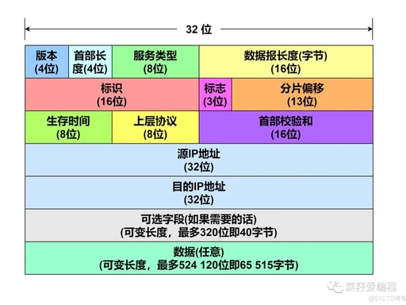
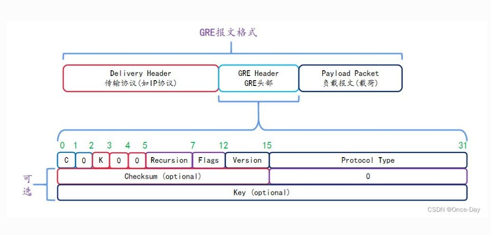
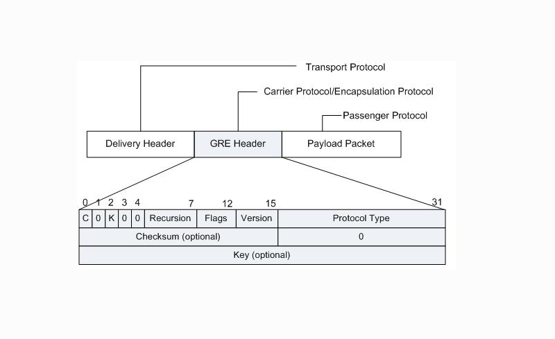

# 3.9 隧道基础

> 章级精读：[../study.md#ch03-9](../study.md#ch03-9) · MTU/PMTUD：[3.8](./3.8-mtu.md) · 网关隧道：[HTTP ch08](../../http-authoritative-guide/chapter-08-gateway-tunnel-relay/chapter-summary.md)（应用层对照）

## 本节核心目标

分清 **IPID ≠ IPIP**；**Type vs 协议号**；**IPIP/GRE** 作 **三层 VPN 隧道**（**+IPsec** 才安全）；掌握封装、**VXLAN** 对照及 **MTU/NAT**。

> **隧道思想**：在一种协议载荷里**再套一层头**，让内层包穿越**当前网络不原生支持**的路径；隧道端点**解封**后继续转发。

---

<a id="ch03-9-layer"></a>

## 零、名词与层级（先掰清楚）

### 1）IPID ≠ IPIP（极易混）

| 名词 | 是什么 | 记法 |
|------|--------|------|
| **IPID** | IPv4 首部里的 **16 位标识字段**，主要用于**分片/重组** | **不是协议**，别当隧道名 |
| **IPIP**（IP-in-IP） | **隧道协议**，把 IP 包套进 IP 里传 | **协议号 = 4** |

口语里把「IP 套 IP」说成 **IPIP**；若写成 **IPID**，多半是把 **Identification 字段**和 **IP-in-IP 协议**搞混了。

### 2）IPIP、GRE 属于哪一层？

**结论（背这句）**

- ✅ **IPIP、GRE 都是「网络层 / IP 型（三层）隧道协议」**
- ❌ **不是链路层（二层 / 以太网帧）协议**

| 协议 | OSI 位置 | IP 协议号 | 封装什么 |
|------|----------|-----------|----------|
| **IPIP** | **三层** | **4** | **仅 IPv4 包**（外层 IP + 内层整包 IP） |
| **GRE** | **三层** | **47** | **任意三层包**（外层 IP + GRE 头 + 内层） |

中间路由器按 **外层 IP 路由**（三层转发）；内层对它们**透明**，到隧道出口才剥壳。

### 3）为什么像「链路」？（逻辑链路 vs 本质）

隧道在运维上常配 **tunnel0** 之类接口，对上层像一根**虚拟点对点专线**：

| 视角 | 表现 |
|------|------|
| **对上层** | 像普通网卡：配 IP、跑路由、跑 OSPF |
| **对下层** | 实际用 **IP 包**在公网/骨干里转发，**不是**二层 MAC 逐跳交换 |

**一句**：**逻辑上是链路，本质是 IP（三层）封装。**

### 4）和二层隧道对照（IPIP / GRE / VXLAN）

| 对比项 | **IPIP** | **GRE** | **VXLAN**（对照用） |
|--------|----------|---------|---------------------|
| **层级** | **三层（IP 型）** | **三层（IP 型）** | **二层 overlay**（以太网帧 over **UDP/IP**） |
| **协议号 / 端口** | IP **4** | IP **47** | **UDP 4789**（常见） |
| **封装对象** | **仅 IPv4** | **多种 L3**（IPv4/IPv6/IPX…） | **以太网帧**（整帧） |
| **组播** | ❌ | ✅ | ✅（L2 广播域延伸） |
| **典型场景** | 容器网、简单 IP 隧道 | 企业 VPN、IPv6 过渡、传路由协议 | **数据中心 / SDN** 多租户 L2 |

→ IPIP / GRE 细节见 [§一](#ch03-9-ipip)、[§二](#ch03-9-gre)

### 5）一句话总结

- **IPID**：IP 头里的**编号字段**，**不是协议**。  
- **IPIP、GRE**：都是 **三层 IP 型隧道**，协议号 **4 / 47**，把三层包套进外层 IP 转发；**不是二层链路协议**。

→ 协议号在帧里还是 IP 里？[§零附](#ch03-9-eth-ip-proto) · [三种报文对比](#ch03-9-packet-compare)

---

<a id="ch03-9-eth-ip-proto"></a>

## 零附、协议号在哪？二层 Type vs 三层 Protocol

网络里有两个容易混的「类型/协议」字段，**位置不同、含义不同**。

| 位置 | 字段 | 长度 | 回答的问题 |
|------|------|------|------------|
| **以太网帧头** | **类型 / 长度**（EtherType） | **2 字节** | 帧载荷是 **IPv4、IPv6 还是 ARP** 等 → [3.2 EtherType](./3.2-ethernet-ieee802-encapsulation.md#ch03-2-frame) |
| **IP 首部** | **协议（Protocol）** | **1 字节** | IP **载荷里**是 TCP、UDP、ICMP 还是 **IPIP/GRE** 等 |

### 1）二层：以太网类型字段（不变样）

| EtherType | 含义 |
|-----------|------|
| **0x0800** | 帧里是 **IPv4 包** |
| **0x86DD** | 帧里是 **IPv6 包** |
| **0x0806** | ARP（对照） |

**IPIP / GRE 不会改变 EtherType**：隧道只是把 **IP 包再套一层 IP**；线上走的仍是 **IPv4 帧**，交换机眼里就是普通 IP，**Type 仍是 `0x0800`**，**看不出里面是隧道**。

### 2）三层：IP 首部协议号（区分 IPIP/GRE 的关键）

当 IP 载荷**不是** TCP/UDP，而是 **又一层网络层封装** 时，靠 **Protocol 字段** 区分：

| Protocol | 上层载荷 |
|----------|----------|
| **1** | ICMP |
| **4** | **IPIP**（内层又是一个 IP 包） |
| **6** | TCP |
| **17** | UDP |
| **47** | **GRE**（后跟 GRE 头 + 内层包） |

**Protocol 字段在哪？**

- 在 **IPv4 首部**里，**从首部第 0 字节起偏移 9** 的那 **1 字节**（图上「**上层协议**」，**8 bit**）
- **不在以太网帧头**；抓包时在 **Internet Protocol Version 4 → Protocol** 一列看

> **协议号写在外层 IP 头里**。以太网 Type 仍是 **`0x0800`**，看不出里面是 IPIP/GRE。

<a id="ch03-9-packet-compare"></a>

### 3）三种报文结构（图 + 字）

#### ① 普通 IPv4（如 TCP/UDP）



```text
以太网帧头 [Type=0x0800]
└─ IPv4 头 [Protocol=6 或 17 …]
   └─ TCP/UDP/ICMP 头 + 数据
```

```text
+---------------------+
|   IPv4 头           |  Protocol = 6 (TCP) / 17 (UDP) / 1 (ICMP) …
+---------------------+
|   传输层 + 应用数据  |
+---------------------+
```

#### ② IPIP（双层 IP，无中间头）

```text
以太网帧头 [Type=0x0800]
└─ 外层 IPv4 头 [Protocol=4]
   └─ 内层 IPv4 头 + 原始数据
```

```text
+---------------------+
|   外层 IPv4 头      |  Protocol = 4 (IPIP)
+---------------------+
|   内层 IPv4 头      |
+---------------------+
|   原始 IP 数据      |
+---------------------+
```

**特点**：**只有两层 IP**，没有 GRE 等额外头，**极简**。

#### ③ GRE（外层 IP + GRE 头 + 内层）

→ 总结构图：[GRE 包三层](./images/gre-packet-structure.png) · GRE 首部位图：[§二](#ch03-9-gre-header)

```text
以太网帧头 [Type=0x0800]
└─ 外层 IPv4 头 [Protocol=47]
   ├─ GRE 头（常 4～8 B，可有 Checksum/Key）
   └─ 内层 IPv4 头 + 原始数据
```

```text
+---------------------+
|   外层 IPv4 头      |  Protocol = 47 (GRE)
+---------------------+
|     GRE 头部         |  C/K、Protocol Type(内层类型) 等
+---------------------+
|   内层 IPv4 头      |
+---------------------+
|   原始 IP 数据      |
+---------------------+
```

### 4）三者一行对比（背）

```text
普通 IP：  [IP头 Prot=6/17/1…] [TCP/UDP/ICMP + 数据]
IPIP：     [IP头 Prot=4]        [内层IP头 + 数据]
GRE：      [IP头 Prot=47]       [GRE头] [内层IP头 + 数据]
```

| 类型 | 外层 **Protocol** | 载荷里是什么 |
|------|-------------------|--------------|
| **普通 IPv4** | **6 / 17 / 1 …** | **传输层**（TCP/UDP/ICMP） |
| **IPIP** | **4** | **又一个 IP 头** + 数据 |
| **GRE** | **47** | **GRE 头** + 内层包 |

**一句话**：**协议号都在外层 IP 头**；**IPIP = 多套一层 IP**；**GRE = 多套一层 IP + GRE 头**；**以太网 Type 始终 0x0800**。

### 5）Wireshark 里看哪（无图，按列找）

| 展开项 | 看什么 |
|--------|--------|
| **Ethernet II** | **Type: 0x0800**（三种都一样） |
| **Internet Protocol Version 4** | **Protocol: 4 / 6 / 17 / 47** ← **考点** |
| **IPIP 时** | 外层 Protocol=4 下再出现**第二个 IPv4** |
| **GRE 时** | Protocol=47 → **Generic Routing Encapsulation** → 内层 IPv4 |

过滤器示例：`ip.proto == 4`（IPIP）、`ip.proto == 47`（GRE）。

### 6）两句话差异（新手背）

| 层级 | 普通 IP vs IPIP/GRE |
|------|---------------------|
| **二层** | 三者一样，EtherType 都是 **`0x0800`** |
| **三层** | 靠 **IP.Protocol**：**6/17** vs **4** vs **47** |

### 7）速记口诀

```text
以太类型不变样（始终 0x0800），
IP 头里看编号：
IPIP 是 4，GRE 是 47，
普通载 TCP/UDP，六和十七。
```

---

<a id="ch03-9-ipip"></a>

## 一、IP-in-IP（IPIP）

**类型**：**网络层（IP 型）三层隧道**——最简单的 IP 封装；**不是**链路层协议。

### 典型形式

```text
[ 外层 IP 头 · 协议号 = 4 ] + [ 内层 IP 头 ] + [ 内层数据 ]
```

### ASCII 结构

```text
┌──────────── 外层 IP（穿越当前网）────────────┐
│ 协议字段 = 4 (IPIP)                          │
│ 载荷 = 整个「旧 IP 包」                      │
│   ┌────── 内层 IP 头 ──────┐                 │
│   │  内层数据              │                 │
│   └────────────────────────┘                 │
└──────────────────────────────────────────────┘
```

### 说明（大白话）

| 点 | 内容 |
|----|------|
| 怎么封 | 把**整个旧 IP 包（头+数据）**当载荷，外面**再加一个新 IP 头** |
| 干什么 | **跨异构网透传**：IPv4 over IPv4、IPv6 over IPv4 等 |
| 场景 | **容器网络**（Calico / Flannel 等）、简单 IP 隧道 |
| 限制 | **只装 IP**（不能装 IPX 等）；**无加密/认证**；**仅单播** |
| 开销 | **小**（只多一层 IP 头） |

**一句**：**IP 包套 IP 包**，轻量隧道，**只传 IP**。VPN 场景见 [§三附](#ch03-9-vpn)。

---

<a id="ch03-9-gre"></a>

## 二、GRE（Generic Routing Encapsulation）

**类型**：**网络层（IP 型）三层隧道**，**通用多协议**封装；**不是**链路层协议。

### 典型形式

```text
[ 外层 IP 头 · 协议号 = 47 ] + [ GRE 头 ] + [ 内层协议包 ]
```

内层可以是 **IPv4 / IPv6 / IPX / AppleTalk** 等。

### 三层封装（书上叫法 ↔ 笔记）



| 图上英文 | 中文 | 在 GRE 里通常是什么 |
|----------|------|---------------------|
| **Delivery header**（Transport protocol） | **投递/外层头** | **外层 IP**（隧道两端公网 IP，负责把整坨 GRE 包送到对端） |
| **GRE header**（Encapsulation protocol） | **封装头** | **GRE 头**（标明内层协议类型等） |
| **Payload packet**（Passenger protocol） | **载荷/乘客包** | **被隧道携带的原始包**（内层 IP、路由协议报文等） |

> **好记**：**外层送货（Delivery）→ GRE 贴标签 → 里面坐乘客（Payload）**。

### ASCII 结构

```text
┌──────── Delivery：外层 IP（协议=47）────────┐
│  ┌── GRE 头（Encapsulation）──┐             │
│  │  指明 Passenger 类型       │             │
│  └───────────────────────────┘             │
│     ┌── Payload：内层包 ──────┐            │
│     └─────────────────────────┘            │
└────────────────────────────────────────────┘
```

**和 MTU / DF=1**：封装后总长度 = **Delivery + GRE + Payload**。若 Payload 已按以太网 **1500** 发，再加头会 **> 链路 MTU** → 入口可能 **丢包 + ICMP 3/4**（DF=1 时）→ 内层有效 MTU 约 **1500 − 24 ≈ 1476**。→ [3.8 DF/PMTUD](./3.8-mtu.md#ch03-8-df)

<a id="ch03-9-gre-header"></a>

### GRE 首部字段（位图）



| 字段 | 要点 |
|------|------|
| **C** | =1 时带 **Checksum** 可选项 |
| **K** | =1 时带 **Key** 可选项（区分隧道内多路流） |
| **Protocol Type**（16 bit） | 标明 **乘客协议类型**，作用类似以太网 **EtherType**（如 **`0x0800`=内层 IPv4**） |
| **Version** | GRE 版本，常见 **0** |

**别混两个「类型」**

| 位置 | 字段 | 例 |
|------|------|-----|
| **外层 IP 头** | **Protocol = 47** | 告诉路由器：载荷是 **GRE** |
| **GRE 头里** | **Protocol Type = 0x0800** | 告诉解封端：乘客是 **IPv4** |

→ 外层 **47** 与帧头 **0x0800** 的分工见 [§零附](#ch03-9-eth-ip-proto)

### 说明（大白话）

| 点 | 内容 |
|----|------|
| 怎么封 | 外层 IP + **GRE 头** + 内层**任意网络层**协议 |
| 干什么 | **跨网透传多种协议**；常传 **组播 / 路由协议**（OSPF、BGP） |
| 场景 | **企业 VPN**、混合云、**IPv6 过渡**（IPv6 over IPv4） |
| 安全 | **无加密**（实战常 **GRE + IPsec**） |
| 开销 | 比 IPIP **多 GRE 头**，稍大，**功能更强** |

**一句**：GRE 是**「万能管道」**，能装各种协议，VPN / 路由穿越常用。

---

<a id="ch03-9-compare"></a>

## 三、IPIP vs GRE（考点对比）

> 层级与 **VXLAN** 对照见 [§零](#ch03-9-layer)。

| 对比项 | **IP-in-IP（IPIP）** | **GRE** |
|--------|------------------------|---------|
| **层级** | **三层 / IP 型** | **三层 / IP 型** |
| 封装对象 | **仅 IP** | **多协议**（IP/IPv6/IPX…） |
| IP 协议号 | **4** | **47** |
| 组播 | ❌ 不支持 | ✅ 支持（传路由协议等） |
| 开销 | **小**（仅外层 IP） | 稍大（外层 IP + **GRE 头**） |
| 加密 | 无 | 无（常配 **IPsec**） |
| 典型场景 | 容器网、简单 IP 隧道 | 企业 VPN、混合云、IPv6 过渡 |

→ **VPN 用法、安全短板**：[§三附](#ch03-9-vpn)

---

<a id="ch03-9-vpn"></a>

## 三附、IPIP / GRE 做经典三层 VPN

**IPIP、GRE 都是经典三层 VPN 隧道技术**：在公网 IP 上建**虚拟隧道**，把**私网报文**套进**公网 IP 包**里转发。协议号见 [§零附](#ch03-9-eth-ip-proto)（**IPIP=4，GRE=47**）。

### 1）为什么适合做 VPN？

| 点 | 说明 |
|----|------|
| **原理** | **封装私网报文**，在公网里当普通 IP 包传 |
| **中间路由器** | 只认**外层公网 IP**，**看不到**内层私网地址（基础隔离） |
| **两端** | 隧道入口/出口设备**解封**后，按内层私网地址继续转发 |

```text
[私网A] ──隧道入口──► 外层公网IP ──公网──► 外层公网IP ──隧道出口──► [私网B]
                         ↑ 中间设备只路由这层
                         载荷 = 内层私网 IP 包
```

### 2）IPIP 做 VPN

| 项 | 内容 |
|----|------|
| **协议号** | IPv4 **Protocol = 4** |
| **结构** | **外层 IP + 内层 IP**（纯双层 IP，**无 GRE 等额外头**） |
| **优点** | 结构极简、**开销小**、转发快 |
| **限制** | **只封装 IPv4**；**不支持组播** → 难跑 OSPF/RIP 等**动态路由** |
| **场景** | **简单点对点静态 VPN**，只要**单播**业务、追求速度（也见容器 overlay） |

### 3）GRE 做 VPN（企业更常用）

| 项 | 内容 |
|----|------|
| **协议号** | IPv4 **Protocol = 47** |
| **结构** | **外层 IP + GRE 头 + 内层报文**（IPv4/IPv6/非 IP 均可） |
| **优点** | **组播/广播**可过隧道 → 能载 **OSPF/BGP** 等；跨站点组网灵活 |
| **开销** | 比 IPIP 多 **GRE 头**（约 4 B 起，常按 **+24 B** 估总封装） |
| **场景** | **企业分支互联**、跨地域内网打通、要**同步路由**或组播 |

### 4）共同短板（考点）

| 短板 | 说明 |
|------|------|
| **不加密、不防篡改** | 只是**封装转发**，载荷**明文** → 纯 GRE/IPIP 常叫**隧道**，不算**安全 VPN** |
| **工程标配** | **GRE/IPIP 负责组网（封装）** + **IPsec 负责加密/认证** → 企业安全 VPN |

```text
内层私网包 → [GRE 或 IPIP 封装] → [可选 IPsec 加密] → 公网 IP 转发
```

### 5）VPN 向对比速记

| 协议 | 协议号 | 组播 / 动态路由 | 加密 | 常用 VPN 场景 |
|------|--------|-----------------|------|----------------|
| **IPIP** | **4** | ❌ | 无（配 **IPsec**） | 简易点对点、纯单播 |
| **GRE** | **47** | ✅ | 无（配 **IPsec**） | 分支互联、要跑路由协议 |

### 6）一句话

**IPIP、GRE 靠三层 IP 封装在公网上拉虚拟链路，是传统 VPN 的基础隧道；GRE 功能更强用得更多；真要安全必须叠 IPsec（或 TLS 等）。**

---

<a id="ch03-9-encap"></a>

## 四、外层 / 内层包头（谁在干活）

| | **外层包头（Outer）** | **内层包头（Inner）** |
|---|----------------------|----------------------|
| **作用** | 在**当前传输网**里路由穿越 | **解封后**按原始目的继续转发 |
| **地址** | 隧道**两端**公网/底层 IP（如两机房公网） | 原始包的**源/目的**（可私网、IPv6） |
| **中间设备** | 只看**外层**，不管里面协议 | 到**隧道出口**才剥外层、看内层 |

> **一句**：**外层负责「过路」，内层负责「到终点」；中间只认外层，出口才看内层。**

```text
[ 外层：隧道入口公网 → 出口公网 ]  中间路由器只转发这层
      └─ 载荷 = [ 内层：真实源/目的 + 数据 ]  出口剥外层后按内层走
```

---

<a id="ch03-9-mtu-nat"></a>

## 五、隧道与 MTU、NAT、PMTUD（高频）

### 1）有效 MTU 变小（核心）

| 基准 | 以太网常见 **1500 B** |
|------|----------------------|
| 隧道额外头 | **IPIP** +约 **20 B**（外层 IPv4）· **GRE** +约 **24 B**（外层 IP+GRE）· **GRE+IPsec** +约 **50～70 B** |
| 结果 | **隧道内有效 MTU ≈ 1500 − 开销** |
| 例 | GRE：1500 − 24 = **1476 B**（内层包不能超过，否则封装后超 MTU → **丢或分片**） |

→ 详解：[3.8 MTU / PMTUD](./3.8-mtu.md)

### 2）NAT 与隧道

| 点 | 说明 |
|----|------|
| NAT 改什么 | 通常改**外层 IP/端口**；**内层私网 IP 不被 NAT 改** |
| 常见问题 | **GRE / IPsec** 等**无端口**，**不易穿越 NAT** |
| 常见解法 | **NAT-T**（IPsec）、**GRE over UDP**、**VXLAN**（UDP 封装，NAT 可改端口） |

### 3）PMTUD（路径 MTU 发现）

**作用**：动态发现路径上**最小 MTU**，避免大包被 silently 丢弃。

**IPv4 原理（简）**

1. 发包 **DF=1（禁止分片）**  
2. 某段 MTU 更小 → 路由器**丢包** + **ICMP 3/4**（需要分片但 DF=1）  
3. 发送方**减小包长/MSS** 后重发  

**隧道场景**

| 现象 | 处理 |
|------|------|
| 隧道**压低**路径 MTU | 内层有效载荷更小 |
| **ICMP 被防火墙拦** | PMTUD **失效** → **大包卡死、小包正常** |
| 工程手段 | 隧道口 **MTU 设小**（1400/1476）；**TCP MSS 钳位（adjust-mss）** |

> **一句**：**隧道加头 → MTU 变小；NAT 主要动外层；PMTUD 靠 ICMP，ICMP 被拦易丢大包。**

---

## 六、易混

| 易混 | 正解 |
|------|------|
| **EtherType vs IP Protocol** | **0x0800** 在**帧头**（载荷是 IPv4）；**4/47** 在 **IP 头**（载荷是 IPIP/GRE） |
| **IPID vs IPIP** | **IPID** = 首部字段（分片用）；**IPIP** = 隧道协议 **4** |
| **IPIP/GRE vs 链路层** | 二者都是 **IP 型三层**；不是以太网 **二层**协议 |
| **隧道口 vs 真链路** | tunnel 接口**像**网线，底下仍是 **IP 封装** |
| 隧道 vs **NAT** | 隧道**再封装**；NAT **改头**（多改外层） |
| 隧道 vs **代理** | 隧道 **IP 层**；代理 **应用层** |
| **IPIP/GRE vs VXLAN** | **IPIP/GRE** = **L3 隧道**；**VXLAN** = **L2 over UDP** |
| **递归隧道** | 套娃加头，MTU 更易爆 |

---

<a id="ch03-9-exam"></a>

## 七、背诵 + 自测

### 卷子两行（可直接写）

1. **外层包头**负责穿越当前网络；**内层包头**在隧道端点**解封后**继续转发。  
2. **隧道减小有效 PMTU**，与 **NAT、MTU** 强相关，需结合 **PMTUD** 避免分片/丢包。

### 七句口诀（考前过一遍）

1. **IPID≠IPIP**；**IPIP/GRE=三层 IP 型**，不是二层。  
2. **外层过路，内层到点**；中间只看外层。  
3. **IPIP=4，GRE=47**；GRE 能组播；**VPN：GRE 组网 + IPsec 加密**。  
4. **VXLAN=二层帧 over UDP**（对照）。  
5. 隧道 **吃 MTU**：IPIP +20、GRE +24 量级。  
6. **NAT 改外层**；GRE/IPsec 难穿 NAT → **UDP 封装 / NAT-T**。  
7. **PMTUD 靠 ICMP**；ICMP 被拦 → 大包死、**调小 MTU/MSS**。

### 四句话（协议选型）

1. **IPIP**：协议号 **4**，**IP 套 IP**，只传 IP、**单播**、开销小。  
2. **GRE**：协议号 **47**，**万能管道**，多协议 + **组播**。  
3. 二者都**不加密**；GRE 常 **+ IPsec**。  
4. 容器多 **IPIP**，企业 VPN 多 **GRE**。

### 自测

1. **IPID** 和 **IPIP** 分别是什么？IPIP/GRE 是几层协议？  
2. IPIP 与 GRE 的 IP 协议号？  
3. 为何 GRE 能传 OSPF 组播？  
4. 隧道入口 IPv6 over IPv4 长什么样？

<details>
<summary>参考答案</summary>

1. **IPID** = 首部 Identification 字段（分片）；**IPIP** = IP-in-IP 隧道。**IPIP/GRE** 均为 **三层 IP 型**。  
2. **4** / **47**。  
3. GRE **支持组播**封装；IPIP 仅单播 IP。  
4. `[ 外层 IPv4 ] + [ 内层 IPv6 头 ] + [ 数据 ]`（或经 GRE 封装），跨 IPv4 骨干后出口剥外层。

</details>
