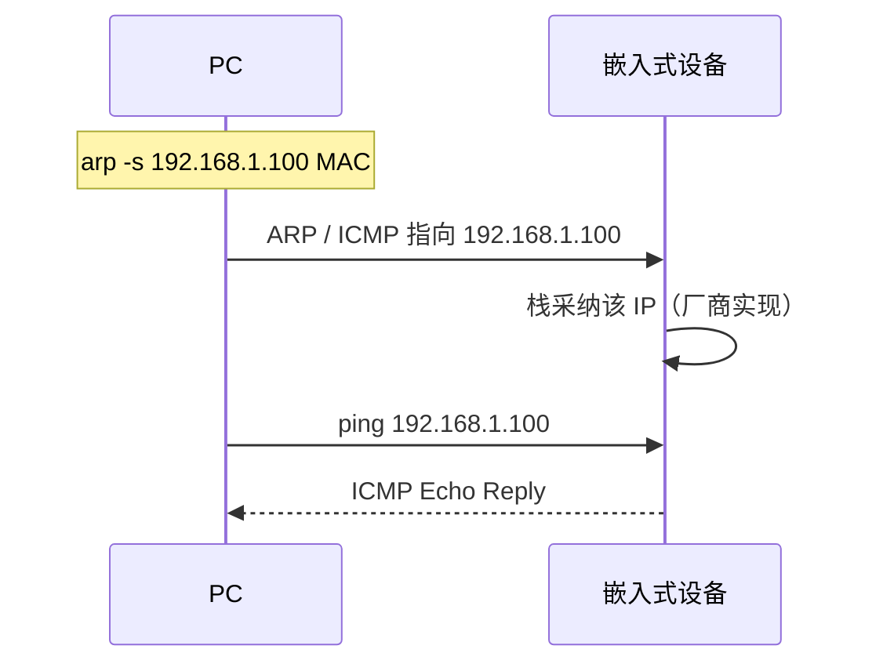

# 4.10 使用 ARP 设置嵌入式设备 IPv4 地址

> 章级精读：[study.md#ch04-10](./study.md#ch04-10) · CLI：[4.9 arp 命令](4.9-arp-cli-commands.md) · DHCP 替代：[ch06](../chapter06-dhcp-config/study.md)

## 本节核心目标

理解无屏、无 DHCP 的嵌入式设备如何通过 **静态 ARP + 诱导报文（ARP-Ping）** 临时绑定 IPv4 地址。

---

<a id="ch04-10-scenario"></a>

## 一、适用场景

| 设备特征 | 典型例子 |
|----------|------------|
| 无屏、无键盘、**出厂无默认 IP** | 工业串口服务器、IoT 模块、老旧网口设备 |

**用途**：无 DHCP 时**快速临时分配 IP**，多用于**产测 / 首次配置**。

→ 长期运行应改用 [ch06 DHCP](../chapter06-dhcp-config/6.1-introduction.md) 或串口/Web 固化配置。

---

<a id="ch04-10-principle"></a>

## 二、核心原理（ARP-Ping）

利用嵌入式网卡/协议栈的 **ARP 行为特性**（**厂商/栈实现相关，非 RFC 标准**）：

1. 设备上电后网卡处于「静默监听」，**尚无 IP 也可能响应 ARP**  
2. PC 手动添加 **静态 ARP 绑定**（IP → 设备 MAC）  
3. PC 向该 IP 发送 **ICMP Echo（Ping）**（或 ARP 请求）  
4. 设备收到 ARP 请求 / ICMP 包后，**自动采纳目标 IP 作为自身地址**  



---

<a id="ch04-10-steps"></a>

## 三、操作步骤（Windows / Linux）

**前提**：PC 与设备**同网段直连或同交换机**；关闭 PC 防火墙；已知设备 **MAC**（贴纸/手册）。

### 1）获取设备 MAC

例：`00-11-22-33-44-55`（Windows）/ `00:11:22:33:44:55`（Linux）

### 2）Windows（管理员 CMD）

```bat
REM 静态绑定：IP → MAC
arp -s 192.168.1.100 00-11-22-33-44-55

REM 发诱导 Ping（-t 持续，确认通后 Ctrl+C）
ping 192.168.1.100 -t

REM 可选：清理静态项
arp -d 192.168.1.100
```

### 3）Linux（root）

```bash
# 静态绑定
arp -s 192.168.1.100 00:11:22:33:44:55
# 或：ip neigh add 192.168.1.100 lladdr 00:11:22:33:44:55 nud permanent dev eth0

# 诱导 Ping
ping -c 4 192.168.1.100

# 可选：清理
arp -d 192.168.1.100
# 或：ip neigh del 192.168.1.100 dev eth0
```

### 4）验证与后续

- **Ping 通** → 设备已绑定该 IP → 可 Telnet / 网页管理  
- 生产环境：通过管理界面或串口**写入 Flash** 固化，或配置 **DHCP 保留**

→ 命令详解：[4.9](4.9-arp-cli-commands.md)

---

<a id="ch04-10-notes"></a>

## 四、关键注意事项

| 项 | 说明 |
|----|------|
| **非标准** | 厂商私有实现，**不可替代 DHCP**；仅引导/产测 |
| **栈差异** | 部分设备仅响应 ARP；部分需 ICMP；少数不支持 |
| **临时生效** | **重启后 IP 丢失**，需重做；长期用 DHCP 保留 / SLAAC / DHCPv6 |
| **安全风险** | 静态 ARP 易被欺骗 → **仅限可信内网** |

---

<a id="ch04-10-troubleshoot"></a>

## 五、常见问题排查

| 现象 | 排查 |
|------|------|
| **Ping 不通** | MAC 是否正确；是否同网段；PC 防火墙是否关闭 |
| 仍不通 | 换 **ARP 请求** 工具：`arping -I eth0 192.168.1.100`（Linux） |
| **重启失效** | 正常现象；需串口/Web **固化到 Flash** 或 DHCP |

### 排查清单

- [ ] MAC 与贴纸一致（注意 `-` vs `:` 格式）  
- [ ] PC 与设备同一二层（直连或同 VLAN）  
- [ ] 目标 IP 与 PC 同子网  
- [ ] Windows 以**管理员**运行 CMD  
- [ ] 尝试 `arping` 代替 ping（仅 ARP 响应型设备）  

---

## 拓展（预留）

- 与 **RARP / BOOTP / DHCP** 演进对照 → [ch06](../chapter06-dhcp-config/study.md)  
- 静态 ARP 用于**防 ARP 欺骗** vs 本节的**引导配置** — 用途相反  

---

## 抓包/实操记录

（待填：Wireshark 同时看 ARP 与 ICMP，确认设备何时采纳 IP）

---

## 疑问与总结

**ARP-Ping = 用静态邻居表 + 诱导流量让哑设备「认领」IP — 产测技巧，不是运维常态。**
