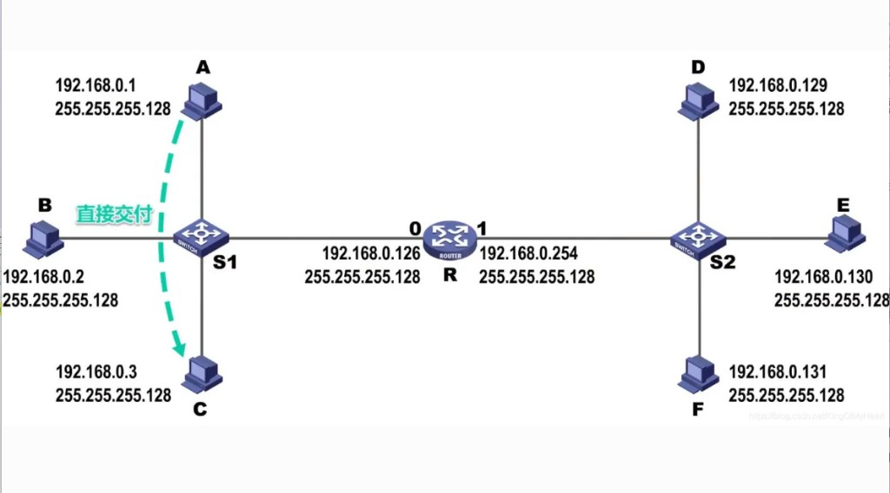

# 4.2 一个例子（直接交付与间接交付）

> 章级精读：[../study.md#ch04-2](../study.md#ch04-2) · 自顶向下：[§6.4 / §6.7](../../../top_down/06_link_layer_and_lan/study.md#ch6-4) · 抓包对照：[4.5](./4.5-arp-tcpdump-example.md) · Wireshark：[§7.1 ARP](../../../wireshark-packet-analysis/chapter-07-network-layer-proto/01-arp-protocol.md)

## 本节核心目标

区分 **直接交付**（同子网）与 **间接交付**（跨子网）；理解**交换机/路由器分工**、**路由表 + ARP 表**联动、**每台设备 ARP 表不同**；掌握帧中 **IP 目标** 与 **MAC 目标** 各变什么。

---

<a id="ch04-2-switch-router"></a>

## 零、交换机 & 路由器：局域网 / 广播域分工

| 场景 | 谁干活 | 依据什么 |
|------|--------|----------|
| **纯局域网**（同一广播域、同一 IP 网段） | **交换机** | **MAC + 端口** 转发以太网帧；**不解析 IP、不用路由表** |
| **跨网段 / 外网 / 其他 LAN** | **路由器**（网关） | 连接多个网段，**隔离广播域**；不同网段互通**必须经过路由器** |

**同网段互通**：源 MAC → 交换机 → 目标 MAC，**不用路由器、不用查网关 ARP**。  
**跨网段**：必须先交给**网关**，再由路由器逐跳转发。

→ 广播域边界：[§零附三](#ch04-2-broadcast-boundary) · [ch03 交换机](../chapter03-link-layer/study.md)

---

<a id="ch04-2-per-device"></a>

## 零、每台设备的 ARP 表都不一样（先建立直觉）

**你的理解对：** 手机、电脑、路由器、交换机（三层）**各自有一份独立的 ARP 表**，内容**互不相同**。

| 要点 | 说明 |
|------|------|
| **ARP 表干什么** | 查「**本机当前这一跳**要发给谁的 MAC」 |
| **每台只关心直连下一跳** | 只解析**本机所在广播域/直连网段**里的 IP→MAC |
| **不会** | 跨网段去 ARP **远端主机**的 MAC |

### 多跳例子（表里各记各的）

链路：`手机 → R1 → R2 → 服务器`

| 设备 | 典型 IP | 本机 ARP 表里常见条目（示意） |
|------|---------|------------------------------|
| **手机** | 192.168.1.10 | `192.168.1.1`（网关 R1 内网口）→ **R1 内网 MAC** |
| **路由器 R1** | 内网 .1 / 外网 10.0.1.1 | `10.0.1.2`（下一跳 R2）→ **R2 对接口 MAC** |
| **路由器 R2** | 10.0.1.2 | `172.16.1.10`（服务器）→ **服务器 MAC** |

**一句**：大家 ARP 表不同，因为**每一跳要解析的「下一跳 IP」不同**。

---

<a id="ch04-2-route-arp"></a>

## 零附、路由表 + ARP 表：完整联动

**口诀**：**路由表定下一跳 IP + 出接口 → ARP 把下一跳 IP 译成 MAC → 封装以太网帧发出**

### 1）路由表：字段与职责

一条标准路由条目（路由器 / Linux `ip route` 通用）：

| 字段 | 含义 |
|------|------|
| **目标网络 / 目标 IP** | 报文要去往的网段或主机 |
| **子网掩码** | 区分网络位与主机位 |
| **下一跳 IP** | 交给**哪一个相邻设备**的 IP（直连主机或相邻路由器） |
| **出接口（出站网口）** | 本机从**哪个物理网卡**发出 |

> **重点**：路由表**天生带「出接口」** — 查表时同时得到「交给谁」和「从哪张网卡发」，不是事后再找端口。

**工作逻辑**：

1. 收到 **IP 报文**，提取**目标 IP**  
2. 查**路由表**（LPM 最长前缀匹配）  
3. 得到：**下一跳 IP** + **本机出接口**  
4. **IP 首部不变**：源 IP、目的 IP 全程保持（跨多跳路由器也不改 IP 头）

→ 路由基础：[ch05 §5.4](../chapter05-ip-protocol/5.4-ip-routing-basic.md)

### 2）ARP 表：IP → MAC

| 字段 | 含义 |
|------|------|
| **IP 地址** | 相邻设备 IP（通常是**下一跳**） |
| **MAC 地址** | 该 IP 对应的二层地址 |
| **老化时间、所在接口** | 条目生命周期与网口 |

### 3）跨网段完整三步（PC 访问外网）

**步骤 1 — 查路由表**

PC 发现目标 IP **不在同一网段** → 匹配默认路由 / 静态路由：

- **下一跳 IP** = **网关 IP**（如 `192.168.1.1`）  
- **出接口** = 本机连交换机的网卡（如 `eth0`）

**步骤 2 — 查 ARP 表**

二层只认 MAC → 用**下一跳 IP（网关 IP）** 查 ARP：

- **命中** → 用缓存 MAC  
- **未命中** → ARP 广播「谁是该 IP？」→ 写入 ARP 表  

**步骤 3 — 封装并从出接口发出**

```text
内层：IP 报文（源 IP、目的 IP 不变 — 目的仍是最终接收方）
外层：以太网帧
  · 源 MAC = 本机网卡 MAC
  · 目的 MAC = 下一跳 MAC（网关 MAC）
→ 从路由表指定的出接口 eth0 发出
```

### 4）同网段（纯交换机，不经网关）

目标 IP 与本机**同网段** → 路由表结论：下一跳 = **目标主机 IP**（可不显式经网关）：

- **直接查 ARP**：目标 IP → 目标主机 MAC  
- 封装帧发给交换机 → **二层直达**

### 5）两个「目标」（极易混淆）

| | **IP 报文的目的 IP** | **以太网帧的目的 MAC** |
|--|----------------------|-------------------------|
| 指向谁 | **最终接收方** | **直连下一跳设备** |
| 是否全程不变 | **不变**（端到端） | **每一跳路由器都会重写** |

### 6）极简实例

**PC** `192.168.1.10` → **网关** `192.168.1.1` → **外网** `220.x.x.x`

| 步 | PC 动作 |
|----|---------|
| 1 | 查路由表：下一跳 = `192.168.1.1`，出接口 = `eth0` |
| 2 | 查 ARP：`192.168.1.1` → 网关 MAC |
| 3 | 帧：源 MAC = PC，目的 MAC = 网关；内层 IP 目的 = `220.x.x.x` |
| 4 | 从 `eth0` 发出 → 交换机 → 路由器 |

**路由器收到后**：剥二层 → 查**自己的**路由表 → 得**新下一跳 + 新出接口** → 在**出接口网段**发 ARP → 重新封装转发 → [§零附 A 路由器跨接口 ARP](#ch04-2-router-arp-egress)

### 7）为何必须联合？

| | 路由表 | ARP 表 |
|--|--------|--------|
| 层次 | **三层（IP）寻址** | **二层（MAC）寻址** |
| 解决 | 逻辑路径、**出接口** | 把下一跳 **IP 译为 MAC** |
| 一句 | **往哪走** | **相邻设备怎么递过去** |

二者缺一不可。

---

<a id="ch04-2-router-arp-egress"></a>

## 零附 A、路由器跨接口发 ARP（R1 → Server 完整过程）

**组网**：

```text
PC(192.168.1.10/24) — 交换机 — R1(eth0:192.168.1.1/24, eth1:10.0.0.1/24) — 交换机 — Server(10.0.0.20/24)
```

### 一、前置前提

| 要点 | 说明 |
|------|------|
| **多网口** | R1 的 `eth0`、`eth1` 各自绑定不同网段，**独立二层广播域** |
| **ARP 是二层广播** | **只从指定网口发出**，不会从其他接口乱窜 |
| **每口独立** | 各网口独立收发逻辑；ARP 缓存常按**接口/网段**区分 |

**当前场景**：R1 从 `eth0` 收到发往 `10.0.0.20` 的 IP 报文（PC 经网关转发而来）

1. 查**路由表**：`10.0.0.0/24` → **出接口 = eth1**，下一跳 IP = **`10.0.0.20`**（直连网段，下一跳即目的主机）  
2. 查 R1 **ARP 表**：无 `10.0.0.20` 的 MAC → 须从 **eth1** 主动发 **ARP 请求**

### 二、R1 构造并发送 ARP 请求

#### 1）选定发送接口

路由表已定 **出接口 = eth1** → **ARP 请求必须从 eth1 发出**，**绝不走 eth0**。

#### 2）组装 ARP 广播帧

**以太网帧头**（广播特征）：

| 字段 | 值 |
|------|-----|
| **源 MAC** | R1 **eth1** 网卡 MAC |
| **目的 MAC** | `FF:FF:FF:FF:FF:FF`（同网段所有设备接收） |
| **EtherType** | `0x0806`（ARP） |

**ARP 报文内容**：

| 字段 | 值 |
|------|-----|
| 发送端 IP | `10.0.0.1`（eth1 地址） |
| 发送端 MAC | R1 eth1 MAC |
| 目标 IP | `10.0.0.20`（待查询） |
| 目标 MAC | 全 0（未知） |

→ 帧格式：[4.4 ARP 报文](4.4-arp-packet-format.md)

#### 3）从 eth1 发出

OS 将 ARP 广播帧交给 **eth1 硬件** 发送：

- 帧只进入 **`10.0.0.0/24` 网段**的交换机  
- **不会**进入 `eth0` 侧的 `192.168.1.0/24` — 路由器**隔离广播域**

### 三、Server 响应 + 回传

1. 网段内设备收到广播，检查「目标 IP 是否为自己」  
2. **Server `10.0.0.20`** 匹配 → 构造 **ARP 应答（单播）**  
   - 帧目的 MAC：**R1 eth1 MAC**  
   - ARP 内容：`10.0.0.20` → Server MAC  
3. 应答沿二层返回 **R1 eth1**

### 四、R1 收到应答后

1. 从 **eth1** 收到应答，解析 `10.0.0.20` ↔ Server-MAC  
2. 写入 **eth1 侧 ARP 表**（与 eth0 侧条目**互不混用**）  
3. 具备：下一跳 IP + MAC + 出接口 **eth1**  
4. **重新封装数据帧**，把原 IP 报文转发给 Server  

```text
数据帧：源 MAC = R1 eth1，目的 MAC = Server-MAC；IP 头不变（目的仍 10.0.0.20）
```

### 五、「怎么发过去？」三句话

| # | 机制 |
|---|------|
| 1 | **路由表锁定出口** — ARP 固定从该网口发 |
| 2 | **二层广播** — 目的 MAC = `FF:FF:FF:FF:FF:FF`，同网段全收到 |
| 3 | **广播域被路由器隔断** — eth1 的 ARP **到不了 eth0 网段** |

### 六、多跳规律（PC → R1 → R2 → Server）

- R1 发给 R2：在 **R1 的出接口网段** 发 ARP，查 **R2 直连 IP** 的 MAC  
- R2 发给 Server：在 **R2 的出接口网段** 发 ARP，查 **Server IP** 的 MAC  

**规律**：每台路由器**只在「本跳出接口所属局域网」**发 ARP；**接口 ↔ 网段一一对应**。

→ 固定拓扑分阶段走读：[§零附 B](#ch04-2-dual-router) · 表格式流程：[§零附二](#ch04-2-end-to-end) · [ch05 转发](../chapter05-ip-protocol/5.4-ip-routing-basic.md)

### 七、一句话

路由器**按路由表指定的出接口**，从对应网卡发 **二层 ARP 广播**；仅在该接口所属 LAN 内传播；收到应答后更新 ARP 表，再封装转发 IP 报文。

→ 双路由器三网段完整走读：[§零附 B](#ch04-2-dual-router)

---

<a id="ch04-2-dual-router"></a>

## 零附 B、双路由器 + 两个局域网：全程分步（PC → R1 → R2 → Server）

### 固定拓扑

```text
局域网A 192.168.1.0/24          互联段 192.168.2.0/24          局域网B 192.168.3.0/24
PC .10 ─ S1 ─ R1 eth0 .1        R1 eth1 .1 ─── R2 eth0 .2      R2 eth1 .1 ─ S2 ─ Server .20
```

| 设备 | 接口 | IP |
|------|------|-----|
| **PC** | — | `192.168.1.10/24` |
| **R1** | eth0 | `192.168.1.1`（A 网网关） |
| **R1** | eth1 | `192.168.2.1` |
| **R2** | eth0 | `192.168.2.2` |
| **R2** | eth1 | `192.168.3.1`（B 网网关） |
| **Server** | — | `192.168.3.20/24` |

**需求**：PC(`192.168.1.10`) 访问 Server(`192.168.3.20`)

**三个独立网段 = 三个独立广播域**，各自独立做 ARP。

---

### 阶段 1：PC → 网关 R1（局域网 A）

| 步 | 动作 |
|----|------|
| 1 | PC 判定 `192.168.3.20` **跨网段** → 查路由表：**下一跳 = 192.168.1.1**，出接口 = 本机网卡 |
| 2 | 在 **A 网** ARP 广播 → 得 **R1-eth0 MAC** |
| 3 | 封装：源 MAC = PC，**目的 MAC = R1-eth0**；IP 源 = PC，**IP 目的 = Server（不变）** |
| 4 | 经 **S1** → R1 **eth0** |

---

### 阶段 2：R1 解帧 → 在互联段 ARP 找 R2（核心）

| 步 | 动作 |
|----|------|
| 1 | R1 剥二层，得 IP 报文，目的 = `192.168.3.20` |
| 2 | 查 **R1 路由表**：`192.168.3.0/24` → **下一跳 IP = 192.168.2.2（R2-eth0）**，**出接口 = R1-eth1** |
| | → 此时 R1 只知「要发给 **192.168.2.2**」，**尚不知 MAC** |
| 3 | 查 R1 ARP 缓存：`192.168.2.2` **无记录** → 从 **eth1** 发 ARP 请求 |
| 4 | **ARP 广播帧（仅从 eth1 发出）**： |
| | · 二层目的 MAC = `FF:FF:FF:FF:FF:FF` |
| | · 二层源 MAC = **R1-eth1 MAC** |
| | · ARP：「我是 `192.168.2.1`，谁是 `192.168.2.2`？」 |
| | · 广播**仅在 192.168.2.0/24**（R1-eth1 ↔ R2-eth0），**不到 A 网、B 网** |
| 5 | **R2-eth0** 收到 → 目标 IP 是自己 → **ARP 单播应答** → R2-eth0 MAC |
| 6 | R1 写入 ARP 表：`192.168.2.2` ↔ **R2-eth0 MAC** |

---

### 阶段 3：R1 重新封装 → 发给 R2

| 项 | 内容 |
|----|------|
| **IP 报文** | 源/目的 **不变** |
| **新以太网帧** | 源 MAC = **R1-eth1**，目的 MAC = **R2-eth0** |
| **发出** | 从 **eth1** 直达 R2 |

---

### 阶段 4：R2 → 局域网 B → Server

与上同逻辑：

| 步 | 动作 |
|----|------|
| 1 | R2 剥二层 → 查路由表：`192.168.3.0/24` → 下一跳 = **`192.168.3.20`**，出接口 = **R2-eth1** |
| 2 | 在 **B 网**（eth1 侧）ARP → 得 **Server MAC** |
| 3 | 封装：源 MAC = R2-eth1，目的 MAC = Server → 经 **S2** 送达 |

---

### 核心问题：跨网段时，路由器怎么知道对端路由器接口的 MAC？

| 步 | 谁负责 | 做什么 |
|----|--------|--------|
| **1** | **路由表**（静态 / OSPF / BGP 等） | 给出**对端路由器接口 IP** + **本机出接口** |
| **2** | **ARP** | 在**两台路由器直连的中间网段**内广播，把该 IP 译为 MAC |

**要点**：

- R1–R2 **互联段**仍是独立二层广播域  
- 路由器之间的 MAC **依旧靠 ARP**  
- A 网、互联段、B 网 **ARP 互相隔离**，不会跨网段乱跑  

---

### 三条规律

| # | 规律 |
|---|------|
| 1 | **ARP 生效范围 = 单个 IP 网段 = 单个广播域**（本例三个网段，三次独立 ARP） |
| 2 | **每一跳**都要单独 ARP：PC→R1（A 网）；R1→R2（互联段）；R2→Server（B 网） |
| 3 | **分工不混**：路由表管**下一跳 IP + 出接口**；ARP 管 **IP→MAC**；OSPF/BGP **只同步路由，不参与 ARP** |

### 快递类比

| 角色 | 对应 |
|------|------|
| **收货地址（IP）** | 全程不变 |
| **路线规划（路由表）** | 快递站 A → 中转 → 快递站 B |
| **当面交接（ARP）** | 每站确认下一中转点「对接人」（MAC）才能转交 |

→ 铁律与易混澄清：[§零附 C](#ch04-2-iron-rules)

---

<a id="ch04-2-iron-rules"></a>

## 零附 C、ARP 铁律（焊死逻辑，消除「跨网段 ARP」错觉）

### 核心铁律（必记）

| # | 铁律 |
|---|------|
| 1 | **ARP 是二层广播** → **路由器天然阻断广播** |
| 2 | **ARP 请求绝对不会跨网段、跨路由器传播** |
| 3 | 任何设备（PC/路由器）发的 ARP，**仅局限在当前发送网卡所在的本地局域网/广播域** |

### 两段视角（沿用 [§零附 B](#ch04-2-dual-router) 拓扑）

#### 1）PC 视角：只在【局域网 A】发 ARP

- 目标不在本网段 → 数据交给**网关 R1**  
- PC **只在局域网 A** ARP 查询「`192.168.1.1` 的 MAC」  
- PC **永远不会、也不能** 到 A 网外 ARP 找 R2、Server  

✅ **印证：ARP 不跨网段。**

#### 2）R1 视角：多网卡 = 多个独立局域网

R1 两张网卡接入**两个隔离的广播域**：

| 网卡 | 所在局域网 |
|------|------------|
| **eth0** | 局域网 A |
| **eth1** | R1–R2 **中间互联段**（仍是独立小 LAN） |

转发给 R2 时：

1. 路由表：下一跳 = R2 接口 IP，**出接口 = eth1**  
2. 从 **eth1 所在互联段** 发 ARP 广播  
3. 该广播**只在中间网段**传播 — **到不了 A 网、也到不了 B 网**

**关键澄清（易懵点）**：

> 不是「ARP 跨网段了」，而是 **路由器换了网卡，在另一个本地局域网里重新发 ARP**。  
> **一个网卡 = 一个本地 LAN**；各 LAN 内部各自 ARP，**互相隔离**。

### 通俗拆解

- 大网络 = **一串独立小局域网**，路由器是之间的「大门」  
- ARP 只能在**单个小门内部**喊话，**穿不过大门**  
- PC 在第一个小门里喊；路由器走到下一个小门，**再喊一次**

### 路由器互联段 = 普通小局域网

| 要点 | 说明 |
|------|------|
| **本质** | 两路由器直连/同交换机 → **同一 IP 网段、同一广播域** — 与 PC 局域网**无区别**（只是设备多为路由器） |
| **ARP 作用** | 在同网段内解析**对端路由器接口 IP → MAC** |
| **终端 vs 中间路由器** | PC/Server：只在本终端 LAN ARP，**最多到网关**；中间路由器：在**相邻互联 LAN** 再 ARP，**逐跳**解析下一跳 MAC |

### 终极两句（背诵）

1. **ARP 永远只在「当前所在本地局域网」生效，无法跨路由器、跨网段。**  
2. 跨网段通信时，**每进入一段新局域网，就由该网段内设备重新发一次本地 ARP** — 全程**没有** ARP 跨网段行为。

→ 广播域边界：[§零附三](#ch04-2-broadcast-boundary) · [3.10 ARP 仅 LAN](../chapter03-link-layer/3.10-link-layer-security.md#ch03-10-arp-lan)

---

## 零附二、串一遍：手机访问远端服务器

**手机** `192.168.1.10` 访问 **服务器** `172.16.1.10`（经 R1、R2）

| 步 | 谁 | 做什么 |
|----|-----|--------|
| 1 | **手机** | 查**路由表**：跨网段 → 下一跳 = 网关 `192.168.1.1` |
| 2 | **手机** | 查 **ARP**：无网关 MAC → **ARP 广播**问 `192.168.1.1` |
| 3 | **R1** | ARP 应答；手机写入 ARP 表 |
| 4 | **手机** | 封装帧：**目的 MAC = R1**，**IP 目的仍 = 服务器** |
| 5 | **R1** | 剥 MAC → 查**路由表**：去 `172.16.1.0/24` 下一跳 `10.0.1.2` |
| 6 | **R1** | 查 **ARP** 得 R2 的 MAC → 转发（**改 MAC，IP 不变**） |
| 7 | **R2** | 同理 → 最终 **ARP 服务器 MAC** → 送达 |

### 关键小结（背）

1. 每台设备**独立 ARP 表**，只和**自己的直连邻居/下一跳**有关。  
2. **先路由表**（下一跳 **IP**）→ **再 ARP**（下一跳 **MAC**）。  
3. ARP **只解析直连网段**；跨网段**不**解析远端主机 MAC。→ 为何？[§零附三](#ch04-2-broadcast-boundary)

---

<a id="ch04-2-broadcast-boundary"></a>

## 零附三、ARP 只在同广播域：结论 + 两场景

### 先定结论

| # | 结论 |
|---|------|
| 1 | **ARP 仅 IPv4 + 同一广播域（同局域网）**；请求/应答是**二层广播**，**路由器不转发广播** → ARP **出不了当前网段** |
| 2 | 目标 IP **不在**本机局域网 → **不对远端 IP 发 ARP**，包交给**边缘路由器（网关）**转发 |

→ 与 [3.10 ARP 仅 LAN](../chapter03-link-layer/3.10-link-layer-security.md#ch03-10-arp-lan) 一致

### 场景 1：同网段（同广播域）

**例**：本机 `192.168.1.10` → 目标 `192.168.1.20`

| 步 | 动作 |
|----|------|
| 1 | **路由表**：同网段 → 下一跳 = **目标主机 IP** |
| 2 | **ARP 广播**问 `192.168.1.20` 的 MAC |
| 3 | 对方应答 → **二层直达**，**不经过路由器** |

→ 下文 [§一 直接交付](#ch04-2-direct)

### 场景 2：跨网段（不同广播域）

**例**：本机 `192.168.1.10` → 外网 `220.181.x.x`

| 步 | 动作 |
|----|------|
| 1 | **路由表**：跨网段 → 交给**默认网关** |
| 2 | **不会**对外网 IP 发 ARP；只 **ARP 网关 IP** → 得网关 MAC |
| 3 | 帧发给网关；**IP 目的仍是外网**；网关再按自己的路由表转发 |

→ 下文 [§二 间接交付](#ch04-2-indirect)

### 补充：路由器 = 广播域边界

| 点 | 说明 |
|----|------|
| **隔离广播** | 内网 ARP 广播到**路由器端口**即被挡住，**不会**漏到外网/别的 LAN |
| **多级路由** | 每一跳重复：**路由表定下一跳 IP** → **本端口所在广播域内 ARP** → 转发；ARP **始终只在当前直连段** |

### 一句话速记

> **跨网段 IP 不直接 ARP，全部先找网关；ARP 广播出不了当前局域网，路由器是广播域边界。**

出网关之后靠 **IGP / BGP** 逐跳路由 → [ch05 §5.4 IGP/BGP](../../chapter05-ip-protocol/5.4-ip-routing-basic.md#ch05-4-full-chain)

---

## 拓扑示例（掩码 255.255.255.128，/25）

| 子网 | 网络号 | 主机 | 路由器接口 |
|------|--------|------|------------|
| 左 | `192.168.0.0/25` | A `.1`、B `.2`、C `.3` | R 接口 0 **`.126`**（左网网关） |
| 右 | `192.168.0.128/25` | D `.129`、E `.130`、F `.131` | R 接口 1 **`.254`**（右网网关） |

```text
判定：源IP & 掩码 = 源网络号；目的IP & 掩码 = 目的网络号
  · 两网络号相同 → 直接交付
  · 不同         → 间接交付
```

例：**A（.1）→ C（.3）** 同网 → 直接；**A（.1）→ D（.129）** 异网 → 间接。

---

<a id="ch04-2-direct"></a>

## 一、直接交付（同子网 / 同网段）

**核心**：源与目的在**同一 IP 前缀**，**不经过网关/路由器**，二层直达。



### 判定

- 源网络号 = 目的网络号 → **直接交付**

### 流程（ARP + 以太网）

1. 源主机查路由表：目的 IP 在**本地子网**。
2. 查本地 **ARP 缓存**：有无「目的 IP → MAC」。
3. 无则发 **ARP 广播**：「谁是 x.x.x.x？请回复 MAC」。
4. 目的主机 **ARP 单播应答**，带回自身 MAC。
5. 封装帧：**源 MAC = 本机，目的 MAC = 目标主机**；**IP 头源/目的 IP 不变**。
6. 交换机按 MAC **单播**转发，直达目标。

---

<a id="ch04-2-indirect"></a>

## 二、间接交付（跨子网 / 跨网段）

**核心**：源与目的**不在同一子网**，须经**默认网关 / 路由器**中转，**逐跳**转发。


### 判定

- 源网络号 ≠ 目的网络号 → **间接交付**

### 流程（ARP 网关 + 路由转发）

1. 源主机查路由表：目的不在本地子网 → 匹配**默认路由（网关）**。
2. **ARP 解析的是默认网关的 MAC**（不是目标主机 MAC）。
3. 封装帧：**源 MAC = 本机，目的 MAC = 网关**；**IP 头源/目的 IP 仍为目标主机 IP**（不变）。
4. 网关收帧：剥二层 → 查路由表 → 定下一跳。
5. **每一跳**：**MAC 重写**（源 = 本跳出接口 MAC，目的 = 下一跳 MAC）；**IP 全程不变**。
6. **最后一跳**：目的在路由器**直连子网** → 转为**直接交付**，ARP 解析目标主机 MAC 后送达。

### 路由器收到 IP 包后（图中文字）

1. **检查 IP 首部**有错 → 丢弃并通知源；无错则继续。
2. **查路由表**匹配目的 IP → 有则按表项**下一跳**转发；无则丢弃并通知源。

---

## 三、关键对比（一眼分清）

| 项目 | 直接交付（同子网） | 间接交付（跨子网） |
|------|-------------------|-------------------|
| 路径 | 源 → 目的（**无网关**） | 源 → 网关 → … → 目的 |
| **ARP 对象** | **目标主机** IP → MAC | **网关** IP → MAC |
| 帧**目的 MAC** | 目标主机 MAC | 网关 / 下一跳 MAC |
| **IP 头** | 源/目的 IP **不变** | 源/目的 IP **全程不变** |
| 典型场景 | 同办公室互传文件 | 访问外网（跨网段） |

---

## 四、一句话总结

- **铁律**：ARP **只在当前本地 LAN**；**不跨路由器**；每段 LAN **各自 ARP** → [§零附 C](#ch04-2-iron-rules)  
- **交换机**：同广播域内按 **MAC** 转发；**路由器**：跨网段边界，隔离广播域。  
- **路由表**自带**出接口**；职责 = 下一跳 IP + 从哪张网卡发。  
- **ARP 只在本广播域**；路由器**挡广播** → [§零附三](#ch04-2-broadcast-boundary)  
- **每台设备 ARP 表不同**；**先路由表（下一跳 IP）→ 再 ARP（下一跳 MAC）**。  
- **IP 目的 = 最终接收方（不变）**；**MAC 目的 = 直连下一跳（每跳重写）**。  
- **同子网**：ARP **目标主机** MAC，二层直达。  
- **跨子网**：**不 ARP 远端**；只 ARP **网关/下一跳**；路由器**逐跳改 MAC、IP 不变**。

---

## 抓包验证

| 场景 | 看什么 | 工具 |
|------|--------|------|
| 同子网 ping 邻居 | ARP 问的是**邻居 IP**；以太网目的 MAC = **邻居 MAC** | `tcpdump -i eth0 arp` 或 Wireshark 过滤器 `arp` |
| 跨子网 ping 外网 | ARP 问的是**网关 IP**；以太网目的 MAC = **网关 MAC**；IP 目的仍是远端 | 先 `arp` 再 `icmp`；对照 [4.5 抓包](./4.5-arp-tcpdump-example.md)、[Wireshark §7.1](../../../wireshark-packet-analysis/chapter-07-network-layer-proto/01-arp-protocol.md) |

**易错**：跨子网时 **IP 目的地址始终是最终主机**，但**链路层目的 MAC 第一跳永远是网关**。
