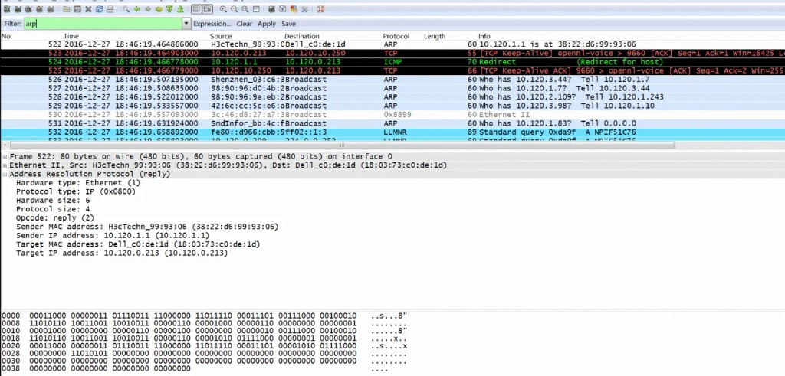
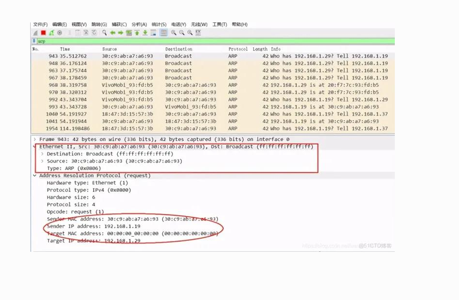

# 4.5 ARP 例子（抓包与超时）

> 章级精读：[study.md#ch04-5-capture](./study.md#ch04-5-capture) · 帧格式：[4.4](4.4-arp-packet-format.md) · Wireshark 专章：[§7.1 ARP](../../wireshark-packet-analysis/chapter-07-network-layer-proto/01-arp-protocol.md)

## 本节核心目标

用 **tcpdump / Wireshark** 看懂**正常 ARP 交互**与**主机不存在时的超时行为**。

<a id="ch04-5-capture"></a>

---

<a id="ch04-5-normal"></a>

## 二、正常 ARP 过程（同网段、首次通信）

**场景**：主机 A（`192.168.1.10`）ping 主机 B（`192.168.1.20`），ARP 缓存为空。

### 1）ARP 请求（Opcode = 1）

| 层 | 字段 | 值 |
|----|------|-----|
| **以太网** | 源 MAC | A-MAC |
| | 目的 MAC | **`ff:ff:ff:ff:ff:ff`（广播）** |
| | 类型 | **`0x0806`（ARP）** |
| **ARP** | 发送方 MAC / IP | A-MAC / `192.168.1.10` |
| | 目标 MAC / IP | **全 0** / `192.168.1.20` |

```text
0.0  00:11:22:33:44:55 > ff:ff:ff:ff:ff:ff  arp 60: arp who-has 192.168.1.20 tell 192.168.1.10
```

### 2）ARP 应答（Opcode = 2）

| 层 | 字段 | 值 |
|----|------|-----|
| **以太网** | 源 MAC | B-MAC |
| | 目的 MAC | **A-MAC（单播）** |
| **ARP** | 发送方 | B-MAC / `192.168.1.20` |
| | 目标 | **A-MAC** / `192.168.1.10` |

```text
0.002  00:aa:bb:cc:dd:ee > 00:11:22:33:44:55  arp 60: arp reply 192.168.1.20 is-at 00:aa:bb:cc:dd:ee
```

### 3）关键特征

| 项 | 典型值 |
|----|--------|
| 请求 | **广播** + ARP 目标 MAC **全 0** |
| 应答 | **单播** + 真实 MAC |
| 耗时 | 通常 **1–3 ms** |
| 缓存 | 成功写入 ARP 表；Linux/macOS 完整条目默认约 **20 分钟** |

### Wireshark 实抓：ARP 应答（单播）



图中可见：**Hardware type=1**、**Protocol=0x0800**、**Opcode=reply(2)**；以太网目的 MAC 为请求方（非广播）。

→ [4.4 帧格式](4.4-arp-packet-format.md#ch04-4-request-reply)

---

<a id="ch04-5-timeout"></a>

## 三、主机不存在（IP 无人响应）

**场景**：ping `192.168.1.99`（同网段，无此主机）。

### 1）行为

| 现象 | 说明 |
|------|------|
| **多次 ARP 请求** | 一般 **3 次**，间隔约 **1 s** |
| **无应答** | 链路层静默 |
| **Incomplete** | ARP 表出现不完整条目 |
| **上层** | ping「请求超时」；部分系统伴随 **ICMP 不可达** |

### 2）tcpdump 示例

```text
0.0    arp who-has 192.168.1.99 tell 192.168.1.10
1.0    arp who-has 192.168.1.99 tell 192.168.1.10
2.0    arp who-has 192.168.1.99 tell 192.168.1.10
# 无应答
```

### 3）Wireshark 实抓：重复请求后才有应答（慢响应）



图中 **943/948/963/967** 均为 `Who has 192.168.1.29? Tell 192.168.1.19`（**Broadcast**）；**968** 为单播 `192.168.1.29 is at …`。  
展开包可见：**Target MAC 全 0**、**EtherType 0x0806**。

### 4）超时时间（典型）

| 条目类型 | 超时 |
|----------|------|
| **完整（成功）** | 约 **20 分钟**（BSD/Linux） |
| **Incomplete** | 约 **3 分钟** |
| 到期 | 自动删除；下次访问重新 ARP |

→ 详：[4.6 缓存超时](4.6-arp-cache-timeout.md#ch04-6-timeout) · [4.3 缓存状态](4.3-arp-cache.md#ch04-3-states)

---

<a id="ch04-5-lab"></a>

## 四、Lab：抓包与查看 ARP 表

### tcpdump

```bash
# 只看 ARP
tcpdump -i eth0 arp

# 含 MAC 地址
tcpdump -i eth0 -e arp

# 保存 pcap → Wireshark
tcpdump -i eth0 arp -w arp.pcap
```

### Wireshark 过滤器

| 过滤器 | 用途 |
|--------|------|
| `arp` | 所有 ARP |
| `arp.opcode == 1` | 仅请求 |
| `arp.opcode == 2` | 仅应答 |
| `eth.type == 0x0806` | 以太网 ARP 帧 |

### 查看 ARP 缓存

```bash
# Linux/macOS
ip neigh show
arp -n

# Windows
arp -a
```

---

<a id="ch04-5-cheat"></a>

## 五、易错点 / 速记卡

| 易错 | 正确 |
|------|------|
| ARP 走 IP 层 | **直接**以太网 **0x0806**，不进 IP |
| 应答也广播 | 请求**广播**，应答**单播** |
| 一次失败即停 | 不存在主机 → **重复请求** → **Incomplete** → **~3 min** 超时 |
| 成功永久有效 | 完整条目 **~20 min** 后过期，期间复用免广播 |

---

## 疑问与总结

**抓包认三件事：who-has 广播、is-at 单播、无应答则看重试与 Incomplete。**
