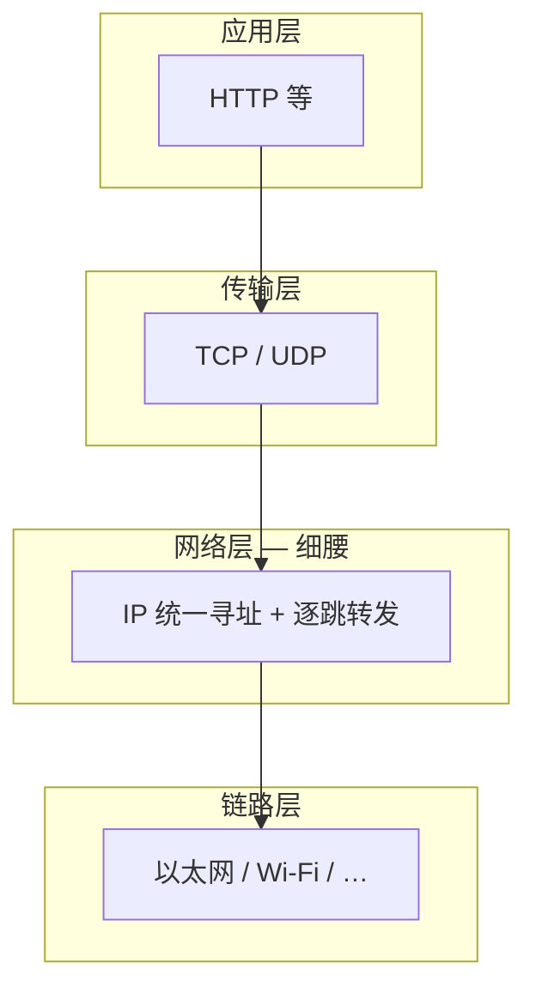

# 5.1 引言

> 章级精读：[study.md#ch05-1](./study.md#ch05-1) · 上一章：[ch04 ARP](../chapter04-arp-protocol/study.md) · [ch01 端到端](../chapter01-overview/study.md#ch01-e2e)

## 本节核心目标

明确 **IP 在 TCP/IP 中的核心地位与服务语义**。

---

## 一、IP 的核心地位

- **IP（Internet Protocol）** 是 **TCP/IP 网络层的核心协议**，整个互联网通信都围绕 IP 展开。
- 所有跨网数据 **必须经由 IP 转发**，向上支撑 TCP/UDP，向下适配各种链路（以太网、Wi‑Fi 等）。
- 提供 **统一寻址 + 逐跳转发** 的「细腰」作用：异构网络都用 IP 地址互通，路由器只看 IP 头转发。

→ 沙漏模型：[ch01](../chapter01-overview/study.md) · 地址结构：[ch02](../chapter02-ip-address-architecture/study.md)

---

## 二、IP 服务语义（核心特性）

### 1）无连接（Connectionless）

- 不维护每条流（per‑flow）的状态。
- 每个 IP 数据报 **独立选路、独立转发**，前后包无关联。
- 类比：每张明信片单独写地址、单独投递，不用先打电话确认对方是否准备好。

### 2）尽力而为（Best‑Effort）

| 不保证 | 含义 |
|--------|------|
| **送达** | 丢包不重传（由 TCP 等上层补） |
| **顺序** | 不同路径可导致乱序 |
| **无重复** | 路由回环或复制可能产生重复包 |

### 3）出错 / 拥塞处理

- 网络出错或拥塞时，路由器**常直接丢弃**数据包。
- 可能回送 **ICMP 差错报告**（目的不可达、超时等）给上层，但**不保证一定回**。

---

## 三、IP 与传输层（TCP/UDP）分工

### IP（网络层）负责

| 职责 | 说明 |
|------|------|
| **寻址** | 全局唯一 IP 地址，定位主机 |
| **路由/转发** | 逐跳把包从源主机送到目的主机 |
| **分片/重组** | 适配不同链路 MTU |

一句话：**IP 管「送到哪台机器」**。

### TCP（传输层）负责

| 职责 | 说明 |
|------|------|
| **可靠性** | 确认、超时重传、去重、排序 |
| **拥塞控制 + 流量控制** | 防网络过载、防发送方压垮接收方 |
| **进程寻址** | 端口号，把数据交给主机上的对应应用 |

一句话：**TCP 管「送到哪个进程、保证可靠」**。

### 分工总结

| 层次 | 特性 |
|------|------|
| **网络层（IP）** | 无连接、尽力而为、逐跳转发、统一寻址 |
| **传输层（TCP）** | 面向连接、可靠、端到端、拥塞/流量控制 |

复杂逻辑（可靠、重传、拥塞）**放在端系统（TCP）**；网络核心（路由器）只做简单转发 — 这是互联网**可扩展**的关键（[端到端原则](../chapter01-overview/study.md#ch01-e2e)）。

---

## 拓展（预留）

- UDP 与 IP 的「无连接」叠加关系  
- 与自顶向下 [§4.1 数据平面](../../top_down/04_network_layer_data_plane/study.md) 对照  

---

## 抓包/实操记录

（待填：Wireshark 只看 IP 头 TTL 递减，不涉及 TCP 状态）

---

## 疑问与总结

**IP = 全球统一地址 + 尽力而为转发；可靠性与拥塞交给端上的 TCP。**
