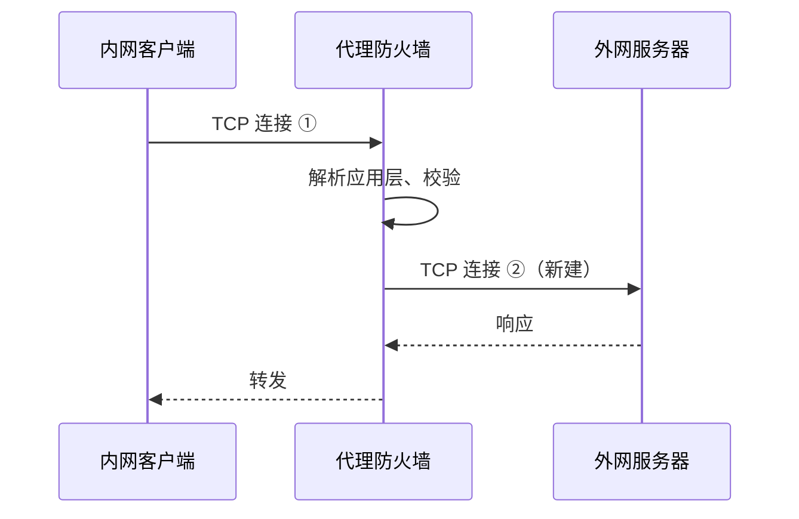

# 7.2 防火墙

> 章级精读：[study.md#ch07-2](./study.md#ch07-2) · 前节：[7.1 引言](7.1-introduction.md) · NAT：[7.3](7.3-nat-napt.md) · 端到端：[ch01](../chapter01-overview/study.md#ch01-e2e)

## 本节核心目标

理解防火墙在可信/不可信网络边界上的作用，以及**包过滤**与**应用层网关（代理）**两类机制的原理与差异。

---

<a id="ch07-2-basics"></a>

## 一、基本概念

**防火墙**部署于**可信内部网络**与**不可信外部网络**的边界，是一套软硬件组合。它依据预设规则对往来数据包进行管控：

- **阻止**未授权访问、恶意流量进入内网  
- **放行**合法通信  
- 为内网主机提供边界安全防护  

早期网络没有防火墙时，主机直接暴露在公网，任意外网主机都能发起连接，安全风险极高。防火墙由此成为网络边界的**标准组件**。

→ 边界定位：[7.1 Middlebox](7.1-introduction.md#ch07-1-roles)

---

<a id="ch07-2-packet-filter"></a>

## 二、包过滤防火墙（Packet Filtering Firewall）

最基础、应用最广的防火墙形态，**工作在网络层与传输层**，通常集成在**路由器**中。

### 1）工作原理

路由器本身具备 IP 转发能力；包过滤在**转发前**增加检查逻辑：

1. 读取数据包的 **IP 首部**、**TCP/UDP 首部**信息  
2. 与管理员配置的规则**逐条匹配**  
3. 根据结果**转发**或**丢弃**  

### 2）过滤依据（核心检查字段）

| 层次 | 字段 |
|------|------|
| **IP 层** | 源 IP、目的 IP、**协议号**（TCP/UDP/ICMP 等） |
| **传输层** | TCP/UDP **源端口**、**目的端口** |
| **TCP 专属** | 控制标志位（**SYN、ACK、FIN、RST、PSH** 等） |

### 3）基础规则逻辑举例（原理 + iptables）

→ 一页纸背诵：[§3 考点](#ch07-2-rules-cheat)

<a id="ch07-2-rules"></a>

#### 规则 1：拒绝外网主动建连（识别纯 SYN）

| 项 | 说明 |
|----|------|
| **原理** | TCP 连接发起方先发 **SYN=1、ACK=0**（**纯 SYN**）；外网入向纯 SYN = **主动连进来**（扫描、暴力破解、木马回连） |
| **策略** | **只允许内网主动向外发起连接**，不允许外网主动向内发起 |
| **通俗** | ✅ 你访问外网网站（你先 SYN） · ❌ 外网机器发「我要连你」的 SYN |

```bash
# 外网网卡 eth0；丢弃 TCP 纯 SYN（入站）
iptables -A INPUT -i eth0 -p tcp --syn -j DROP
# --syn 等价于 --tcp-flags SYN,ACK,RST,FIN SYN
```

> **注意**：无状态规则会**误伤**合法 SYN-ACK 回程；生产环境多用 **有状态**（`ESTABLISHED,RELATED`）配合，见 [§4 有状态](#ch07-2-packet-filter)。

---

#### 规则 2：仅允许访问外网 80/443（最小权限）

| 项 | 说明 |
|----|------|
| **原理** | **最小权限**：只开放必要服务端口，其余全关 |
| **端口** | **80** HTTP · **443** HTTPS |
| **通俗** | 内网机器**只能上网浏览**，不能对外 SSH、连数据库、发 SMTP 等 |

```bash
# 出站：内网 → 外网
iptables -A OUTPUT -p tcp --dport 80 -j ACCEPT
iptables -A OUTPUT -p tcp --dport 443 -j ACCEPT
iptables -A OUTPUT -j DROP   # 其余出站默认拒绝（放最后）
```

---

#### 规则 3：屏蔽恶意 IP（黑名单）

| 项 | 说明 |
|----|------|
| **原理** | 对已知攻击源 / 恶意 IP 或网段，**最前面直接丢弃** |
| **通俗** | 「坏人 IP」拉黑 → **连都连不上** |

```bash
# 拉黑单个恶意源 IP（入站）
iptables -A INPUT -s 203.0.113.45 -j DROP
# 拉黑网段 /24
iptables -A INPUT -s 198.51.100.0/24 -j DROP
# 也可拦目的 IP（防内网访问恶意服务器，出站）
iptables -A OUTPUT -d 198.51.100.0/24 -j DROP
```

---

<a id="ch07-2-rules-order"></a>

#### 三条规则合在一起的匹配顺序（必考）

防火墙规则 **从上到下匹配，首个命中即停止**（First Match）：

| 顺序 | 规则 | 动作 |
|------|------|------|
| **1** | **黑名单**恶意 IP | DROP |
| **2** | 拒绝外网主动 **纯 SYN** | DROP |
| **3** | 允许必要端口 **80/443**（及已建立连接等） | ACCEPT |
| **4** | **默认拒绝**所有未明确允许的流量 | DROP |

```text
黑名单 → 拒 SYN → 允许 80/443 → 默认 DROP
```

→ ACL 通用原则：[7.5](7.5-acl-port-control.md) · [study §7.5](#ch07-5)

---

<a id="ch07-2-rules-cheat"></a>

#### 一页纸背诵版

| # | 一句 | 易错 |
|---|------|------|
| 1 | 外网入向 **纯 SYN** → **DROP**（防外网主动建连） | 无状态 `--syn` 可能误伤；生产用 **conntrack/ESTABLISHED** |
| 2 | 出站仅 **80/443** ACCEPT，其余 **DROP**（最小权限） | 规则顺序：允许在前，**默认 DROP 在最后** |
| 3 | **黑名单 IP/网段** 放**最前** DROP | 可拦 **源**（入站）或 **目的**（出站） |
| 4 | 顺序：**黑 → 拒 SYN → 允端口 → 默认拒** | **First Match**；具体规则在前 |

### 4）无状态 vs 有状态包过滤

#### （1）无状态包过滤（Stateless）

每一个数据包被**独立判断**；设备**不记录**过往通信或连接状态。

| 优点 | 缺点 |
|------|------|
| 逻辑简单、转发快、硬件开销小 | 安全性弱；难区分「正常应答」与「伪造包」，易被恶意构造报文绕过 |

#### （2）有状态包过滤（状态检测防火墙）

在无状态基础上增加**连接状态表**，跟踪 TCP/UDP 会话：

1. 内网向外发起连接（首包），规则放行 → 状态表记录 **五元组**（源 IP、目的 IP、源端口、目的端口、协议）  
2. 外网返回的应答包若**匹配状态表** → 直接放行，无需重匹配全部规则  
3. 连接断开或会话超时 → 删除表项  

**特点**：兼顾性能与安全性，是目前主流的包过滤方案。

→ 状态检测流程：[study.md §TCP 状态](study.md#ch07-2)

### 5）包过滤的优缺点

| 优点 | 缺点 |
|------|------|
| 部署简单、吞吐量大、延迟低 | **不解析应用层** |
| 可复用现有路由器 | 无法识别应用层攻击（恶意请求、病毒、违规内容） |
| | 对复杂协议、**动态端口**协议适配差 |

典型实现：`iptables` / `nftables`、商用防火墙策略。

---

<a id="ch07-2-proxy"></a>

## 三、应用层网关（代理防火墙 / Application-Level Gateway）

简称**代理防火墙**，**工作在应用层**，与包过滤原理**完全不同**。

> **易混**：此处是**代理型防火墙**；NAT 语境下的 **ALG（应用层网关）** 是修正 FTP/SIP 等载荷中地址的另一类组件 → [7.3 ALG](7.3-nat-napt.md)

### 1）工作架构

代理防火墙多为**多网卡主机**，**不做单纯 IP 转发**，而是内外网之间的「中转节点」：



1. 内网客户端 → 与**防火墙**建立 TCP 连接  
2. 防火墙解析应用层请求，校验合法性  
3. 防火墙**主动新建**独立连接访问外网服务器  
4. 外网响应经防火墙回传内网客户端  

**内外网主机没有直接的端到端连接** — 防火墙是两条独立连接的终点。

### 2）核心特性

| 特性 | 说明 |
|------|------|
| **深度应用层解析** | 完整解析 HTTP、FTP、Telnet 等；可检查请求内容、指令、文件 → 拦截恶意代码、违规指令、病毒 |
| **隐藏内网拓扑** | 外网只见防火墙 IP，无法获知内网真实地址与结构 |
| **附加能力** | 用户认证、访问日志、内容缓存、细粒度策略 |

### 3）优缺点

| 优点 | 缺点 |
|------|------|
| 安全等级高，可防应用层威胁 | 流量须经应用层解析与中转 → **延迟大、吞吐量低** |
| 精细化管控业务流量 | 易成网络**瓶颈** |
| | 每种应用协议常需**单独代理模块**，通用性差，维护复杂 |

---

<a id="ch07-2-dmz"></a>

## 四、DMZ 非军事区（延伸架构）

实际组网中，防火墙常划分 **DMZ** 隔离网段：

- **放置对象**：对外服务的服务器（Web、邮件、DNS 等）  
- **规则设计**：  
  - 外网 → **仅能访问 DMZ**，不能直入内网  
  - 内网 → 可按需访问 DMZ 与外网  
- **作用**：即便 DMZ 服务器被攻破，攻击者也难以直接渗透到核心内网  

| 路径 | 典型策略 |
|------|----------|
| **Internet → DMZ** | 仅开放必要服务（80/443 等） |
| **Intranet → Internet/DMZ** | 较宽松 |
| **DMZ → Intranet** | 通常**严禁**（防横向渗透） |

---

<a id="ch07-2-compare"></a>

## 五、两种防火墙核心区别

| 维度 | **包过滤防火墙** | **应用层网关（代理）** |
|------|------------------|------------------------|
| **工作层级** | 网络层 + 传输层 | **应用层** |
| **核心行为** | IP 转发 + 逐包头部检查 | **双重连接** + 解析应用数据 |
| **性能** | 高吞吐、低延迟 | 低吞吐、高延迟 |
| **安全深度** | 基于头部与状态，偏基础 | 可防应用层威胁，更全面 |
| **理解应用语义** | 否 | **是** |

---

## 拓展（预留）

- 防火墙 vs **IDS**（检测报警 vs 阻断准入）  
- 自顶向下：[§8.5 防火墙](../../top_down/08_network_security/8.5_firewall_ids.md)  

---

## 抓包/实操记录

→ 三条基础规则 + iptables：[§3 规则举例](#ch07-2-rules) · [背诵版](#ch07-2-rules-cheat)

```bash
iptables -L -n -v          # 查看规则
conntrack -L               # 有状态表（Linux）
```

---

## 疑问与总结

**包过滤看头与状态，代理看内容并拆成两条连接 — 性能与安全深度的经典权衡。**
