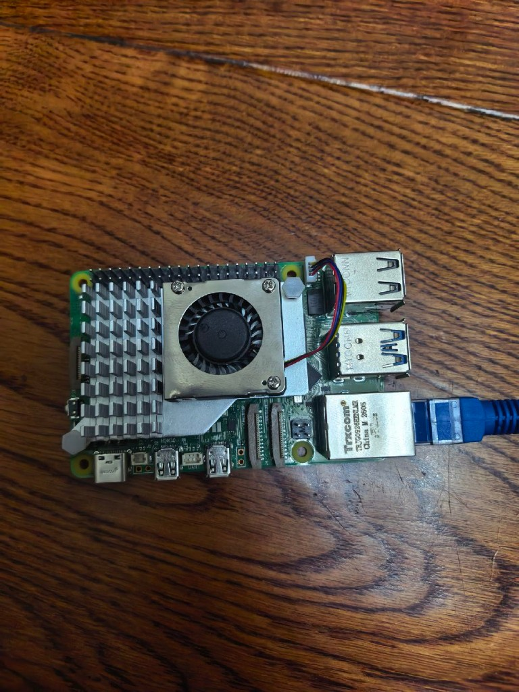
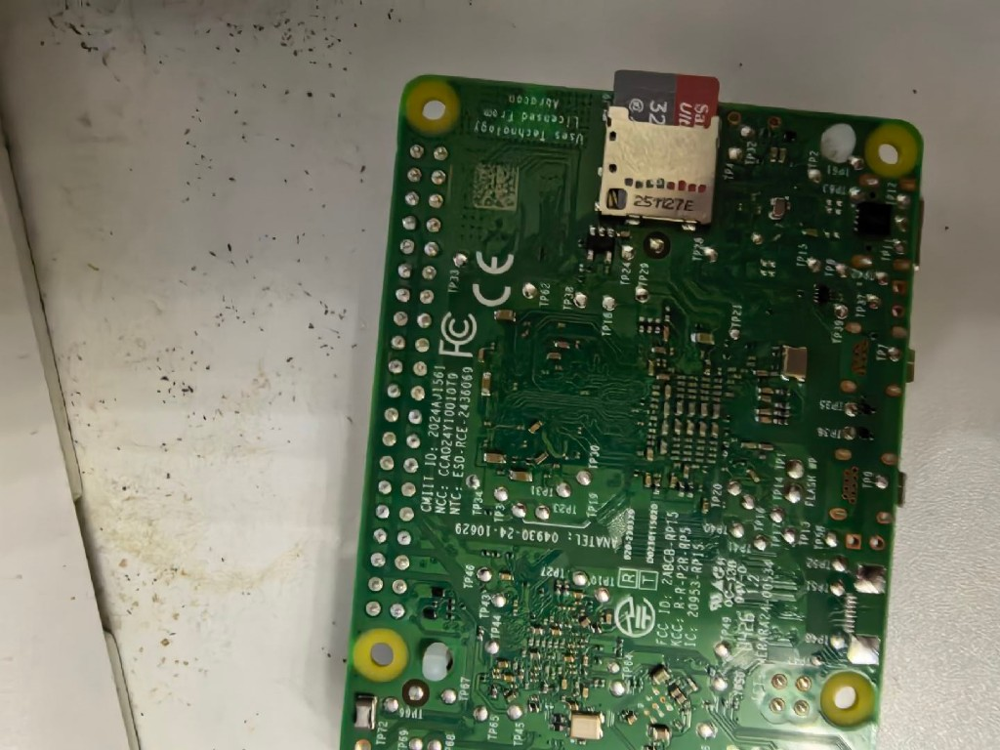

# Project #1 · Active Cooler 风扇接线 + 首次开机

> 实物核对 · 官方主动散热（Active Cooler）· 接在 [02 microSD](./02-microsd-card-reader.md) 烧录之后  
> 对齐 [RASPBERRY-PI5-LABS](../RASPBERRY-PI5-LABS.md)

---

## 你现在的硬件状态（对照照片）

### 正面：散热片 + 风扇已装好，线还没插



- 银色散热片 + 黑色小风扇已用螺丝固定（官方 Active Cooler）
- **4 色线（黑/红/黄/蓝）插头还悬在 USB 口附近** ← 下一步就是插它
- 网线可先插着；USB-C 电源等系统烧好、风扇插好再上电

### 背面：microSD 已就位



- 32GB SanDisk Ultra 已卡紧；**不要抠**；要取卡就往里按一下再弹出
- 风扇 **FAN 座不在背面**（背面是焊点 / 安装孔 / SD 槽）
- 少用手摸密密麻麻焊点，防静电

---

## 1. 插风扇供电线（只差这一步硬件）

1. 翻回**正面**，在**网口上方、USB 旁**找 **4 针 `FAN` 针座**（小白座 / 4 个小孔）。  
2. 插头**卡扣朝外**，对准孔位**垂直按到底**卡紧。  
3. 不要斜插、硬掰——针脚很细。

> 插反一般**不会烧板**，只是风扇不转；拔下反过来再插即可。

### 风向

风扇在散热片上方，**风往下吹向散热片** —— 你现在的安装方向正确，不用翻风扇。

---

## 2. 系统里打开风扇温控（必须）

烧录好 **64-bit** 系统、能 SSH / 本机登录后：

```bash
sudo raspi-config
```

路径大致：`Performance Options` → `Fan`

- 启用风扇  
- 启动温度常见设 **60℃**（高于此温度才转）

保存后重启。闲置可能不转；升温后才嗡嗡响，属正常。

---

## 3. 快速自检

```bash
# 若未安装：sudo apt install stress
stress --cpu 4
# 温度 > 60℃ 左右应听到风扇；Ctrl+C 结束
```

看温度（可选）：

```bash
vcgencmd measure_temp
```

---

## 4. 避坑

| 项 | 说明 |
|----|------|
| 螺丝 | 手拧紧即可，死拧可能压坏芯片 |
| FAN 针 | 对准再垂直下压 |
| SD | 已插入就别反复拔；烧录完成再上电更稳妥 |
| 背面 | FAN 不在背面；背面只确认 SD / 安装孔 |

---

## 5. 首次上电推荐顺序

1. Imager 写好 **Pi 5 · Lite 64-bit**（开 SSH）— 见 [02](./02-microsd-card-reader.md)  
2. 卡已在板子背面就位  
3. 正面：**FAN 插头插紧**  
4. 接网线（可选）→ USB-C 电源上电  
5. SSH 登录 → `raspi-config` 开风扇温控 → 可选 `stress` 自检  

---

## 本步完成标准

- [ ] Active Cooler 螺丝已固定，风向正确  
- [ ] 4 色插头已插入正面 **FAN** 座  
- [ ] microSD 在位且系统已烧录  
- [ ] 上电能进系统；`raspi-config` 已开风扇  
- [ ]（可选）加压后风扇能转  

← [02 microSD](./02-microsd-card-reader.md) · [01 三层模型](./01-userspace-kernel-hardware.md)
