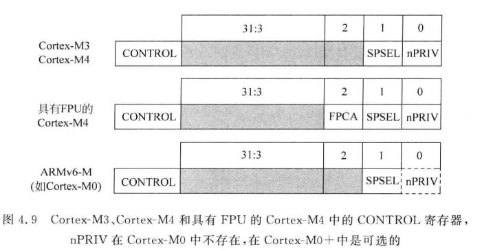
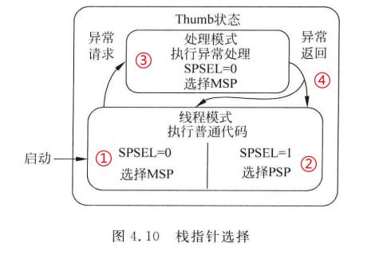

## §2.4 Cortex-M4 — 处理器模式 · 寄存器 · 向量表

> **Ch 2 · 程序员模型** · [章导读](../README.md) · [本章概述](./section-0-本章完整概述.md)  
> **英文：** Cortex-M4 Programmer's Model · → [Ch15 异常详解](../../chapter-15-exception-handling-cortex-m4/)

---

### Cortex-M4 是什么（定位）

**Cortex-M4** = ARM **32 位嵌入式内核**（**ARMv7-M**），主打 **控制 + 适度 DSP**。比 M3 多 **更强 DSP 指令**；**FPU 可选**（带则为 **M4F**）。常见于手表、工控、汽车电子；**STM32F4** 多用此内核。

> **M4 ≠ ARM7 换皮**：模型从 **7 模式 Bank** → **Thread/Handler + 硬件压栈**（下文 + Ch15）。

---

## 一、运行模型：2 种模式 + 2 级特权

### 1. 两种运行模式

| 模式 | 说明 |
|------|------|
| **Thread Mode** | 普通应用 / 用户任务正常执行；**上电默认**进入 |
| **Handler Mode** | **任意中断/异常** 自动进入；**固定特权**；异常返回自动回 Thread |

### 2. 两级访问特权

| 级别 | 能力 |
|------|------|
| **Privileged** | 可操作 **NVIC、MPU、CONTROL、系统控制块** 等；内核与异常处理默认特权 |
| **Unprivileged (User)** | 访问内核寄存器受限 — **RTOS 隔离**业务任务，防篡改内核配置 |

**组合关系（口述）：**

```
Handler Mode  →  永远 Privileged
Thread Mode   →  Privileged 或 Unprivileged（由 CONTROL 决定）
```

上电复位后典型：**Thread + Privileged + MSP**；跑 RTOS 时再切 **Thread Unprivileged + PSP**。

### 3. CONTROL 寄存器（位图 + 栈指针选择）

> 图源：《ARM Cortex-M3 与 Cortex-M4 权威指南》图 4.9 / 4.10。  
> Smith 本书展开 → **[Ch15 异常处理 · Cortex-M4](../../chapter-15-exception-handling-cortex-m4/)**（CONTROL · 8-word 栈帧 · EXC_RETURN · RTOS 切换）。

#### 1）位定义（仅低 3 位有效）

| Bit | 名称 | 功能 |
|-----|------|------|
| **0** | **nPRIV** | Thread：**0=特权** · **1=非特权**。Handler **永久特权**，此位不改变 Handler 权限 |
| **1** | **SPSEL** | Thread：**0=MSP**（内核/中断栈）· **1=PSP**（任务栈）。Handler **强制 MSP**，写此位无效 |
| **2** | **FPCA** | **仅 M4F**：当前是否有浮点现场；异常进出硬件自动更新 |
| **31:3** | 保留 | 只读 0，勿改 |



| 内核 | nPRIV | SPSEL | FPCA |
|------|-------|-------|------|
| M3 / M4（无 FPU） | ✓ | ✓ | — |
| **M4F** | ✓ | ✓ | ✓ |
| M0 | **无** | ✓ | — |
| M0+ | 可选 | ✓ | — |

#### 2）两大核心作用

**(1) MSP / PSP 双栈**

| | |
|--|--|
| **MSP** | 主栈 — 内核、Handler、初始化默认 |
| **PSP** | 进程/任务栈 — RTOS 每任务私有栈 |
| **切换** | 改 `CONTROL.SPSEL`（+ 换 PSP 值）→ **任务栈隔离** |

**(2) Thread 特权 / 非特权**

| | |
|--|--|
| **特权** | NVIC、SCS、特殊寄存器（MSR/MRS）、全外设 |
| **非特权** | 禁碰内核系统寄存器；经 **`SVC`** 请求内核服务 |
| **用途** | 轻量 RTOS 隔离用户任务，防破坏底层 |

#### 3）RTOS 价值

1. **双栈分离** — 任务 PSP 溢出不易打爆内核 MSP  
2. **权限隔离** — 用户态非法访问 → 常进 **HardFault**  
3. **硬件协助返回** — 异常返回依 **EXC_RETURN** 恢复栈/模式上下文（Ch15 细节）

#### 4）栈指针选择状态机（图 4.10）



```
启动 → Thread，SPSEL=0 → MSP（①）
写 SPSEL=1 → Thread 用 PSP（②）
异常请求 → Handler，强制 MSP（③）
异常返回 ④ → Thread；回 MSP 或 PSP 视 CONTROL / EXC_RETURN
```

| 状态 | 模式 | SP |
|------|------|-----|
| ① | Thread · SPSEL=0 | **MSP**（上电默认） |
| ② | Thread · SPSEL=1 | **PSP**（RTOS 任务） |
| ③ | Handler | **始终 MSP** |
| ④ | 异常返回 | 回 Thread ① 或 ② |

**口述一句：**

> **nPRIV 管权限，SPSEL 管 Thread 用哪根栈；Handler 永远 MSP。M4F 多 FPCA 管浮点压栈。**

### 4. 两个独立概念：执行模式 vs 特权等级

**勿混：** Thread/Handler 是 **「此刻在跑什么场景」**；特权/用户是 **「Thread 里这张权限标签」**。

#### ① 执行模式（全局只有 2 种，不是每个任务专属一套）

| 模式 | 何时 | 特权 |
|------|------|------|
| **Handler** | 进中断/异常 **自动**切 | **永久 Privileged**，不可改成用户态 |
| **Thread** | 正常跑业务代码 | 特权等级 **可切换**（CONTROL） |

所有任务 **共用** 这套划分：CPU 同一时刻只有一种执行模式；切任务不「自创第三种模式」。

#### ② 特权等级（Privileged / Unprivileged）

| | |
|--|--|
| **作用域** | **主要约束 Thread**（Handler 锁死特权） |
| **Privileged** | 可碰 NVIC / MPU / CONTROL / 系统控制寄存器 — 内核、初始化默认 |
| **Unprivileged** | 硬件限制上述访问 — 普通业务任务，防篡改内核配置 |

**问题对答：**

| 问 | 答 |
|----|-----|
| 特权/用户是不是两种状态？ | **是** — Thread 下二选一 |
| 每个任务能否单独配特权等级？ | **能** — RTOS 在任务控制块里记「此任务 Priv 还是 Unpriv」，**切换任务时写 CONTROL**（常顺带换 PSP） |

```
内核任务 / 驱动任务  →  Thread + Privileged
普通业务任务        →  Thread + Unprivileged
IRQ/SysTick/SVC…    →  Handler（永远 Privileged）
```

**关键安全点：** Unprivileged 任务 **不能自己写 CONTROL 提权** — 只有 **Privileged** 代码（内核 / SVC handler）能改特权位与 SP 选择。  
「每个任务独立配置」= **OS 替你配 + 切任务时切换**，不是 APP 自我升级。

#### ③ 组合一览

| 组合 | 谁在用 |
|------|--------|
| **Handler + Privileged** | 所有中断/异常（唯一组合） |
| **Thread + Privileged** | 内核、驱动、初始化 |
| **Thread + Unprivileged** | 普通业务任务 |
| ~~Handler + Unprivileged~~ | **不存在** |

#### ④ 大楼类比

| | |
|--|--|
| **Handler** | 消防通道 — 一进来就是全部权限（固定特权） |
| **Thread + 特权** | 管理员办公室 — 能进机房（内核寄存器） |
| **Thread + 用户** | 普通员工办公室 — 机房门锁死 |
| **任务切换** | 换办公室 → 换「管理员/员工」标签（写 CONTROL） |

#### ⑤ 背诵两句

> **模式 = 跑业务还是跑中断（全局场景）。**  
> **特权 = Thread 上的权限标签；每任务可由 OS 单独配置，切任务时换标签；Handler 无用户态。**

### 对比 ARM7（摘要）

详见下方 **§五**。一句话：M4 用 **Thread/Handler + CONTROL + 硬件压栈** 换掉 ARM7 的 **7 模式 Bank + 手动压 R0–R12**。

---

## 二、内核寄存器架构

### 1. 基础 16 个内核寄存器

| 寄存器 | 功能 |
|--------|------|
| **R0–R12** | 通用；传参惯例 → [Ch13](../../chapter-13-subroutines-and-stacks/)（APCS / AAPCS） |
| **R13 (SP)** | **双堆栈**：**MSP**（主栈）· **PSP**（进程/任务栈） |
| **R14 (LR)** | 普通调用 = 返回地址；**异常上下文 = EXC_RETURN** 特殊码（非普通 PC） |
| **R15 (PC)** | 程序计数器；**仅 Thumb-2** |

### 双堆栈分工（RTOS 基础）

| 指针 | 谁用 |
|------|------|
| **MSP** | 内核初始化、**异常/中断**、OS 内核代码 |
| **PSP** | 普通用户任务独立栈；**切任务主要换 PSP**，少碰内核栈 |

```
异常入口：硬件用当前 SP（或按规则到 MSP）自动压帧 → Ch15
任务切换：换 PSP + 常改 SPSEL → 下一任务栈恢复
```

### 2. Cortex-M4F 浮点扩展（Ch9–11，可跳过）

| | |
|--|--|
| **S0–S31** | 32 个单精度浮点寄存器 |
| **FPSCR** | 浮点运算状态 / 异常控制 |

带 FPU 时异常入口还可能自动保存部分 **s** 寄存器（lazy stacking，Ch15）；**CONTROL.FPCA** 标记是否需要。

---

## 三、xPSR — 三合一状态寄存器

逻辑三段，硬件合为 **xPSR**，一次读可得三类状态：

| 视图 | 全称 | 内容 |
|------|------|------|
| **APSR** | Application | **N Z C V**、饱和标志等 |
| **IPSR** | Interrupt | **当前异常编号**（Thread 时为 **0**；Handler 里为对应号） |
| **EPSR** | Execution | Thumb 相关位 — **M 系只跑 Thumb-2** |

---

## 四、异常向量表（与 ARM7 最核心差异）

### 1. ARM7 ↔ M4

| 特性 | ARM7TDMI | Cortex-M4 |
|------|----------|-----------|
| 表项内容 | 跳转指令 `B handler` | 处理函数 **地址（字）** |
| 表头首项 | Reset 跳转 | **初始 MSP** + Reset_Handler 地址 |
| 风格 | 经典 ARM | 类似 **8051** 向量表 |

ARM7 示例（存指令）：

```
0x00: B Reset
0x04: B Undefined
0x08: B SWI
…
```

M4：硬件 **直接取地址跳转** — 少一层 `B`，Flash 更省、延迟更固定。

### 2. Thumb 地址强制规则

- 向量中函数地址 **LSB 必须为 1**（标记 Thumb）
- 硬件取址时 **自动清 LSB**，得到真实对齐地址

### 3. 表头布局（偏移 · 字节）

| 偏移 | 内容 |
|------|------|
| **0x00** | 上电初始 **MSP**（栈顶） |
| **0x04** | **Reset_Handler** 地址（LSB=1） |
| **0x08+** | NMI · HardFault · … · SVCall · PendSV · SysTick · 外设 IRQ… |

---

## 五、ARM7TDMI vs Cortex-M4 完整对比

### 1. 运行模式

| | ARM7（v4T） | Cortex-M4（v7-M） |
|--|-------------|-------------------|
| 模式 | **7 种**：User / System / IRQ / FIQ / SVC / Abort / Undefined | **Thread + Handler** |
| 寄存器 | 多组 **Banked** SP/LR/SPSR（FIQ 还有 r8–r12） | **无** 七模式 bank；靠 **栈 + MSP/PSP** |
| 特权 | 仅 User 非特权，其余特权 | Thread 由 **nPRIV** 切；Handler **永久特权** |

### 2. 中断现场（关键性能差）

| | ARM7 | Cortex-M4 |
|--|------|-----------|
| 压栈 | **软件** `PUSH` 共用 GPR（r0–r12 等） | **硬件自动 8-word 帧**：R0–R3、R12、LR、PC、xPSR |
| Bank 已做 | SP / LR / CPSR→SPSR | —（换以栈帧 + EXC_RETURN） |
| ISR 语言 | 入口常需汇编壳 | **纯 C 可写 ISR** |
| 延迟 | 软件保存多少可变 → 较难固定 | **更可预测**（Ch15） |

### 3. 向量表

| ARM7 | Cortex-M4 |
|------|-----------|
| 存 `B handler` | 存 **函数指针**；首字 = **初始 MSP** |

### 4. M4 相对 ARM7 五大优势（口述）

1. **OS 友好** — CONTROL：双栈 + 权限，少写汇编保护  
2. **中断更实时** — 硬件压帧，延迟更可量化  
3. **代码更小** — 向量表指针；C ISR 少装配  
4. **任务隔离** — Thread Unprivileged + MPU（可选）收紧用户任务（ARM7 有 User，但 **无 MSP/PSP + CONTROL 这套 RTOS 接口**）  
5. **模型更简** — 两种顶层模式，无 7 模式迷宫  

---

## 六、一页速查表（背诵用）

| 维度 | ARM7 | M4 |
|------|------|-----|
| 模式 | 7 + bank | Thread / Handler |
| 权限开关 | CPSR.M | **CONTROL.nPRIV**（仅 Thread） |
| 双栈 | 各模式 SP | **MSP + PSP**（**SPSEL**） |
| 进异常 | 软件压 GPR | **硬件 8 字帧** |
| 向量 | `B` 指令 | **地址**；[0]=MSP |
| 指令 | ARM+Thumb | **Thumb-2 only** |

**CONTROL 三比特：** `nPRIV` | `SPSEL` | `FPCA(M4F)`  
**组合：** Handler=永特权+MSP · Thread+Priv · Thread+User  

→ 细节 **[Ch15](../../chapter-15-exception-handling-cortex-m4/)**

---

## 七、必背考点

1. **Thread / Handler** + **Priv / User**；CONTROL + MPU 做隔离。  
2. **MSP / PSP** 分内核与任务栈 — RTOS 调度基础。  
3. **向量表存地址**（非 `B`）；首字 = **初始 MSP**；handler 地址 **LSB=1**。  
4. 硬件 **8-word 压栈** — 相对 ARM7 最大实时差异。  
5. 本书实验主平台 **Cortex-M4**；Ch3 起代码按 **Thumb-2** 读。

---

### 与 ARM7 Bank 对照一句

> ARM7：**Bank 换 SP/LR/SPSR**，共用 GPR 还要软件压栈。  
> M4：**硬件自动压 8-word 帧** + **CONTROL 选栈/权限** — 实现不同，都是为了 **少手动画上下文**。
