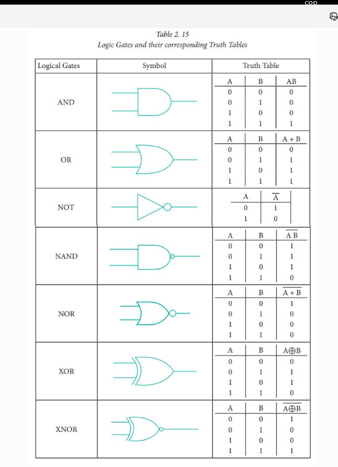

# 1.5 逻辑门

> **Core Concept:** 最简单数字电路：二进制入 → 二进制出；**缓冲门**单独算基础门  
> **Link Target:** Ch2 组合逻辑 · 2.6 三态缓冲 · 2.9 延迟  
> **档位:** 浅读

## 状态

- [x] 已读（口述巩固）
- [x] 已写要点

## 笔记

逻辑门对二进制变量做最简单操作；**符号、布尔式、真值表**三位一体。

### 基础门

| 门 | 逻辑 | 作用 |
|----|------|------|
| **NOT** 非门 | 取反 | 逻辑翻转 |
| **Buffer** 缓冲 | **输出=输入** | **驱动放大 · 时序对齐**（见下） |
| **AND** 与 | 全 1 才 1 | 合取 |
| **OR** 或 | 有 1 则 1 | 析取 |

### 纸片逻辑（直觉）

约定：**正面 = 1，反面 = 0**。

| 门 | 纸片怎么玩 |
|----|------------|
| **非门** | 一张纸片**翻面**：正进 → 反出（1→0）；反进 → 正出（0→1） |
| **缓冲门** | 把**薄纸加厚**：正进仍正、反进仍反（1→1、0→0），只是更扎实、能传更远 |
| **与门** | **两张叠着**：两张都正面才露出 1；任一张是反面就把输出挡成 0 |
| **或门** | 只要**有一张正面朝上**就是 1；两张都反面才是 0 |

### 为什么缓冲门要单列为基础门

真值表上看「进出一样」，容易误以为没用。工程上它是刚需：

| 用途 | 做什么 |
|------|--------|
| **驱动能力放大** | 弱信号增强，去带更多负载（扇出、长线、重电容） |
| **时序对齐** | 可控延迟，让各路信号同步到达，减时序偏差 |
| **隔离 / 整形** | 把前级与后级负载隔开，减轻信号衰减与畸变 |

→ 解决的是 **信号衰减** 与 **时序偏差**，不是改逻辑值。  
→ 与 **三态缓冲**（可出 Z，见 [2.6](../ch02_combinational/2.6_X和Z.md)）不同：普通缓冲始终驱动 0/1；三态多一个使能，用于总线。

**缓冲门真值表**（多数教材表不画它，这里补上）：

| A | Out |
|---|-----|
| 0 | 0 |
| 1 | 1 |

### 符号与真值表速查

参考图（七种逻辑门；**不含 Buffer**）：

| 门 | 输出记法 | 一句话 |
|----|----------|--------|
| **AND** | AB | 全 1 才 1 |
| **OR** | A+B | 有 1 则 1 |
| **NOT** | A̅ | 取反 |
| **NAND** | (AB)̅ | AND 再非；**功能完备**，芯片里极常见 |
| **NOR** | (A+B)̅ | OR 再非 |
| **XOR** | A⊕B | **相异**为 1 |
| **XNOR** | (A⊕B)̅ | **相同**为 1（相等比较常用） |

另有 **多输入**（≥3）与/或/与非等。

CMOS 硅片上怎么串并联搭这些门（一对管子=非；NOR/NAND 拓扑；OR/AND=再加反相器）→ [1.7 · 从非门到与/或](./1.7_CMOS晶体管.md)。

→ Ch2 用这些门拼 MUX、加法器；布线与关键路径里常能见到缓冲链。
