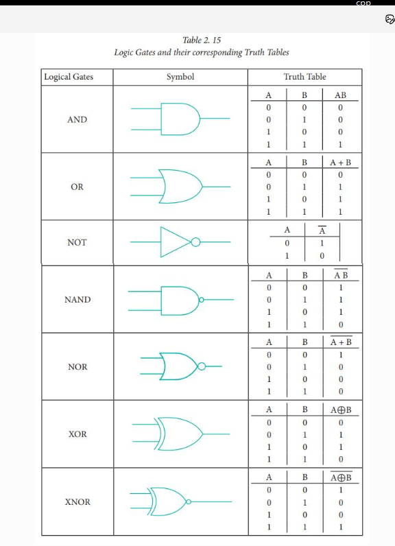
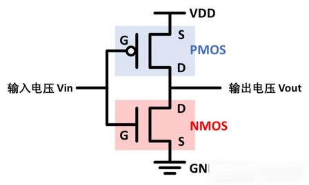
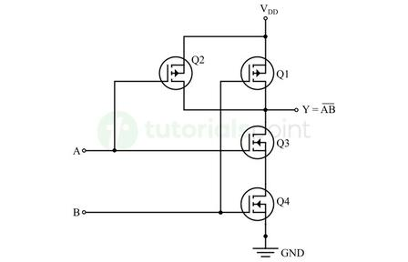
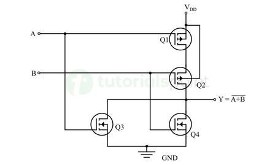
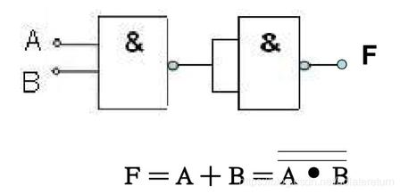
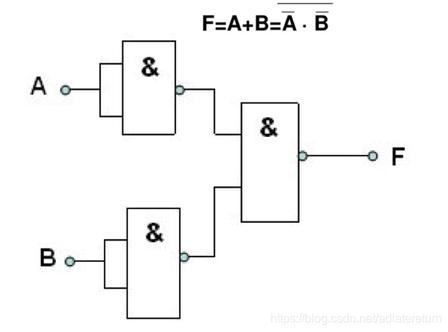
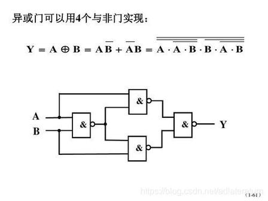

# 1.5 逻辑门

> **Core Concept:** 最简单数字电路：二进制入 → 二进制出；**缓冲门**单独算基础门  
> **Link Target:** Ch2 组合逻辑 · 2.6 三态缓冲 · 2.9 延迟  
> **档位:** 浅读

## 状态

- [x] 已读（口述巩固）
- [x] 已写要点

## 笔记

逻辑门对二进制变量做最简单操作；**符号、布尔式、真值表**三位一体。

### 基础门

| 门 | 逻辑 | 作用 |
|----|------|------|
| **NOT** 非门 | 取反 | 逻辑翻转 |
| **Buffer** 缓冲 | **输出=输入** | **驱动放大 · 时序对齐**（见下） |
| **AND** 与 | 全 1 才 1 | 合取 |
| **OR** 或 | 有 1 则 1 | 析取 |

### 纸片逻辑（直觉）

约定：**正面 = 1，反面 = 0**。

| 门 | 纸片怎么玩 |
|----|------------|
| **非门** | 一张纸片**翻面**：正进 → 反出（1→0）；反进 → 正出（0→1） |
| **缓冲门** | 把**薄纸加厚**：正进仍正、反进仍反（1→1、0→0），只是更扎实、能传更远 |
| **与门** | **两张叠着**：两张都正面才露出 1；任一张是反面就把输出挡成 0 |
| **或门** | 只要**有一张正面朝上**就是 1；两张都反面才是 0 |

### 为什么缓冲门要单列为基础门

真值表上看「进出一样」，容易误以为没用。工程上它是刚需：

| 用途 | 做什么 |
|------|--------|
| **驱动能力放大** | 弱信号增强，去带更多负载（扇出、长线、重电容） |
| **时序对齐** | 可控延迟，让各路信号同步到达，减时序偏差 |
| **隔离 / 整形** | 把前级与后级负载隔开，减轻信号衰减与畸变 |

→ 解决的是 **信号衰减** 与 **时序偏差**，不是改逻辑值。  
→ 与 **三态缓冲**（可出 Z，见 [2.6](../ch02_combinational/2.6_X和Z.md)）不同：普通缓冲始终驱动 0/1；三态多一个使能，用于总线。

**缓冲门真值表**（多数教材表不画它，这里补上）：

| A | Out |
|---|-----|
| 0 | 0 |
| 1 | 1 |

### 符号与真值表速查

参考图（七种逻辑门；**不含 Buffer**）：

| 门 | 输出记法 | 一句话 |
|----|----------|--------|
| **AND** | AB | 全 1 才 1 |
| **OR** | A+B | 有 1 则 1 |
| **NOT** | A̅ | 取反 |
| **NAND** | (AB)̅ | AND 再非；**万能门**，芯片里极常见 |
| **NOR** | (A+B)̅ | OR 再非；同样是 **万能门** |
| **XOR** | A⊕B | **相异**为 1 |
| **XNOR** | (A⊕B)̅ | **相同**为 1（相等比较常用） |

另有 **多输入**（≥3）与/或/与非等。

### 万能门 + CMOS 原生三件套（纠用词）

**逻辑层：** 只用 **非门** 拼不出全部逻辑。  
**NAND / NOR** 各是一套 **万能（功能完备）门**：无数个同种门即可拼出非、与、或、异或……一切组合逻辑。

**CMOS 硬件层（原生易做、功耗优）：**

| ✅ 原生 | ❌ 不直接原生 |
|--------|---------------|
| **NOT** 反相器 | **AND** 与门 |
| **NAND** 与非 | **OR** 或门 |
| **NOR** 或非 | |

做法：AND = NAND+NOT；OR = NOR+NOT。晶体管细节 → [1.7](./1.7_CMOS晶体管.md)。

#### CMOS 门拓扑速记（2 输入，看懂即止）

**反相器（看懂这张就够）：**

| | PMOS（上，蓝） | NMOS（下，红） |
|--|----------------|----------------|
| 源 S | → **VDD** | → **GND** |
| 漏 D | 与下管漏相连 → **Vout** | 同上 |
| 栅 G | 与下管栅并联 ← **Vin** | 同上 |

P 管栅极小圈 = 低电平易导通（与 N 管互补）。  
\(V_{in}=0\) → P 通 N 断 → \(V_{out}=V_{DD}=1\)；  
\(V_{in}=1\) → P 断 N 通 → \(V_{out}=\mathrm{GND}=0\)。  
→ \(V_{out}=\overline{V_{in}}\)。译码器里地址原/反变量就靠这种非门。

| 门 | \(Y\) | 上拉 PMOS | 下拉 NMOS | 何时 \(Y=0\) |
|----|-------|-----------|-----------|--------------|
| **NAND** | \(\overline{A\cdot B}\) | **并联** | **串联** | 仅 A=B=1 |
| **NOR** | \(\overline{A+B}\) | **串联** | **并联** | A=1 或 B=1 |

口诀：**NAND = P 并 N 串；NOR = P 串 N 并**（与非/或非对偶）。  
真值：NAND 仅 11→0，其余→1；NOR 仅 00→1，其余→0。

**NAND（对照图）：** \(Y=\overline{AB}\)

上 Q1/Q2（P）**并联**→VDD；下 Q3/Q4（N）**串联**→GND。仅 A=B=1 时下拉通路通 → Y=0；任一为 0 则有 P 通 → Y=1。

**NOR（对照图）：** \(Y=\overline{A+B}\)

上 Q1/Q2（P）**串联**→VDD；下 Q3/Q4（N）**并联**→GND。A 或 B 为 1 → 有 N 通 → Y=0；仅 A=B=0 时两 P 全通 → Y=1。

两图合看：**拓扑对偶**——NAND 的并/串，到 NOR 刚好对调。

同片上 N/P 管怎么长在硅里（P-sub + N-well 剖面）→ [1.7 · 截面图](./1.7_CMOS晶体管.md)（看懂结构即可，不钻工艺）。

#### NAND / NOR 万能变换（保存）

**方案 1 · NAND（CMOS 最常用）：**

| 想要 | 接法 |
|------|------|
| NOT A | NAND(A, A) |
| A AND B | NOT( NAND(A,B) ) |
| A OR B | NAND( NOT A, NOT B ) |
| A XOR B | NAND( NAND(A,T), NAND(B,T) )，其中 \(T=\mathrm{NAND}(A,B)\) |

即：\(A\oplus B=\mathrm{NAND}\big(\mathrm{NAND}(A,\mathrm{NAND}(A,B)),\,\mathrm{NAND}(B,\mathrm{NAND}(A,B))\big)\)（标准 4×NAND 异或）。

> **纠口述：** 若写成 \(\overline{A\cdot\overline{AB}+B\cdot\overline{AB}}\) 按「或的非」理解，得到的是 **XNOR（同或）**，不是 XOR。以表中 NAND 嵌套为准。

**图解（纯 NAND 万能）：**

AND = NAND + 再非：\(F=AB=\overline{\overline{AB}}\)

OR = 先各自非再 NAND（德摩根）：\(F=A+B=\overline{\overline{A}\cdot\overline{B}}\)

XOR = 4×NAND（与上表同一拓扑）：

\(Y=A\oplus B=\overline{\overline{A\cdot\overline{AB}}\cdot\overline{B\cdot\overline{AB}}}\)（图中公式；中间共享 \(T=\overline{AB}\)）。

**方案 2 · NOR：**

| 想要 | 接法 |
|------|------|
| NOT A | NOR(A, A) |
| A OR B | NOT( NOR(A,B) ) |
| A AND B | NOR( NOT A, NOT B ) |

#### 和组合模块的衔接

- 工业优先 NAND/NOR：原生、管少；AND/OR = 再加一级非。  
- [74HC138](../ch02_combinational/2.8_组合逻辑模块.md) 内部主要是**与非阵列**；MUX 常化为与或 / 与非等价网。  
- 异或是全加器核心；门级用上表即可，**不必**先背整份 CMOS 异或晶体管图（需要时再开 [1.7](./1.7_CMOS晶体管.md) / 全加器节）。

> **一句话：** CMOS 原生 NOT/NAND/NOR；一种万能门可搭出一切基础门；译码/MUX/ALU 最终沉到这一层。

→ Ch2 用这些门拼 MUX、加法器；布线与关键路径里常能见到缓冲链。
