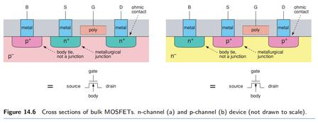
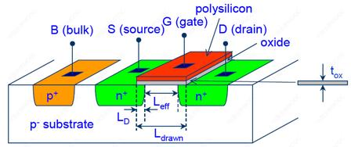
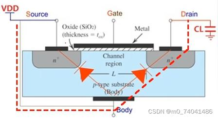

# 1.7a 单管：NMOS ↔ PMOS（四电极）

> 拆自 [1.7_CMOS晶体管.md](./1.7_CMOS晶体管.md) · 内容完整保留

### 1. 单管对比：NMOS ↔ PMOS（结构对称，掺杂与极性反过来）

**物理上四电极：** **G** 栅 | **D** 漏 | **S** 源 | **B** 衬底/阱（Bulk）。  
原理图常只画 G/S/D（3 脚）：数字 CMOS 里 **B 已在片内接到电源轨**，不单独外引。

| | **NMOS** | **PMOS** |
|--|----------|----------|
| 体区 B 所在 | **P 衬底** | **N 阱**（或 N 衬底） |
| S、D 掺杂 | **n+** | **p+** |
| 载流子 | **电子**（S→D） | **空穴**（S→D） |
| 传统电流方向 | 常 **D→S**（与电子反向） | 常与空穴同向 **S→D** |
| 导通（增强型，简化） | \(V_{GS}>V_{th}\)（栅相对源够高） | \(V_{SG}>|V_{th}|\)（源相对栅够高 / 栅相对源够低） |
| 符号（数字教材常见） | 栅**无**小圈；体端箭头 **指向沟道** | 栅**带**小圈；体端箭头 **离开沟道** |
| **B 硬性接法（标准数字 CMOS）** | **B → GND**（最低电位） | **B → VDD**（最高电位） |

> **导通口误纠：** 「栅比源高」只是 NMOS 的粗记；正式是 **V_GS = V_G − V_S 超过阈值 V_th**（源不在 0 时不能只看 V_G 绝对值）。PMOS 对称看 V_SG 或「栅够低于源」。

---

### 1.1 电路符号怎么认（箭头 · 小圈 · 别和「朝栅极」搅在一起）

认管时看两件独立的事：**① 体端（衬底）箭头方向**；**② 栅极旁有没有小圈**。

#### ① 四端符号：体端箭头 = 沟道类型

箭头画在 **衬底/体 B** 那条腿上，表示体与沟道之间的结类型：

| | 箭头方向（钉死） | 口误 |
|--|------------------|------|
| **NMOS** | **从衬底指向沟道**（朝沟道「刺进去」） | ✅ |
| **PMOS** | **从沟道指向衬底**（离开沟道「拔出去」） | ✅ |

画在纸上时：体端常在沟道下方 → NMOS 箭头往往 **朝上指进沟道**；PMOS 箭头往往 **朝下离开沟道**。  
具体「朝上/朝下」取决于你怎么摆符号，**以「进沟道 / 离沟道」为准**，不要死记上下。

| ❌ 易混 | ✅ |
|--------|-----|
| 把「指向沟道」说成「远离栅极」 | 体在下、箭头进沟道时，其实是 **朝栅极那一侧** 指；勿用「远不远离栅」当判据 |
| 用箭头朝上=一定是 PMOS | 上下只是画法；看 **进/离沟道** |

与本文件图注一致：`朝沟道 = N 沟（NMOS）`；`离沟道 = P 沟（PMOS）`。

#### ② 数字 CMOS 简图：PMOS 栅极旁小圈

很多逻辑图里：

| | 栅极 |
|--|------|
| **NMOS** | 无圈 |
| **PMOS** | **有小圆圈**（表示反相/增强型 P 管「栅低才导通」的画法习惯） |

小圈 **不是** 又一个物理电极，只是符号约定，用来和 NMOS 一眼区分。

#### ③ 反相器里成对出现（接 CMOS）

标准静态 CMOS 反相器：

```
VDD ── PMOS（在上，S 接 VDD）──┐
                               ├── Out
GND ── NMOS（在下，S 接 GND）──┘
         两管栅极并接 = In
```

- **总是成对**：上拉用 P，下拉用 N（→ [1.7b](./1.7b_CMOS互补架构.md)）  
- 输入共栅 → 天然一开一关 → 电平翻转（非门）

> **一句话：** 体箭头 **进沟道=N、离沟道=P**；数字图上 **P 管栅带圈**；反相器 **P 上 N 下、共栅**。

---

**S/D 不固定左右：** 载流子从哪边「出发」，哪边叫源。原理图勿死记「左 S 右 D」。  
数字门里习惯：接 **GND** 的 N 管端、接 **VDD** 的 P 管端 **称为源**（标准反相器/NAND/NOR 如此）。

**为何 B 必须接轨：** 让源–衬底 / 阱–衬底等 PN 结保持**反偏**，减漏电、抑闩锁；乱接 B 会正偏或体偏置乱漂阈值。  
（体效应 / 衬底偏置：B 与 S 电位差会改 V_th——知道有这事即可，公式体系结构向不背。）

细节机理 → [补充_PN结到MOS](./补充_PN结到MOS.md)。同片剖面 → 下文「三、CMOS 芯片硅片横截面」。

**教材剖面 + 符号（四极对照）：**



| 图上标注 | 含义 |
|----------|------|
| (a) n-channel | NMOS：体 **p⁻**，S/D **n⁺**，B 经 **p⁺** body tie |
| (b) p-channel | PMOS：体 **n⁻**，S/D **p⁺**，B 经 **n⁺** body tie |
| metallurgical junction | S/D 与体之间的 **PN 结**（要反偏） |
| body tie, not a junction | p⁺–p⁻ 或 n⁺–n⁻：**同型重掺接触**，不是结 |
| ohmic contact | 金属与重掺区的欧姆接触 |
| 下方符号箭头 | 体端箭头：**朝沟道 = N 沟（NMOS）**；**离沟道 = P 沟（PMOS）** |

→ 与上表「B→GND / B→VDD」同一套结构；看懂标注即可，不背工艺尺寸。

**NMOS 立体示意（认四极 + 沟道，参数浅尝）：**



| 看到 | 记什么 | 体系结构向要不要深挖 |
|------|--------|----------------------|
| B / S / G / D | 四电极；B 经 p⁺ 接 p⁻ 衬底 | ✅ 要 |
| n⁺ … n⁺ 之间 | 栅下形成 **N 沟道** 的地方 | ✅ 要（通/断直觉） |
| poly + oxide | 栅极 + 绝缘氧化层（t_ox） | 知「栅与硅绝缘」即可 |
| L_drawn、L_D、L_eff | 版图栅长、侧扩、**有效沟道长度**（大致 L_eff ≈ L_drawn − 2L_D） | ❌ 公式/工艺不背 |

→ 反相器下管就是这种 NMOS（S→GND）；上管是对偶的 PMOS。到此对「管长什么样」收束，回到门级 NAND/NOR。

**再认一张：结构 ✅ / 图中偏置 ⚠️（勿当 CMOS 门标准接法）**



| 看什么 | 结论 |
|--------|------|
| p-type Body、两 n⁺、Metal–SiO₂–沟道 L、t_ox | 仍是 **NMOS** 结构，与上图同源 |
| 红虚线二极管 | S/体、D/体的 **寄生 PN 结**；正常须 **反偏** |
| 图中 S 与 Body 短接且标到 **VDD**，D 接电容 C_L | 只是**某一示例偏置**（充电/开关示意） |
| **CMOS 数字门里的下拉 NMOS** | **S→GND，B→GND**（不是 VDD！）；D 才接到输出 |

> **坑：** 别把「这张图的 S/B 接 VDD」记成 NMOS 通用接法。标准逻辑：**NMOS 的 B（及通常 S）接芯片最低电位 GND；PMOS 的 B（及通常 S）接 VDD。**

---

