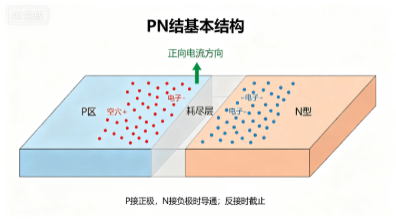
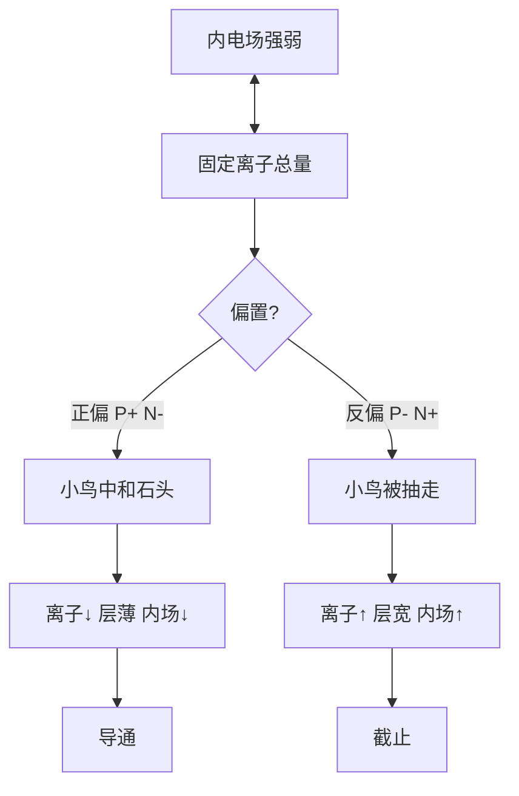

# 补充 · PN结（从零小白版）

> **Core Concept:** 多子扩散建耗尽层 / 少子漂移维持平衡；固定离子定内电场；正薄反宽  
> **Link Target:** [1.7 CMOS](./1.7_CMOS晶体管.md) · [补充_PN结到MOS](./补充_PN结到MOS.md)  
> **档位:** 浅读（想懂 MOS「为什么能开关」时读）

## 状态

- [x] 已读（口述巩固）
- [x] 已写要点
- [x] 已拆：同偏置「层宽=场强」对，但正偏变多的是载流子不是固定离子
- [x] 已拆：扩散（多子）≠ 漂移（少子）

## 笔记

不讲难词，一步一步来。芯片、MOS 原材料都是**硅**；纯硅几乎不导电，**掺杂质**才分出两种。

### 1. 两种基础半导体（先钉死多子 / 少子）

| 区 | **多子**（多） | **少子**（少） |
|----|----------------|----------------|
| **N型** | **自由电子** | 空穴 |
| **P型** | **空穴** | 自由电子 |

#### N型硅

往纯硅里掺**磷** → 多出很多**自由电子**。导电主力是电子。  
> 记：N = Negative（负，电子多）

#### P型硅

往纯硅里掺**硼** → 留下很多**空穴**。  
> 记：P = Positive（正，空穴多）

### 2. 什么是 PN结？

一块 **P型** 和一块 **N型** 紧紧贴在一起，接触面这一层结构 = **PN结**。



> 图注：P接正极、N接负极时**导通**；反接时**截止**。绿色箭头为正向电流方向。

### 3. 零偏：扩散建层 + 漂移回流（别混）

#### 3.1 刚接触：扩散（主力 = 多子）

- P区大量**空穴（多子）** → 往 N区扩散  
- N区大量**自由电子（多子）** → 往 P区扩散  

跨过交界面后：电子 + 空穴 **复合**，直接消失。  
✅ **建耗尽层起主要作用的是两边的多数载流子：P的空穴、N的电子。**

#### 3.2 复合后剩下：耗尽层 + 内建电场

| 侧 | 留下什么 |
|----|----------|
| P侧（空穴跑掉） | **负电固定离子** |
| N侧（电子跑掉） | **正电固定离子** |

这一层几乎没有可移动载流子 = **耗尽层**。  
固定离子 → **内建电场**，方向 **N → P**。

> 载流子只在耗尽层**两侧**参与扩散/漂移；层**内部**只有不动的离子 → **内电场只由这些离子决定**（接 §4）。

#### 3.3 内电场带来漂移（主力 = 少子）

漂移方向与扩散**相反**（电场反向拉扯）：

- 推着 **N区少子（空穴）** 往 P 走  
- 推着 **P区少子（自由电子）** 往 N 走  

👉 **漂移靠的是少子：N的空穴、P的自由电子。**

#### 3.4 四行对照表（一次性记牢）

| 运动 | 干什么 | 谁参加 |
|------|--------|--------|
| **扩散** | 一开始**搭建**耗尽层的主力 | P多子【空穴】、N多子【自由电子】 |
| **漂移** | **平衡**扩散，维持稳定耗尽层 | P少子【自由电子】、N少子【空穴】 |

零偏平衡：

```
扩散电流 = 漂移电流（大小相等、方向相反）→ 外部总电流 = 0
```

#### 3.5 纠正原话

>「接触层是 n区的空穴和 p区的自由电子起作用」

不完全对，要看哪种运动：

| 若说的是… | 主力其实是… |
|-----------|--------------|
| **扩散建耗尽层** | P空穴、N电子（**多子**） |
| **电场造成的漂移回流** | N空穴、P自由电子（**少子**） |

#### 3.6 串到正偏 / 反偏（预告）

| 偏置 | 内电场 | 谁占上风 | 结果 |
|------|--------|----------|------|
| **正向** | 削弱 | **扩散**占上风 | 持续电流 |
| **反向** | 增强 | 扩散被压住，只剩微弱**少子漂移**（漏电流） | 截止 |

**同一种偏置条件下：** 固定离子越多 → 层越宽 → 内电场越强。✅（细节见下节：别把「多子变多」当成固定离子变多。）

---

### 4. 正偏 / 反偏：先分清两种电荷（最大卡点）

| 电荷 | 在哪 | 能不能动 | 跟内电场的关系 |
|------|------|----------|----------------|
| **固定离子** | 耗尽层里 | 不能动 | **唯一直接决定**内电场强弱 |
| **自由空穴 / 自由电子** | P/N 区（可移动载流子） | 能跑 | **不直接贡献**内电场；正偏时去**中和**离子 |

> ❌「空穴/电子变多 → 电场变强」  
> ✅ 空穴/电子跑去中和离子 → **消灭产生电场的源头** → 内电场变弱

**围墙比喻：**

- 耗尽层 = 【固定带电石头】堆的围墙（离子）→ 产生阻挡电场  
- P/N 区空穴、电子 = 四处乱跑的**小鸟**  

| 偏置 | 小鸟干啥 | 围墙 / 内电场 |
|------|----------|----------------|
| **正向** | 冲向围墙，撞石头正负抵消 | 石头少 → 墙**变矮变薄** → 内电场**变弱** |
| **反向** | 被电源抽走，远离交界 | 更多石头暴露 → 墙**变宽** → 内电场**变强** |

**严谨逻辑链（建议背这条）：**

```
内电场强弱  ↔  耗尽层内「固定离子」总量
     ↑
正偏：移动载流子进入耗尽层，中和固定离子
      固定离子↓ → 宽度↓ → 内电场↓ → 容易穿过 → 导通
反偏：载流子被拉走，更多固定离子暴露
      固定离子↑ → 宽度↑ → 内电场↑ → 挡死 → 截止
```



**再补一句：内电场 ≠ 外加电源电场**

| | 内建电场 | 外加电源电场 |
|--|----------|--------------|
| 谁产生 | 耗尽层**固定离子** | 电池/电源 |
| 正偏 | 被外场**反向抵消**（削弱） | 方向 P→N，与内场相反 |
| 反偏 | 与外场**同向叠加**（加强） | 方向与内场相同 |

---

### 5. 正偏细节：P接+、N接-（接上节）

**电源在干嘛？**

- 正极往 P区 **强行推入空穴（+）**（小鸟变多）  
- 负极往 N区 **强行推入电子（-）**  

**耗尽层怎么变？→ 变薄（不是变宽）** —— 因为小鸟去中和石头，不是「电荷多了墙就加高」。

**「内建电场被抵消，PN结是不是不存在了？」**

| 错觉 | 事实 |
|------|------|
| PN结彻底消失 | **结构还在**（P/N 掺杂分区没变） |
| 内建电场完全没了 | 只是被 **大幅削弱**，不是彻底为零 |
| 耗尽层完全没了 | 只是 **变薄**，不是消失 |

变薄之后：空穴 P→N、电子 N→P 容易穿过 → **持续电流 = 导通**。  
**器件用途：** 整流、LED、稳压、测温等。

### 6. 反偏对照：P接-、N接+

外电场与内建电场 **同方向** → **叠加变强**；载流子被抽走 → 更多固定离子暴露 → 耗尽层 **变宽** → 截止（极小漏电流）。

| 工况 | 作用 |
|------|------|
| **普通反向低压** | 隔离 —— MOS 源/漏–衬底结靠这个挡「经衬底」通路 |
| **超过击穿电压** | 雪崩/齐纳；稳压管利用击穿区 |

### 7. 极简对照表

| | 接线 | 外场 vs 内场 | 固定离子 | 耗尽层 | 内电场 | 结果 |
|--|------|--------------|----------|--------|--------|------|
| **正向** | P+ N- | **抵消** | ↓（被中和） | **变薄** | ↓ | 导通 |
| **反向** | P- N+ | **叠加** | ↑（更多暴露） | **变宽** | ↑ | 截止 |

---

### 8. 一句话本性

单个 PN结：**正向导电，反向截止** —— 二极管单向导电的本质。  
同偏置下「层越宽场越强」✅；正偏时变多的是**载流子**不是固定离子，所以层变**薄**、场变**弱**。

### 9. 和 MOS 怎么关联

| 点 | 记住 |
|----|------|
| MOS 里那两个结 | **永远反向截止**；**绝不允许正向导通**（正向 = 衬底漏电） |
| 栅压干什么 | **不靠导通 PN结**；栅极是电容，电场在表面造沟道 **绕开** PN结（两套机理，见下） |
| 反向结的用处 | 正是「普通反向低压」：阻断经衬底的通路 |

完整：结的故事收在本文；**栅极怎么开** → **[补充_PN结到MOS](./补充_PN结到MOS.md)**（文首有 PN结 vs 栅极电容对照表）。

### 超简背诵口诀

```
N：多子电子、少子空穴；P：多子空穴、少子电子；
扩散建层靠多子；漂移回流靠少子；零偏两电流抵消、外电流=0；
内电场只认固定离子，不认乱跑的空穴/电子；
同偏置：离子多 → 层宽 → 内场强（这话对）；
正偏：小鸟中和石头 → 离子↓ → 层薄 → 内场弱 → 扩散占优 → 导通；
反偏：小鸟被抽走 → 离子↑ → 层宽 → 内场强 → 只剩少子漏电 → 截止；
内场≠外场：正偏抵消，反偏叠加；
MOS：结锁反向；通靠沟道旁路。
```
