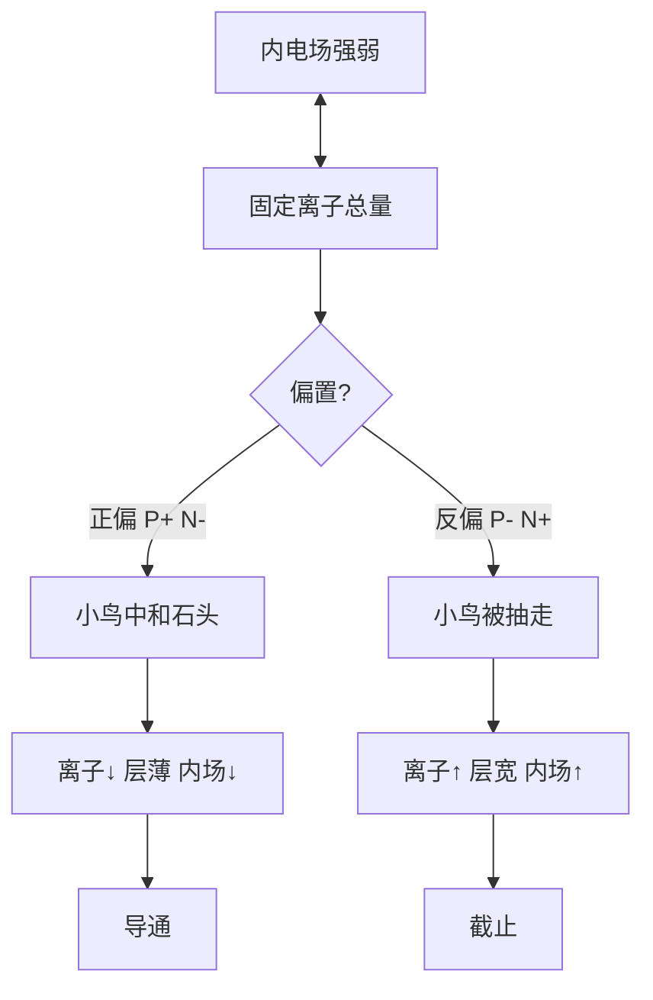

# 补充 · PN结（从零小白版）

> **Core Concept:** 固定离子定内电场；正偏中和→层薄场弱；反偏暴露→层宽场强；内场≠外场  
> **Link Target:** [1.7 CMOS](./1.7_CMOS晶体管.md) · [补充_PN结到MOS](./补充_PN结到MOS.md)  
> **档位:** 浅读（想懂 MOS「为什么能开关」时读）

## 状态

- [x] 已读（口述巩固）
- [x] 已写要点
- [x] 已拆：同偏置「层宽=场强」对，但正偏变多的是载流子不是固定离子

## 笔记

不讲难词，一步一步来。芯片、MOS 原材料都是**硅**；纯硅几乎不导电，**掺杂质**才分出两种。

### 1. 两种基础半导体

#### N型硅（自由电子多）

往纯硅里掺**磷**这类元素 → 多出很多**自由电子**（带负电）。  
导电主力是电子。

> 记：N = Negative（负，电子多）

#### P型硅（空穴多）

往纯硅里掺**硼**这类元素 → 少电子，留下**空穴**。  
别的电子来填空穴，看起来像「正电荷在移动」。

> 记：P = Positive（正，空穴多）

### 2. 什么是 PN结？

一块 **P型** 和一块 **N型** 紧紧贴在一起，接触面这一层结构 = **PN结**。


> 图注：P接正极、N接负极时**导通**；反接时**截止**。绿色箭头为正向电流方向。

### 3. 零偏（不加电压）：PN结本来什么样

P区多子 = **空穴(+)**；N区多子 = **自由电子(-)**。  
接触面：空穴往 N 跑、电子往 P 跑，复合消失。

交界处剩下：

| 侧 | 留下什么 |
|----|----------|
| P侧 | 一层**负离子**（固定、不能移动） |
| N侧 | 一层**正离子**（固定、不能移动） |

这一层 = **耗尽层**（没有可移动载流子 → 不导电）。

离子层形成 **内建电场**：方向 **N → P**，阻止载流子继续扩散。  
平衡时：扩散力 ≈ 内建电场阻力 → 耗尽层厚度固定。

（图见上：[pn-junction.png](./figures/pn-junction.png)）

**同一种偏置条件下（这句话本身没错）：**  
耗尽层里固定离子越多 → 层越宽 → **内建电场越强**。✅  

后面正偏推反了，是因为漏了下一环：外加后「变多的」是哪一种电荷。

---

### 4. 正偏 / 反偏：先分清两种电荷（最大卡点）

| 电荷 | 在哪 | 能不能动 | 跟内电场的关系 |
|------|------|----------|----------------|
| **固定离子** | 耗尽层里 | 不能动 | **唯一直接决定**内电场强弱 |
| **自由空穴 / 自由电子** | P/N 区（可移动载流子） | 能跑 | **不直接贡献**内电场；正偏时去**中和**离子 |

> ❌「空穴/电子变多 → 电场变强」  
> ✅ 空穴/电子跑去中和离子 → **消灭产生电场的源头** → 内电场变弱

**围墙比喻：**

- 耗尽层 = 【固定带电石头】堆的围墙（离子）→ 产生阻挡电场  
- P/N 区空穴、电子 = 四处乱跑的**小鸟**  

| 偏置 | 小鸟干啥 | 围墙 / 内电场 |
|------|----------|----------------|
| **正向** | 冲向围墙，撞石头正负抵消 | 石头少 → 墙**变矮变薄** → 内电场**变弱** |
| **反向** | 被电源抽走，远离交界 | 更多石头暴露 → 墙**变宽** → 内电场**变强** |

**严谨逻辑链（建议背这条）：**

```
内电场强弱  ↔  耗尽层内「固定离子」总量
     ↑
正偏：移动载流子进入耗尽层，中和固定离子
      固定离子↓ → 宽度↓ → 内电场↓ → 容易穿过 → 导通
反偏：载流子被拉走，更多固定离子暴露
      固定离子↑ → 宽度↑ → 内电场↑ → 挡死 → 截止
```



**再补一句：内电场 ≠ 外加电源电场**

| | 内建电场 | 外加电源电场 |
|--|----------|--------------|
| 谁产生 | 耗尽层**固定离子** | 电池/电源 |
| 正偏 | 被外场**反向抵消**（削弱） | 方向 P→N，与内场相反 |
| 反偏 | 与外场**同向叠加**（加强） | 方向与内场相同 |

---

### 5. 正偏细节：P接+、N接-（接上节）

**电源在干嘛？**

- 正极往 P区 **强行推入空穴（+）**（小鸟变多）  
- 负极往 N区 **强行推入电子（-）**  

**耗尽层怎么变？→ 变薄（不是变宽）** —— 因为小鸟去中和石头，不是「电荷多了墙就加高」。

**「内建电场被抵消，PN结是不是不存在了？」**

| 错觉 | 事实 |
|------|------|
| PN结彻底消失 | **结构还在**（P/N 掺杂分区没变） |
| 内建电场完全没了 | 只是被 **大幅削弱**，不是彻底为零 |
| 耗尽层完全没了 | 只是 **变薄**，不是消失 |

变薄之后：空穴 P→N、电子 N→P 容易穿过 → **持续电流 = 导通**。  
**器件用途：** 整流、LED、稳压、测温等。

### 6. 反偏对照：P接-、N接+

外电场与内建电场 **同方向** → **叠加变强**；载流子被抽走 → 更多固定离子暴露 → 耗尽层 **变宽** → 截止（极小漏电流）。

| 工况 | 作用 |
|------|------|
| **普通反向低压** | 隔离 —— MOS 源/漏–衬底结靠这个挡「经衬底」通路 |
| **超过击穿电压** | 雪崩/齐纳；稳压管利用击穿区 |

### 7. 极简对照表

| | 接线 | 外场 vs 内场 | 固定离子 | 耗尽层 | 内电场 | 结果 |
|--|------|--------------|----------|--------|--------|------|
| **正向** | P+ N- | **抵消** | ↓（被中和） | **变薄** | ↓ | 导通 |
| **反向** | P- N+ | **叠加** | ↑（更多暴露） | **变宽** | ↑ | 截止 |

---

### 8. 一句话本性

单个 PN结：**正向导电，反向截止** —— 二极管单向导电的本质。  
同偏置下「层越宽场越强」✅；正偏时变多的是**载流子**不是固定离子，所以层变**薄**、场变**弱**。

### 9. 和 MOS 怎么关联

| 点 | 记住 |
|----|------|
| MOS 里那两个结 | **永远反向截止**；**绝不允许正向导通**（正向 = 衬底漏电） |
| 栅压干什么 | **不靠导通 PN结**；表面生成沟道 **绕开** PN结 |
| 反向结的用处 | 正是「普通反向低压」：阻断经衬底的通路 |

| 管 | 衬底 + 源/漏 |
|----|--------------|
| **NMOS** | P衬底 + N源/漏 → 两个反向 PN结 |
| **PMOS** | N衬底 + P源/漏 → 同样 |

完整四步 +「旁路非打通」→ **[补充_PN结到MOS](./补充_PN结到MOS.md)** · 总览 [1.7](./1.7_CMOS晶体管.md)。

### 超简背诵口诀

```
内电场只认「固定离子」，不认乱跑的空穴/电子；
同偏置：离子多 → 层宽 → 内场强（这话对）；
正偏：小鸟中和石头 → 离子↓ → 层薄 → 内场弱 → 导通；
反偏：小鸟被抽走 → 离子↑ → 层宽 → 内场强 → 截止；
内场≠外场：正偏抵消，反偏叠加；
MOS：结锁反向；通靠沟道旁路。
```
