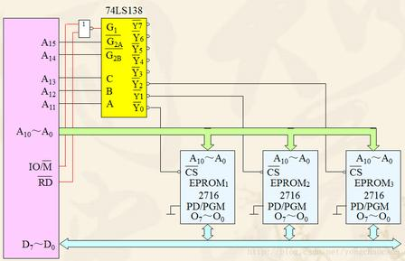
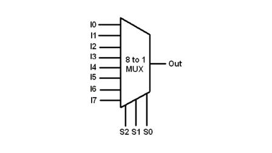
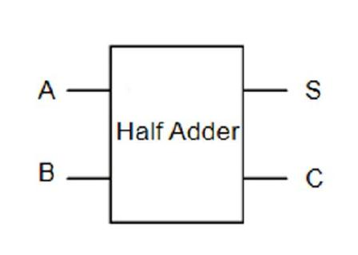

# 2.8 组合逻辑模块

> **Core Concept:** 教材标准组合电路清单；MUX / 译码 / 编码；加法·比较·校验  
> **Link Target:** CSAPP §4.2 · [5.2 算术](../ch05_digital_blocks/5.2_算术电路.md) · [2.9 毛刺](./2.9_时序.md) · Logisim  
> **档位:** 精读

## 状态

- [x] 已读（口述巩固）
- [x] 已写要点
- [x] 教材标准组合电路全清单（编码/译码/MUX/加法/比较/校验/码转换）

## 笔记

标准化组合「黑盒」：输出 **仅由当前输入** 决定（无触发器、无记忆）。  
匹配阎石《数电》/ Harris ARM《数字设计》考点。

**清单：** 编码器 · 译码器 · MUX · DEMUX · 加法器 · 比较器 · 奇偶校验 · 码转换。  
**不是组合：** 触发器 / 寄存器 / 计数器 / 移位寄存器 / FSM → [Ch3](../ch03_sequential/README.md)。

---

### 2.8.1 编码器 Encoder

**功能：** 一组有效输入 → 二进制编码。

| 类型 | 要点 |
|------|------|
| **普通** | 如 8 线–3 线；同时 **只能一路** 有效，多路有效则乱 |
| **优先**（重点，如 74HC148） | 允许多路有效，只对 **优先级最高** 者编码；常低有效输入、反码输出；带选通/扩展/标志，可级联 |

应用：键盘、**中断请求线 → 编号**（多请求同时来时靠优先级）。

#### 编码器 ↔ 译码器：功能互逆 ≠ 电路反接

**结论钉死：** 理想条件下功能互为逆操作；**不能**把译码器倒接线当成编码器。工程常用 **74HC148 优先编码器**，内部更不是 138 的反向。

| | 3–8 译码（74HC138） | 8–3 普通编码 | 8–3 **优先**编码（74HC148） |
|--|---------------------|--------------|------------------------------|
| 流向 | 3 编码 → 8 选中线 | 8 独热 → 3 编码 | 8 请求 → 3 编码（含优先级） |
| 输入约束 | 任意合法地址；结构保证至多一路出有效 | **必须**单路有效，否则错乱 | **允许多路**有效，只编最高优先 |
| 典型内部 | 并行最小项与非阵列 | 简单与/或按位编码 | 优先级比较 + 或逻辑，拓扑更复杂 |
| 与「逆」关系 | — | 单路有效时与译码**功能**互逆 | **不是**译码的电路反向 |

**理想互逆（仅理论）：**  
译码：二进制 → 独热；普通编码：独热 → 二进制。单路有效时串起来可还原。  
注意：138 输出是**低有效**，普通高有效编码器直连还要电平匹配（反相或选用匹配器件），不是裸线对接就完事。

**148 电平例（与 138 不能想当然对接）：**  
输入 /I0~/I7 低有效；输出 /Y2/Y1/Y0 **反码**。  
最高优先 /I7 有效 → 真值编号 7=`111` → 反码输出 `000`。

**场景对照：**

| | 典型用途 |
|--|----------|
| 译码器 | 编码 → 选中线（CPU 地址 → 内存/外设 /CS） |
| 优先编码器 | 多线请求 → 压缩成编号（8 路中断 → 3 bit 告诉 CPU 是谁） |

**口诀：** 理想普通编码 ↔ 译码 = 功能互逆；优先编码 = 另加优先级，**电路不是译码倒过来**。

---

### 2.8.2 译码器 Decoder（重中之重）

**功能：** 二进制编码 → **唯一一路** 输出有效（相对**理想普通编码器**的功能逆运算；见上节，勿等同于「电路反接」）。

| 类 | 典型 | 要点 |
|----|------|------|
| **二进制** | **74HC138**（**3–8**，不是「83」） | 见下专节 |
| **BCD** | 4–10 | 8421 BCD → 10 路 |
| **七段** | BCD→段码 | 共阳（低亮）/ 共阴（高亮）；仪表显示 |

#### 3–8 译码器（74HC138）钉死

**口误纠：** 是 **3 线→8 线**，不是 83。方向与编码器相反。

| | 编码器（如 8–3 优先 74HC148） | **译码器 3–8（74HC138）** |
|--|------------------------------|---------------------------|
| 方向 | **多进少出**（8→3） | **少进多出**（3→8） |
| 功能 | 有效输入 → 二进制编号 | 二进制地址 → 独热选一路 |

**端口：**

| | |
|--|--|
| 输入 | 地址 **A₂ A₁ A₀**（3 bit） |
| 使能 | /E1,/E2（低有效脚须为 0）+ E3（须为 1）；缺一则全输出高 |

| 输出 | /Y0~/Y7：**低电平有效**（带横线！） |

**口误钉死（高频错）：**  
❌ 「某一路输出为**高**代表选中」  
✅ 使能开时：对应那一路 **拉低为 0** = 选中；其余 **7 路全为 1**。使能关：八路**全高**，无一路有效。  
横线 /Y = 低有效。为何如此做：内存/外设 /CS 也多低有效 → 138 可直连，少加反相器。  
教材「理想译码」有时画**高有效**独热；**74HC138 实物是低有效**，别混。

3 地址 → 000～111 共 8 种 → 故有 8 根输出，每种地址唯一对应一根。  
**任何时刻最多一路输出有效（为低）。**

**四大用途：**

| # | 用途 | 说明 |
|---|------|------|
| 1 | **地址译码**（硬件最常用） | CPU 地址 → 选外设/片选；HFT·嵌入式·ARM 大量用 |
| 2 | **实现任意组合函数**（教材考点） | /Yi=/mi；译码器出全部最小项 + 与非门 → 任意 F=sum m(dots)。例 F=sum m(1,3,5)：/Y1,/Y3,/Y5 进三输入与非 |
| 3 | **当 DEMUX** | 某一使能端当数据入，A₂A₁A₀ 当通道地址 → 一进八出分配 |
| 4 | **脉冲/时序选通** | 地址轮转 → 轮流拉低 8 路，触发后级 |

> **坑：** 输出低有效；使能不全满足则整片不工作。

#### 74HC138 完整逻辑拆解（门级必吃透）

**定性：** 3 地址入 → 8 路**低有效**出；带使能；**纯组合**；核心是并行**与非门阵列**。

**工作条件（钉死）：** E3=1 且 /E1=0 且 /E2=0。  
任一不满足 → **全部** /Y 恒高（无效），地址怎么变都不管。

**总使能 EN（纠表达式坑）：**  
引脚 /E1,/E2 是**低有效**：脚上为 0 才算打开。不能写成「EN=/E1·/(E2·E3)」（脚=0 时乘积反而是 0）。

正确：


EN = E3 · /(/E1) · /(/E2)


即：EN=1 ⇔ E3=1 且两低有效使能脚均为 0。  
（口述可记：EN = E3 land (/E1脚为低) land (/E2脚为低)。）

**核心式：**


/Yi = /EN · mi(A2,A1,A0)


八路展开：

| i | 表达式 |
|-------|--------|
| 0 | /Y0=/EN·/A2 /A1 /A0 |
| 1 | /Y1=/EN·/A2 /A1 A0 |
| 2 | /Y2=/EN·/A2 A1 /A0 |
| 3 | /Y3=/EN·/A2 A1 A0 |
| 4 | /Y4=/(EN·A2) /A1 /A0 |
| 5 | /Y5=/(EN·A2) /A1 A0 |
| 6 | /Y6=/(EN·A2) A1 /A0 |
| 7 | /Y7=/(EN·A2) A1 A0 |

→ 每一路 = **EN + 该路最小项的原/反变量** 送进一个与非门。

**三级结构：**

```
A2,A1,A0 ──► [反相器] ──► 原变量 + 反变量
E3,/E1,/E2 ─► [使能组合] ──► EN
                │
                ▼
        8 个并行与非门（每路 EN + 3 个地址字面量）
                │
                ▼
         /Y0 … /Y7（低有效）
```

**纠「三输入」：** 每路是 **四输入与非**（EN + 三个地址字面量），不是三输入。  
（若片内先把地址三变量与成 mi 再与 EN 与非，级数不同，布尔等价。）

**完整真值表（EN=1；一眼看 8 路电平。EN=0 时八列全为 1）：**

| A₂ | A₁ | A₀ | Y̅₀ | Y̅₁ | Y̅₂ | Y̅₃ | Y̅₄ | Y̅₅ | Y̅₆ | Y̅₇ |
|----|----|----|-----|-----|-----|-----|-----|-----|-----|-----|
| 0 | 0 | 0 | **0** | 1 | 1 | 1 | 1 | 1 | 1 | 1 |
| 0 | 0 | 1 | 1 | **0** | 1 | 1 | 1 | 1 | 1 | 1 |
| 0 | 1 | 0 | 1 | 1 | **0** | 1 | 1 | 1 | 1 | 1 |
| 0 | 1 | 1 | 1 | 1 | 1 | **0** | 1 | 1 | 1 | 1 |
| 1 | 0 | 0 | 1 | 1 | 1 | 1 | **0** | 1 | 1 | 1 |
| 1 | 0 | 1 | 1 | 1 | 1 | 1 | 1 | **0** | 1 | 1 |
| 1 | 1 | 0 | 1 | 1 | 1 | 1 | 1 | 1 | **0** | 1 |
| 1 | 1 | 1 | 1 | 1 | 1 | 1 | 1 | 1 | 1 | **0** |

粗体 **0** = 该行唯一有效（选中）。口误坑：/Y2 行是 **010**，不是第二个 000。

任意时刻（EN=1）**至多一路为低**，其余全高。

**与已学串联：**

| 点 | 结论 |
|----|------|
| 片选 | /Y 直连 /CS，电平匹配 |
| 组合函数 | EN=1 时 /Yi=/mi；F=sum m(i,j,k) → 把对应 /Y 送入与非：NAND(/Yi,/Yj,/Yk)=mi+mj+mk |
| 链路 | CMOS → NAND → 并行 NAND 阵列 → 138 → 地址译码 / 片选 |
| 使能二级译码 | 高位再控 E3//E1//E2，可扩展片选、做 4–16 等 |

**自测：两片 138 → 4–16 译码**

设地址 A3 A2 A1 A0（A3 最高）。两片地址脚都接 A2 A1 A0：

| 芯片 | 负责 | 使能接法（一例） |
|------|------|------------------|
| 低片 | /Y0~/Y7（地址 0000～0111） | E3=1，/E1=0，/E2=/A3（A3=0 时该片开） |
| 高片 | /Y8~overlineY15（1000～1111） | E3=A3，/E1=/E2=0（A3=1 时该片开） |

A3=0 只开低片；A3=1 只开高片 → 16 路互斥低有效输出。使能就是为这种**级联扩展**准备的。

**验收：** 给内部图能写出上表；知每路 = EN· mi 的与非。  
**止步：** 不拆 CMOS 版图。总深度 → [学习深度_门级到译码](../学习深度_门级到译码.md)。

**三张图怎么对照看（门级 / 引脚 / 片选）：**

| 图 | 看什么 | 对应上文 |
|----|--------|----------|
| **内部门级** | 反相器 → 使能与 → 8×四输入与非 → /Y | 整段「完整逻辑拆解」 |
| **引脚框图** | 标准符号与脚名 | 下表别名 |
| **片选接线** | 高位→CBA；/Y→各片 /CS；低位并联 | 「内存片选」专节 |

**教材彩图（对照用）：**




> **极性钉死：** 引脚图 / 符号输出带横线 → **选中=拉低**。部分 Logic Diagram 末级画法易看成高有效——**以 74HC138 手册为准：/Y 低有效**；结构仍认「原/反变量 + 使能 + 八路互斥」。

**EPROM 实战图读法（与「高位译码、低位片内」一致）：**

| 接线 | 含义 |
|------|------|
| A₁₅→非→G1；A₁₄→/G2A；IO//M→/G2B | 仅 A₁₅A₁₄=00 且访存时译码器才开 |
| A₁₃A₁₂A₁₁ → C B A | 选 Y0/Y1/Y2… |
| /Y0/1/2→三片 2716 的 /CS | 片选低有效直连 |
| A₁₀…A₀ 并联三片 | 每片 2KiB（2^11）片内寻址 |

例：使能满足且 CBA=000 → /Y0 低 → EPROM1；地址窗约 `0000H～07FFH`。CBA=001 → `0800H～0FFFH`；CBA=010 → `1000H～17FFH`。

**引脚别名（教材 / 数据手册常混用，钉死）：**

| 常见写法 | 另一写法 | 含义 |
|----------|----------|------|
| A, B, **C** | A₀, A₁, **A₂** | 地址；**C = A₂ = 最高位** |
| G1 | E₃ | 使能，**高有效** |
| /G2A, /G2B | /E1, /E2 | 使能，**低有效** |
| /Y0~/Y7 | 同左 | 低有效输出 |

使能打开：G1=1 且 /G2A=/G2B=0（与前面 EN 条件同一件事）。

**信号推演例：A2 A1 A0 = 011（即 CBA=011）→ 为何只有 /Y3 变低**

前提：使能已满足，EN=1。

1. 反相器：A2=0,A1=1,A0=1 → /A2=1,/A1=0,/A0=0  
2. 最小项：m3=/A2 A1 A0=1·1·1=1；其余 mi=0  
3. /Y3=/(EN·m3)=/1·1=0（拉低）  
4. 对其它 i：mi=0 → /Yi=/(EN·0)=1（保持高）  
5. 若 /Y3 接第 3 片 /CS → 仅该片唤醒；低位地址在该片内选单元。

传播路径：地址/使能 →（反相器延迟）→（与非门延迟）→ /Y；级数有限但非零 → 组合延迟 / 毛刺直觉见 [2.9](./2.9_时序.md)。

**地址译码 / 内存片选（完整硬件流程，纠口述坑）：**

**结论一句：** CPU 把**出现在地址总线上的物理地址**拆开——**高位进外部译码器 → 片选哪一块芯片**；**低位进被选中芯片 → 片内哪个单元**。3–8（74HC138）是最简单的一类片选译码器。

```
物理地址（示意 18 bit）：
  A17 A16 A15 | A14 ………… A0
  └─ 高 3 位 ─┘ └─ 低 15 位 ─┘
        │              │
        ▼              ▼
   74HC138 的          每片 SRAM 的
   引脚 A2 A1 A0       地址脚 A14…A0
        │
        ▼
  Y0~Y7 → 各片 /CS
```

**一步步真实顺序（简化板级 / 教学机）：**

1. CPU 执行访存指令，算出要访问的地址。  
   - **有 MMU 的系统：** 虚地址 → 物理地址（这步在 CPU/MMU 内部完成；**总线上看不到虚地址**）。  
   - **无 MMU 的单片机/简单板：** 指令里的地址往往直接就是物理地址。  
   → 译码电路只关心：**地址总线上出现的那串物理位**。
2. 地址（及 /RD//WR 等控制）放到总线上。
3. **高位**接外部译码器；**低位**并联接到所有内存芯片的地址脚（未选中片因 /CS 无效而不响应）。
4. 译码器使能满足且高位=某值 → **仅一路** /Yi 拉低 → 第 *i* 片 /CS 有效。
5. 被选中芯片用**低位**做片内译码（SRAM 常为地址→单元；DRAM 还有行/列分时），再按 /OE//WE 把数据放到/取自数据总线。
6. 同一时刻正常设计下 **只有一块** 被片选（互斥），避免多片同时驱动数据总线冲突。

**数字例子：** 8 片相同 SRAM；高 3 位 = `011` → /Y3 低 → 第 3 片选中；低位在第 3 片内选具体单元。

| 系统高地址（例 A17..A15） | 138 输出 | 接到 |
|---------------------------|----------|------|
| 000 | /Y0 | 第 0 片 /CS |
| 011 | /Y3 | 第 3 片 /CS |
| 111 | /Y7 | 第 7 片 /CS |

**两层「选择」（易混，钉死）：**

| 层 | 谁做 | 用哪段地址 | 选什么 |
|----|------|------------|--------|
| 片间 | 板级/SoC 里的译码器（可简化为 138） | **高位** | 哪一块芯片 / 哪块外设 |
| 片内 | 芯片内部行列/地址译码 | **低位** | 芯片里哪个存储单元 |

**命名大坑（必纠）：**  
74HC138 芯片引脚叫 **A₂ A₁ A₀**，只表示「译码器的 3 个输入脚」，**不等于**系统地址的最低位 A2 A1 A0。  
接到这三脚的，应是系统的**高位地址线**（如上例 A17 A16 A15）。口述里说「最高 3 根叫 A2 A1 A0」会把「引脚名」和「总线位号」搅在一起。  
正确说法：系统高位（例 A12 A11 A10）→ **接到** 138 的引脚 A2 A1 A0。

**定量小例（3 高 + 10 低）：**  
地址总线共 13 根：高 3 + 低 10。每片容量 2^10=1 Ki 单元；8 片共 8 Ki 单元，高位区分 8 段。  
高位=`010` → /Y2 低 → 2 号片 /CS 有效；低 10 位进 2 号片内译码选单元。  
0/1/3～7 号片 /CS 无效：**低位线虽并联到它们，也不驱动数据总线**。

**电平匹配：** 多数内存 /CS 低有效，138 的 /Y 也低有效 → 常可直连，少加反相器（138 常做片选的原因之一）。

**简易布线关系：**

```
              CPU 地址总线
         ┌────────┴────────┐
         │ 高3位            │ 低10位（并联到每片）
         ▼                  ▼
    ┌─────────┐      ┌──────────┐  ┌──────────┐     ┌──────────┐
    │ 74HC138 │      │ SRAM #0  │  │ SRAM #1  │ ... │ SRAM #7  │
    │ A2A1A0  │      │ A9..A0   │  │ A9..A0   │     │ A9..A0   │
    │  Y0─────┼──────│/CS       │  │          │     │          │
    │  Y1─────┼──────│──────────┼──│/CS       │     │          │
    │  ...    │      │          │  │          │     │          │
    │  Y7─────┼──────│──────────┼──│──────────┼─────│/CS       │
    └─────────┘      │ D7..D0───┼──│ D7..D0───┼─────│ D7..D0   │←→ 数据总线
                     └──────────┘  └──────────┘     └──────────┘
         （未画 /OE /WE、138 使能；读时仅 /CS 有效的那片驱动数据）
```

**编码 vs 译码（记忆）：**  
编码：多路有效线 → 短二进制编号。  
译码：短二进制 → **单独一根** 有效选中线（138 为低有效「一冷」）。

**现实拓展：**  
现代 PC/手机很少外挂 74HC138；片选逻辑在 **CPU 片内存储控制器 / SoC**（旧教材说的「北桥」多数已并进 CPU）。地址线几十根、分区复杂，但原理不变：**截高位产生片选/区域选通，低位进存储体**。  
138 的使能端常接 /RD//WR 或「落在合法地址窗」信号，非法访问时整片不译码。

**极简口诀：** 高位外部译码出片选；低位并联到各片，仅被选中片用片内译码定位单元。

---

### 2.8.3 数据选择器 MUX

**一句话：** 多路数据入 + 地址选通道 → **一路数据出**（多进一出）。


**2 选 1（最小模型）：** `sel=0` → `out=in0`；`sel=1` → `out=in1`。  
公式：Y=bar S· I0+S· I1。  
→ 可作 D 锁存直觉：`out` 反馈回 `in0`，`in1=D`，`sel=EN` → EN=1 跟 D，EN=0 保持（与 [3.2](../ch03_sequential/3.2_锁存器和触发器.md) 电平锁存同源思想）。

| | 3–8 译码器 | MUX（如 8 选 1） |
|--|------------|------------------|
| 地址做什么 | → 多路**控制/选中**信号 | → 挑哪一路**数据**送到 Y |
| 输出是什么 | 控制线（如 /CS） | **数据** 0/1 流 |
| 内部关系 | 最小项阵列 | **≈ 小型译码 + 与或**：Y=sum mi Di |

生活类比：译码=按编号只点亮一盏灯；MUX=按编号只把一台播放器接到音箱。

#### 8 选 1（74HC151）标准模型




梯形符号：左宽入、右窄出。图中 I0~ I7 = 数据 D0~ D7；底边 S2 S1 S0 = 选择地址 A2 A1 A0（S2 最高位）；Out = Y。  
S2S_1S0=i → Y=Ii（使能有效时）。

**内部门级读法（印证「MUX=译码+与或」）：**  
S 经反相器得原/反变量 → 八个与门各吃 mi· Di· Eint → 或门汇总得 Y；再非得 /Y/W。  
使能脚 /E **低有效**：图中常先非成高有效内使能再进与门；/E=1 时各与门封死 → Y=0。

> **纠「三输入与门」：** 仅地址最小项是 3 个字面量；再乘上 Di 就是 **四输入与**；若使能也进与门则是 **五输入**（教材图常见）。说「三输入」只指译码那三根，别漏掉 Di。

与 138 对照一句：两边第一级都是地址原/反变量；138 **只引出** /mi 控制线；MUX **多** mi· Di 与或 → 单路数据 Y。

| 脚 | 含义 |
|----|------|
| A2 A1 A0（或 S2 S1 S0） | 选择地址（与 3–8 译码地址同角色）；**S2 高位** |
| D0~ D7（或 I0~ I7） | 八路数据 |
| /EN//E | 使能，**低有效**（0 工作，1 不工作） |
| Y；W 或 /Y | 原码输出；反码输出 |

**逻辑（使能打开时）：**


Y = sumi=0^7 mi Di
= m0 D0 + m1 D1 + ·s + m7 D7


其中 mi 即地址最小项（与 138 同源）。

**使能公式坑（必纠）：**  
脚名 /EN 低有效：/EN=0 才工作。  
**不能**写成 Y=/EN·(sum mi Di)（把脚电平直接相乘）——使能有效时脚=0，乘积反成全 0。  
应记：


Y =
begincases
sum mi Di & /EN=0（使能） \\
0（或芯片规定的固定电平） & /EN=1（禁止）
endcases


或 Y = Eint·sum mi Di，其中 Eint=/(/EN)。

**真值表（/EN=0）：** 地址 i → Y=Di（000→D₀ … 111→D₇）。

#### 内部门级（打通译码）

```
A2A1A0 → [反相器] → 全部最小项 m0…m7   ← 等价小型 3–8 译码思想
              │
         mi & Di（与）
              │
         全部相或 → Y
```

**结论：** **MUX = 译码（最小项）+ 与或阵列**。芯片内部常是同一套原/反变量树，不必真焊一颗 138。  
CMOS 层仍多落到 NAND/NOR 等价实现；学到门级与或即可，不拆版图。

#### MUX / DEMUX / 译码：边界钉死（同源 ≠ 等价）

**结论：** 底层都是**最小项地址译码**；但 **不能**说「MUX = 3–8 译码器」。DEMUX 则是译码器的一种**用法/工作模式**。

| 说法 | 对错 |
|------|------|
| MUX 就是 3–8 译码器 | ❌ |
| MUX **内部含有**一套 3–8 形式译码 | ✅ |
| DEMUX 是全新另一种电路 | ❌（功能名不同） |
| DEMUX = 3–8 译码器换信号定义（使能当数据） | ✅ |

**口诀：** 译码器是底座；DEMUX = 底座换用法；MUX = 底座再加数据选择（与或）通路。

```
地址译码（最小项）
├─ 只出控制线          → 3–8 译码器（片选等）
├─ 使能脚改定义为 Data → DEMUX（一进多出；芯片可不改焊）
└─ + mi&Di 与或阵列    → MUX（多进一出；多一整套数据通路）
```

比喻：译码=只扳 8 个开关的控制器（无数据通道）；DEMUX=用控制器把一路数据送到选中线；MUX=先造同款控制器，打开一路数据通道汇到一根线。

| | 3–8 译码（138） | 8 选 1 MUX（151） |
|--|-----------------|-------------------|
| 有无数据入 | 无（作译码时） | 有 D0~ D7 |
| 译码产物 | 常引出 /mi（低有效） | 内部用 **原码** mi（极性不同，同源） |
| 输出 | 8 路**控制** | 1 路**数据** Y=sum mi Di |
| 公式 | /Yi=/(EN·mi) | 使能开时 Y=sum mi Di |

**踩坑：** 138 外接拼 MUX 要处理 /mi→mi；工程用 151。

#### 两大用途（接上节）

| # | 用途 | 要点 |
|---|------|------|
| 1 | **数据通路切换** | 多源共用一线；改地址轮流选通（传感器、总线源） |
| 2 | **实现任意组合函数**（考点） | 变量接选择端；真值表 0/1 接到各 Di（常无需外部门） |

与译码器实现函数对照：

| 方案 | 做法 |
|------|------|
| A 译码器 | 138 出 /mi + 外接与非 → F=sum m |
| B MUX | 地址=变量，Di=该行函数值 0/1 → 直接得 F |

CPU 数据通路大量 MUX（CSAPP §4.2）；HFT/FPGA 里也是选通与延迟敏感点。

#### 自测：4 选 1 实现三变量函数 F(A,B,C)

选择端只有 2 根，不能三变量都接地址。标准手法：

- A1 A0 接 **两个**变量（如 B,C）
- 第三个变量 A（及其 /A、常量 0/1）接到四个 D 端，使对每一组 BC，D 上出现「以 A 为变量的子函数」

例：对固定 BC，若真值表要求 F=/A，则该 Di 接 /A；若 F=1 则该 Di 接 1。  
→ 4:1 可实现任意 3 变量函数（数据端允许接变量/常量）。8:1 则三变量全接地址、Di 只接 0/1 即可。

---

### 2.8.4 数据分配器 DEMUX

**一路数据按地址分到多路输出**（一进多出）。与 MUX **功能**互逆。

**硬件事实（教材原话级）：** 译码器可以当数据分配器。  
74HC138 **电路不用改**——把某一使能脚改定义为 **Data**，地址仍接 A2A_1A0；其余使能固定为「允许」。此时工作模式 = **1→8 DEMUX**（输出仍常为低有效极性，跟 138 一致）。

→ **DEMUX ≌ 3–8 译码器的一种工作模式**（换信号定义，不是另焊一套全新硅）。  
→ **MUX ≠ 译码器**（见上节：还要整套与或数据通路；产品是 151 等）。

**配对记忆：**

| 对 | 关系 |
|----|------|
| 理想普通编码 ↔ 译码 | 功能互逆；优先编码不是电路反接 |
| MUX ↔ DEMUX | 功能互逆（多进一出 ↔ 一进多出） |
| 译码 ↔ DEMUX | 同一底座；DEMUX = 换用法 |

---

### 2.8.5 加法器（运算核心）

细节精读 → [5.2](../ch05_digital_blocks/5.2_算术电路.md)。

#### 半加器 Half Adder（无低位进位）




| | |
|--|--|
| 入 | A、B（两比特） |
| 出 | S=A⊕ B（和）；C=A· B（进位） |
| 门 | 上 **XOR** → S；下 **AND** → C |

全与非实现（共享 /AB）→ [1.5 · 全与非半加器](../ch01_binary/1.5_逻辑门.md)。

| A | B | S | C |
|---|---|---|---|
| 0 | 0 | 0 | 0 |
| 0 | 1 | 1 | 0 |
| 1 | 0 | 1 | 0 |
| 1 | 1 | 0 | 1 |

→ 只能加两比特，**没有**来自更低位的进位 Cin；多位加法要 **全加器**（再加 Ci）。异或你已会用 NAND 搭 → [1.5](../ch01_binary/1.5_逻辑门.md)。

#### 全加器 Full Adder（有 Cin，可级联）


| | 半加 | 全加 |
|--|------|------|
| 入 | A、B | A、B、**Cin** |
| 出 | S、C | S、**Cout** |
| 和 | S=A⊕ B | S=A⊕ B⊕ Cin（两级 XOR） |
| 进位 | C=AB | Cout=AB+(A⊕ B)Cin（两 AND + OR） |

读右图：第一级 XOR/AND = 半加 A,B；第二级把半加的和再与 Cin 异或得 S，并把「半加进位」与「(A⊕ B)· Cin」或起来得 Cout。  
→ **全加 ≈ 两半加 + 或**（进位合并）。多位：全加器串成行波进位链 → [5.2](../ch05_digital_blocks/5.2_算术电路.md)。

| 积木 | 输入 | 输出 | 备注 |
|------|------|------|------|
| **半加器 HA** | A、B | S、Co | **无** 低位进位；仅最低位 |
| **全加器 FA** | A、B、Ci | S、Co | 可级联多位 |
| **行波进位** | 多 FA 串 | | 进位逐级传，慢 |
| **超前进位 CLA**（如 74HC283） | 并行算进位 | | 更快；ALU 常用 |

减法：A-B=A+(~ B)+1（B 取反且最低位 Cin=1），补码。

#### 1 位 ALU（MUX 正式上场 · Harris / MIPS / CSAPP 同款思想）

```
A ──┬── AND ──┐
    ├── OR  ──┤
B ──┤         ├──► 4:1 MUX ──► Result
    │  FA     │         ▲
    └──(+/-)──┘    Operation
         ▲
    Binvert / Cin（减法则 B 取反且 Cin=1）
```

| 块 | 作用 |
|----|------|
| AND / OR（可再加 XOR 等） | 位逻辑，与加法**并行**算出 |
| 全加器 | 算术：加；减 = 加补码 |
| **4 选 1 MUX** | 用 Operation 挑选：AND / OR / ADD / SUB… 哪一路出 |

**钉死：** **ALU ≠ 加法器**。加法器只做加（减）；ALU = 算术 + 逻辑，靠 **MUX 选功能**。  
N 位 ALU：N 个 1 位切片横拼，全加器的 Cout→ 下一位 Cin（行波）；细节与 Flags → [5.2](../ch05_digital_blocks/5.2_算术电路.md)。

**链路：** CMOS → NAND/XOR → HA → FA → 1 位 ALU（FA+逻辑+MUX）→ N 位 ALU → CPU 运算单元。

---

### 2.8.6 数值比较器

比较两二进制数 → A>B / A=B / A<B。  
1 位为基础；多位并行（如 74HC85 4 位）：从最高位比，高位不等即定结果；可级联扩位。

---

### 2.8.7 奇偶校验

核心：异或门树。  
**产生：** 由数据生成奇/偶校验位。  
**检测：** 收端查「数据+校验」中 1 的个数是否符合约定 → 检单比特错。  
应用：串口、存储器检错。

---

### 2.8.8 码制转换

本质仍是组合函数：二进制↔格雷码、二进制↔8421 BCD、余 3↔BCD 等。  
格雷码：相邻码仅 1 bit 变 → 减竞争冒险。

---

### 2.8.9 竞争与冒险（常绑组合电路考）

| | |
|--|--|
| **竞争** | 信号经不同路径，到门输入时间有先后 |
| **冒险** | 竞争导致输出瞬间毛刺 |
| 消除 | 冗余项、滤波、选通脉冲等 |

→ [2.9](./2.9_时序.md)。

---

### 作查找表 (LUT)

MUX / 译码器都可当 LUT，直接实现任意布尔函数（FPGA LUT 直觉同源）。

**实操：** Logisim 搭 2:1、4:1 MUX → `../lab_logisim/`。
