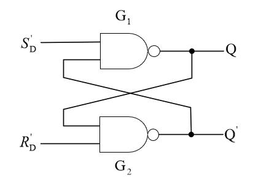
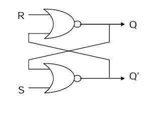
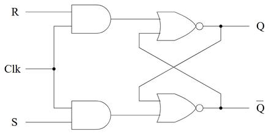
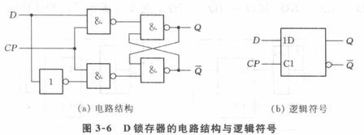
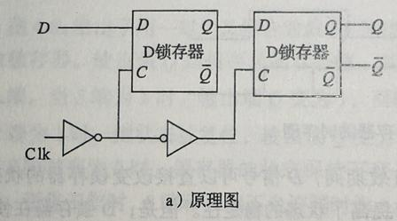

# 3.2 锁存器和触发器

> **Core Concept:** 正反馈存 1 bit；SR → D 锁存 → **主从 D-FF** → 寄存器  
> **Link Target:** CPU GPR / 流水线寄存器全是 D-FF · Logisim · [1.7 CMOS 反相器](../ch01_binary/1.7_CMOS晶体管.md)  
> **档位:** 精读

## 状态

- [x] 已读（口述巩固）
- [x] 已写要点
- [x] D-FF 如何保存 1 bit：正反馈 · 主从 · 边沿采样

## 笔记

时序最基础的 **1 bit / 多 bit** 存储。

**底层脉络：** SR 锁存（最基础）→ D 锁存（电平）→ **D 触发器（边沿）**。  
存储本质：**正反馈环路** —— 两反相器首尾互锁电平。

---

### 3.2.0 记忆的物理根源：交叉耦合正反馈

**零件：** 与非门 \(Y=\overline{A\cdot B}\)（全 1 出 0，否则出 1）。

#### 什么叫「交叉耦合」

两个与非门：

| 门 | 输入 | 输出 |
|----|------|------|
| 门1 | \(\bar S\)、\(\bar Q\) | **Q** |
| 门2 | \(\bar R\)、**Q** | \(\bar Q\) |

连线：**门1 的 Q → 门2 输入；门2 的 \(\bar Q\) → 门1 输入。**  
→ **交叉耦合 = 互相把输出送给对方当输入**；这两根线 = **反馈环路**。

**拆开两块（极易混）：**

| 部分 | 是什么 |
|------|--------|
| **① 内部闭环（记忆本体）** | Q↔\(\bar Q\) 交叉耦合；无外部干预时 **自锁** |
| **② 外部控制端子** | \(\bar S\)、\(\bar R\)：**外面电路** 送来的驱动信号，用来 **改写** 记忆；**不属于** 环路内部 |

```
   S̄（外部）          R̄（外部）
      ↓                  ↓
   与非门1 ──Q──► 与非门2 ──Q̄─┐
      ▲                      │
      └──────────Q̄───────────┘
         （内部反馈环）
```

#### 什么是「正反馈」

信号绕环一圈后 **强化原状态**，把电平锁死。

保持模式 \(\bar S=\bar R=1\)，设 \(Q=1,\bar Q=0\)：

1. Q=1、\(\bar R=1\) 进门2 → \(\bar Q=0\)  
2. \(\bar Q=0\)、\(\bar S=1\) 进门1 → Q=1  

闭环：\(Q=1\Rightarrow\bar Q=0\Rightarrow Q=1\) → **自我维持**。  
另一稳态 \(Q=0,\bar Q=1\) 同理锁住。

#### 为何能存 1 bit（双稳态 · 易失）

\(\bar S=\bar R=1\)（保持）时，电路退化成 **两反相器首尾相连的正反馈闭环**：只有两稳态 \(Q=1,\bar Q=0\) 或 \(Q=0,\bar Q=1\)。  
进入某稳态后，反馈互相支撑电平，**不需要外部持续输入维持**。

| ❌ 别这样理解 | ✅ 正确 |
|--------------|--------|
| 「无限循环」= 电平来回 **振荡** | 环路是 **静态自洽稳态**：电平稳定不动；「环路持续生效」≠ 翻转震荡 |
| 断电还记得住 | **易失**：通电靠反馈保持；**断电电平全消、记忆丢失**（≠ Flash/ROM） |

教材标准说法：锁存器有双稳态；无置位/复位激励时 **长久维持现态**，直到外控强制切换 —— 1 bit 存储最基础机理。

**可背标准版：**  
与非 SR 靠交叉耦合正反馈形成双稳态。当 \(\bar S=\bar R=1\) 无有效改写时，内部反馈环路 **持续维持当前稳定电平**。通电下状态不自行改变；**断电后状态消失**。这是数字电路最原始的 1 bit 记忆。

对比组合电路：无反馈 → 输入撤掉输出立刻没了，不能保存。

#### 怎么改写（Set / Reset）——外部打断、环再接管

| 阶段 | \(\bar S,\bar R\) | 谁在管 |
|------|-------------------|--------|
| **常态** | 都是 1 | 外部不起作用；只靠 Q↔\(\bar Q\) **保持** |
| **置位** | \(\bar S=0,\bar R=1\) | 外部强行打破平衡 → Q=1；再把 \(\bar S\) 回 1 → **环重新锁住** Q=1 |
| **复位** | \(\bar S=1,\bar R=0\) | 外部强制 Q=0；\(\bar R\) 回 1 后环维持 Q=0 |

横线 = **低电平有效**：\(\bar S=0\) 才置位；\(\bar S=1\) 不干预。或非版则是不带横线的 S、R，**高有效**。

考点：\(Q,\bar Q\) = **内部反馈信号**；\(\bar S,\bar R\) = **外部驱动信号**。正因两路外输入有非法组合，才合并成一路 D → D 锁存。

#### 非法坑

\(\bar S=\bar R=0\) → \(Q=\bar Q=1\)，互补破坏；同时回 1 时竞争，次态不定。

或非门版：同样交叉耦合正反馈、两稳态存 1 bit，只是 S/R **高有效**。

> **一句话：** 两门输出互为对方输入成环；环有两稳态，不靠外部就不会变 → **正反馈存 1 bit**。  
> 链路：交叉耦合 → SR 锁存 → +EN 得 D 锁存 → 主从串联得 D-FF。

---

### 3.2.1 SR 锁存器（一切触发器的源头）

**定位：** 时序电路最基础的 1 bit 存储；无时钟 → **异步**时序。  
结构：两与非（或两或非）**交叉耦合正反馈**。  
相对组合逻辑（译码/MUX）：输出不只看当前输入，还依赖**现态**（有记忆）。

#### 版本 1：与非门 SR（更常用，**低电平有效**）



输入 \(\bar S\)（置位）、\(\bar R\)（复位）；输出 \(Q,\bar Q\)。图中 \(S'_D/R'_D\) 即 \(\bar S/\bar R\)。

| \(\bar S\) | \(\bar R\) | 动作 | Q（次态） |
|------------|------------|------|-----------|
| 1 | 1 | **保持** | 不变（记忆） |
| **0** | 1 | **Set 置位** | **强制 Q=1**（与现态无关） |
| 1 | **0** | **Reset 复位** | **强制 Q=0**（与现态无关） |
| 0 | 0 | **非法** | \(Q=\bar Q=1\)；同时回 1 时竞争，禁止 |

**写完再松手：** 置位/复位脉冲过后把对应脚抬回 1 → \(\bar S=\bar R=1\) → 环路 **保持** 刚写入的值。

**时序串一遍：**

1. \(\bar S=0,\bar R=1\) → Q=1  
2. \(\bar S\) 抬到 1 → 保持 Q=1  
3. \(\bar R\) 拉到 0 → Q 强制变 0  
4. \(\bar R\) 抬到 1 → 保持 Q=0  

**背诵四行：** 11 保持 · 01 置 1 · 10 置 0 · 00 非法。  
（或非版 S、R **不带横线、高有效**，别和本表搞混 → 见下。）

#### 版本 2：或非门 SR（**高电平有效**；教材常先讲）



```
      R ────>┌──────┐
             │ NOR  │──────> Q
      ┌──────┤      │
      │      └──────┘
      │             ↑ 交叉反馈
      │      ┌──────┐
      └──────┤ NOR  │──────> Q̄
             │      │
      S ────>└──────┘
```

| 脚 | 含义 |
|----|------|
| **S** | Set，**高**有效 → 强迫 Q=1 |
| **R** | Reset，**高**有效 → 强迫 Q=0 |
| Q / \(\overline{Q}\) | 主输出 / 反相输出；**正常工作时**互补（非法态除外） |

| S | R | Q | \(\overline{Q}\) | 模式 |
|---|---|---|------------------|------|
| 0 | 0 | 保持 | 保持 | **记忆**（靠交叉反馈） |
| 1 | 0 | 1 | 0 | Set |
| 0 | 1 | 0 | 1 | Reset |
| 1 | 1 | 0 | 0 | **非法**（禁止） |

> **危险：** S=R=1 时两输出都为 0（暂时不互补）；再同时回到 00，谁先恢复不确定 → **竞争**，次态不可预测。

搜高清原图关键词：`SR latch cross coupled NOR gate schematic labeled S R Q Qbar`

| | 与非 SR | 或非 SR（本版） |
|--|---------|----------------|
| 有效电平 | \(\bar S/\bar R\) **低**有效 | S/R **高**有效 |
| 保持 | 11 | **00** |
| 非法 | 00 | **11** |
| CMOS | 原生 NAND | 原生 NOR |

#### 正反馈（同 3.2.0）

Q 送入另一门输入，另一门输出再送回；稳定在 0/1 后，无外部 S/R 则 **永久锁住**。

#### SR → D 锁存：为何要改

痛点：存在 **非法输入**（与非版 \(\bar S=\bar R=0\)；或非版 S=R=1）。  
改造：加组合逻辑 \(S=D\)，\(R=\overline{D}\)（或等价），合并为单输入 D，消非法组合 → 再加 EN → **D 锁存器**。

#### 链条（理顺）

| 器件 | 要点 |
|------|------|
| **SR 锁存** | 异步、无时钟、有非法态（教材常先讲 **或非**高有效版） |
| **钟控 SR** | +CLK：仅 CLK=1 时响应 S/R（**仍可能非法**）→ 见下图 |
| **D 锁存** | 用 D 消非法 + EN/CP；**电平**触发 |
| **主从 D-FF** | 两级 D 锁存串联；**边沿**触发；CPU 寄存器单元 |

#### 钟控 SR（Gated / Clocked SR）



- 两 **AND**：\(R\cdot\mathrm{Clk}\)、\(S\cdot\mathrm{Clk}\) → 送到基本或非 SR  
- **Clk=0**：两 AND 输出恒 0 → 内层 SR 处于保持 → S/R 怎么变都不管  
- **Clk=1**：等价普通或非 SR（S=R=1 仍非法）

→ 解决了「何时允许改写」，**没解决**非法态。下一步用 D 消非法。

**易考点：** 本质=交叉耦合正反馈；有非法态，实际少直接用；是 D 锁存/各类 FF 的底层原型；无时钟基本 SR=异步。

---

### 3.2.2 D 锁存器（电平敏感）



**目标不是「让两个输入一样」。**  
核心输入：**D（数据）** + **EN/CP（使能/门控）**；输出 Q、\(\bar Q\)。

图 (a)：D 与 \(\overline{D}\) 经两 NAND 与 CP 相与 → 交叉耦合与非 SR（保证内层不会 \(\bar S=\bar R=0\) 那种双有效）；(b) 符号里 1D / C1 = 数据受控于该控制端。

| EN/CP | 模式 | 行为 |
|-------|------|------|
| **1（高）** | **透明 / 直通** | \(Q=D\)，跟随变化；此时才「Q 与 D 相等」 |
| **0（低）** | **锁存 / 保持** | 切断输入；靠正反馈 **冻结** 关锁前那一刻的 Q；之后 D 怎么变都无关 |

**纠误区：**

| ❌ | ✅ |
|----|-----|
| 目的是保持「两个输入一样」 | 目的是：**开则跟 D，关则冻住、隔绝 D 波动** |
| D 与 Q 永远相等 | 仅透明时相等；关锁后可 **D≠Q**（这正是锁存意义） |

例：CP=1、D=1 → Q=1；再 CP→0，D 改成 0 → **D=0 而 Q 仍为 1**。

**一句话：** CP 开 → 输出跟着 D 走；CP 关 → 冻结当前值。  
缺陷：CP 持续高时 D 变 Q 就变，易捕获毛刺 → 要用边沿触发的 D-FF。

---

### 3.2.3 D 触发器（边沿敏感 · 主流：主从）

**CPU 标准：** 仅在时钟 **上升/下降沿** 采样并锁存；其余时间 Q 不变。

#### 主从结构（Master-Slave）



```
D →【主 D 锁存】→【从 D 锁存】→ Q
      C = ~Clk         C = Clk
         （图：Clk→非门→主；再非一次→从）
```

**上升沿触发，分阶段：**

| 阶段 | 主锁存（C=~Clk） | 从锁存（C=Clk） | 效果 |
|------|-----------------|-----------------|------|
| **Clk=低** | 透明，跟随 D | 保持 | 主在采、从在守 |
| **Clk 上升沿 0→1** | 立刻关闭，**锁死**刚采到的值 | 打开，把主的值传到 Q | **沿上完成采样+交接** |
| **Clk=高全程** | 持续关；外部 D 进不来 | 透传的是已冻结的主输出 | 隔绝外部抖动 |

**关键结论：**

- D-FF **只在时钟沿附近把 D 交到 Q**（本图为上升沿）  
- 采样后靠两级锁存内部 **正反馈** 维持  
- 之后外部 D 怎么变，**无法**改 Q（直到下一沿）  

#### 形象总结

| 角色 | 比喻 |
|------|------|
| 正反馈环 | 锁住电平的 **保险柜** |
| 主锁存 | Clk 低时先把数据 **临时拿进来** |
| 上升沿 | **关上柜门**，数据封存并交给从 |
| 从锁存 | 把封存数据送到输出 Q |
| 下一上升沿 | 才允许换新数据 |

#### 锁存 vs 触发器（考试易混）

| | D 锁存器 | D 触发器（主从） |
|--|----------|------------------|
| 控制 | **电平** | **边沿** |
| 高电平时 | 持续 **透明**，环可被改写 | 主关、外 D 进不来 |
| 毛刺 | 透明窗易进 | 采样后隔离 |

**CPU 通用寄存器、栈指针相关状态、流水线级间寄存器 — 全是 D-FF 搭的。**

---

### 3.2.4 寄存器

多个 D-FF 并排 → 多 bit。  
例：**32 位寄存器 = 32 个独立 D-FF**，共同一 clk；沿到 → 一次载入 32 bit，之后保持到下一拍。

### 3.2.5 带使能触发器

`enable=1` 时边沿才更新 → **条件写** 寄存器。

### 3.2.6 带复位触发器

同步/异步复位；开机清空；外设与 CPU 复位电路必备。

### *3.2.7 晶体管级（可选）

CMOS 底层实现；做极致功耗/电路优化再看。反相器对 → [1.7](../ch01_binary/1.7_CMOS晶体管.md)。

### 3.2.8 小结

| | 锁存器 | 触发器 |
|--|--------|--------|
| 触发 | **电平** | **边沿** |
| 透明 | 有（易进毛刺） | 无（隔离毛刺） |
| 工业 CPU | 少作主存状态 | **标准存储器件** |

**实操：** Logisim 搭 D-FF + 8 位寄存器 → `../lab_logisim/`。
